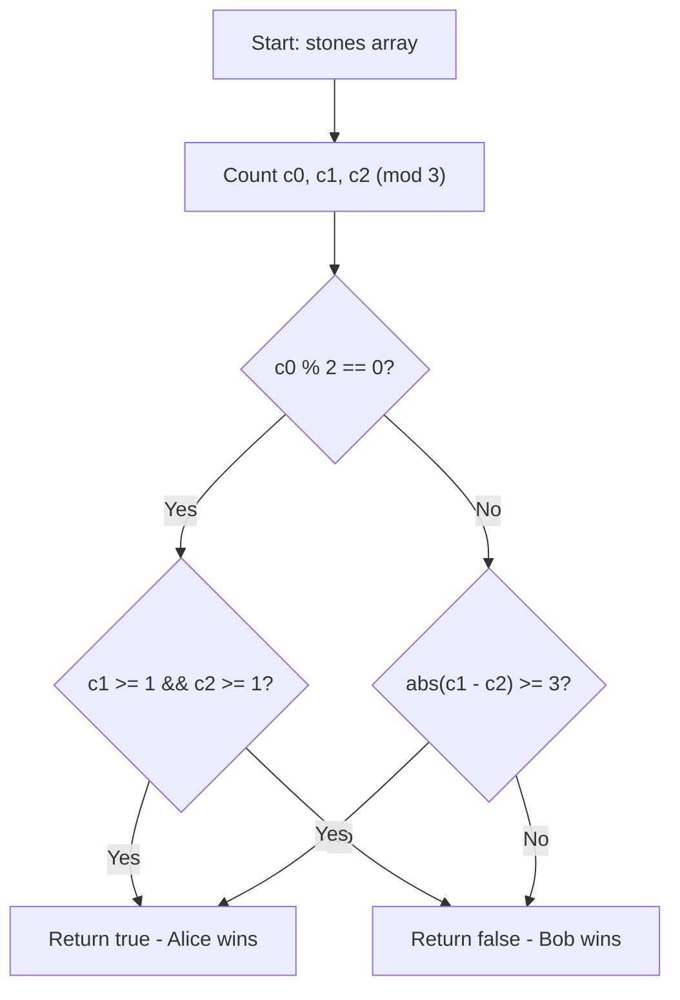

# 💡 Approach — 2029. Stone Game IX

| 📄 [Problem](./Problem.md) | 💡 [Approach](./Approach.md) | 🧩 [Solution](./Solution.cpp) | 🚀 [Main](./Main.cpp) |
|:--------------------------:|:-----------------------------:|:------------------------------:|:---------------------:|

## 📊 Metadata

---

## 💡 Core Insight

> [!TIP]
> **Core Insight:**  
> Since game validity only depends on `sum % 3 == 0`, we reduce all stone values modulo $3$:
> - `c0`: count of stones with value $\equiv 0 \pmod 3$
> - `c1`: count of stones with value $\equiv 1 \pmod 3$
> - `c2`: count of stones with value $\equiv 2 \pmod 3$
>
> 1. **Role of `0` stones**: Picking a `0` stone does not change `sum % 3`, but passes the turn. Thus, an **even** number of `0` stones has no effect on turn parity, while an **odd** number of `0` stones allows a single turn-swap.
> 2. **When `c0` is Even (`c0 % 2 == 0`)**:
>    Alice wins if and only if both `c1 >= 1` and `c2 >= 1`. Alice starts with the stone type (`1` or `2`) that has a smaller count, forcing Bob to run out of matching responses first.
> 3. **When `c0` is Odd (`c0 % 2 == 1`)**:
>    The extra `0` stone flips the advantage. Alice wins if and only if `abs(c1 - c2) >= 3`.

---

## 🔩 Step-by-Step Breakdown

1. Count frequency of remainders $0, 1, 2$ in `stones`:
   - `c0 = count(x % 3 == 0)`
   - `c1 = count(x % 3 == 1)`
   - `c2 = count(x % 3 == 2)`
2. Evaluate based on parity of `c0`:
   - **If `c0 % 2 == 0`**: Return `c1 >= 1 && c2 >= 1`.
   - **If `c0 % 2 == 1`**: Return `abs(c1 - c2) >= 3`.

---

## 🔄 Mermaid Flowchart

---

## 🔍 Detailed Dry Run

### Example 1: `stones = [2, 1]`
- `c0 = 0`, `c1 = 1`, `c2 = 1`.
- `c0 % 2 == 0` $\implies$ check `c1 >= 1 && c2 >= 1` $\implies 1 \ge 1 \land 1 \ge 1 \implies$ `true`.

### Example 2: `stones = [2]`
- `c0 = 0`, `c1 = 0`, `c2 = 1`.
- `c0 % 2 == 0` $\implies$ check `c1 >= 1 && c2 >= 1` $\implies 0 \ge 1 \land 1 \ge 1 \implies$ `false`.

### Example 3: `stones = [5, 1, 2, 4, 3]`
- `c0 = 1`, `c1 = 2`, `c2 = 2`.
- `c0 % 2 == 1` $\implies$ check `abs(c1 - c2) >= 3` $\implies |2 - 2| = 0 \ge 3 \implies$ `false`.

---

## 📊 Complexity Analysis

| Complexity | Resource | Details / Explanation |
| :--------: | :------: | --------------------- |
| **Time**   | $O(N)$   | Single pass to count remainders mod 3. |
| **Space**  | $O(1)$   | Fixed auxiliary array/counters for mod 3 values. |

---

> *"Counting remainders modulo 3 reduces a complex combinatorial game to parity and difference checks."*

---

<h3>Happy Coding! 🚀</h3>

