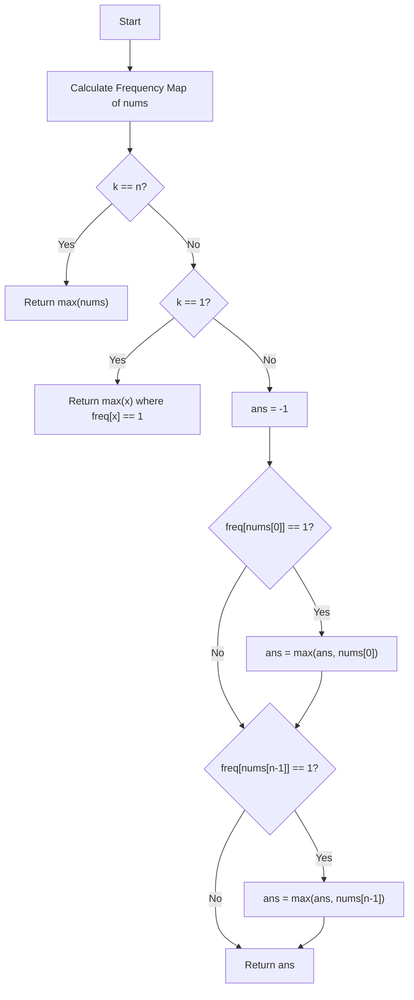

# 💡 Approach — Find the Largest Almost Missing Integer

  | 📄 [Problem](./Problem.md) | 💡 [Approach](./Approach.md) | 🧩 [Solution](./Solution.cpp) | 🚀 [Main](./Main.cpp) |
  |:--------------------------:|:-----------------------------:|:------------------------------:|:---------------------:|

## 📊 Metadata

> [!TIP]
> **Core Insight:** If $k = 1$, only elements appearing exactly once in the entire array fit the condition. If $k = n$, there is only one subarray, so all elements appear exactly once; we just return the maximum element. For any $1 < k < n$, elements in the middle of the array will always appear in multiple subarrays. Thus, the only elements that can appear in exactly one subarray are the first and last elements (`nums[0]` and `nums[n-1]`), provided they only occur once in the entire array!

## 🔩 Step-by-Step Breakdown
1. **Count Frequencies**: First, calculate the overall frequency of every element in the array `nums` using a frequency map or an array.
2. **Handle Case `k == n`**: If $k$ equals the length of the array, return the maximum element present in `nums`.
3. **Handle Case `k == 1`**: Iterate through the frequency map and return the maximum element that has a frequency of exactly 1.
4. **Handle Case `1 < k < n`**: Initialize the answer to `-1`. Check if `nums[0]` has an overall frequency of 1; if so, update the answer. Do the same for `nums[n-1]`. Return the maximum of the two.

## 🔄 Mermaid Flowchart

## 🏃‍♂️ Dry Run
Let's trace **Example 2**: `nums = [3, 9, 7, 2, 1, 7]`, `k = 4`
* **Length $n$**: 6. Condition: $1 < k < n$ holds since $1 < 4 < 6$.
* **Frequency Map**: `{3: 1, 9: 1, 7: 2, 2: 1, 1: 1}`

**Checking Boundaries:**
* **Step 1:** Initial `ans = -1`.
* **Step 2:** Check `nums[0]` which is `3`. Its frequency is `1`. It qualifies. `ans = max(-1, 3) = 3`.
* **Step 3:** Check `nums[n-1]` which is `7`. Its frequency is `2`. It does not qualify.
* **Step 4:** Return `ans = 3`.

## 📊 Complexity Analysis
| Complexity | Analysis |
| :---: | :--- |
| **Time** | $\mathcal{O}(n)$: We traverse the array a constant number of times to compute frequencies and find the max elements. |
| **Space** | $\mathcal{O}(n)$: We use a hash map to store the frequencies of the elements, taking linear space. |

> *"Simplicity is prerequisite for reliability."*

---

<h3>Happy Coding! 🚀</h3>

