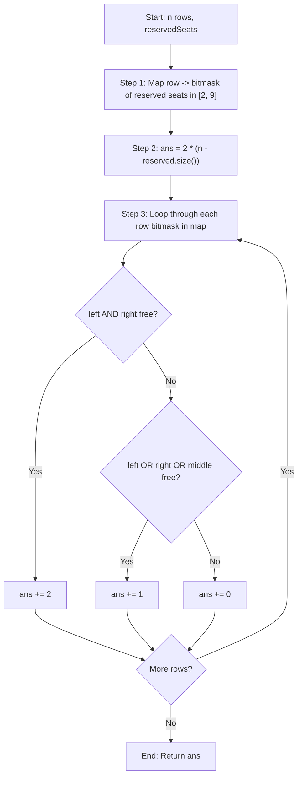

# 💡 Approach — Cinema Seat Allocation

  | 📄 [Problem](./Problem.md) | 💡 [Approach](./Approach.md) | 🧩 [Solution](./Solution.cpp) | 🚀 [Main](./Main.cpp) |
  |:--------------------------:|:-----------------------------:|:------------------------------:|:---------------------:|

## 📊 Metadata

  

> [!TIP]
> **Core Insight:** Seats `1` and `10` never affect any four-person block. In any completely unreserved row, we can place at most **2** groups (Left: `[2,3,4,5]` and Right: `[6,7,8,9]`). For rows with reservations within `[2, 9]`, we can represent the reserved seats as a **bitmask** and check availability in $\mathcal{O}(1)$:
> 1. If **both** Left and Right blocks are free $\implies +2$ groups.
> 2. Else if **Left**, **Right**, or **Middle** (`[4,5,6,7]`) is free $\implies +1$ group.
> 3. Otherwise $\implies +0$ groups.
> 
> Unreserved rows contribute $2 \times (n - \text{reservedRowsCount})$ directly without explicit iteration.

## 🔩 Step-by-Step Breakdown

1. **Bitmask Representation**:
   - For each reservation `[row, seat]`, if $2 \le \text{seat} \le 9$, set the corresponding bit in a hash map `reserved[row] |= (1 << seat)`.
2. **Initial Answer**:
   - Initialize `ans = 2 * (n - reserved.size())` to count 2 groups for all rows that have zero reservations in columns `2` to `9`.
3. **Evaluate Each Reserved Row**:
   - **Left Block** (`2, 3, 4, 5`): Bitmask `0b0000111100 = 60`. Available if `(mask & 60) == 0`.
   - **Right Block** (`6, 7, 8, 9`): Bitmask `0b1111000000 = 960`. Available if `(mask & 960) == 0`.
   - **Middle Block** (`4, 5, 6, 7`): Bitmask `0b0011110000 = 240`. Available if `(mask & 240) == 0`.
   - If `left && right`: add 2.
   - Else if `left || right || middle`: add 1.
4. **Return Result**: Return the total computed `ans`.

## 🔄 Mermaid Flowchart

## 🏃‍♂️ Dry Run
Let's trace **Example 1**: $n = 3$, `reservedSeats = [[1,2],[1,3],[1,8],[2,6],[3,1],[3,10]]`

* **Bitmask Construction**:
  * `[3, 1]` and `[3, 10]` ignored (outside `[2, 9]`).
  * Row 1: Seats `2, 3, 8` $\implies \text{mask} = 2^2 + 2^3 + 2^8 = 4 + 8 + 256 = 268$.
  * Row 2: Seat `6` $\implies \text{mask} = 2^6 = 64$.
  * Row 3: Not in map (no reservations in `2..9`).
* **Unreserved Count**: `ans = 2 * (3 - 2) = 2`.
* **Row 1**:
  * `left` (mask & 60 == 0): $(268 \& 60) = 12 \ne 0 \implies \text{false}$
  * `right` (mask & 960 == 0): $(268 \& 960) = 256 \ne 0 \implies \text{false}$
  * `middle` (mask & 240 == 0): $(268 \& 240) = 0 \implies \text{true}$
  * Middle is free $\implies \text{ans} += 1 \implies \text{ans} = 3$.
* **Row 2**:
  * `left` (mask & 60 == 0): $(64 \& 60) = 0 \implies \text{true}$
  * `right` (mask & 960 == 0): $(64 \& 960) = 64 \ne 0 \implies \text{false}$
  * `middle` (mask & 240 == 0): $(64 \& 240) = 64 \ne 0 \implies \text{false}$
  * Left is free $\implies \text{ans} += 1 \implies \text{ans} = 4$.
* **Total Answer:** `4`.

## 📊 Complexity Analysis
| Complexity | Analysis |
| :---: | :--- |
| **Time** | $\mathcal{O}(m)$: Where $m$ is the number of reservations in `reservedSeats`. Processing each reservation and evaluating each distinct row takes $\mathcal{O}(1)$ time. |
| **Space** | $\mathcal{O}(m)$: An unordered map stores the bitmasks of only the rows containing reservations in columns `2` to `9`. |

> *"Simplicity is prerequisite for reliability."*

---

<h3>Happy Coding! 🚀</h3>

