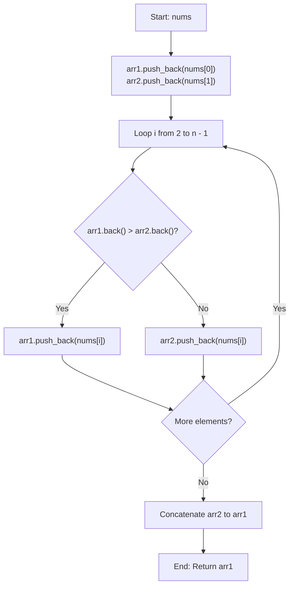

# 💡 Approach — Distribute Elements Into Two Arrays I

  | 📄 [Problem](./Problem.md) | 💡 [Approach](./Approach.md) | 🧩 [Solution](./Solution.cpp) | 🚀 [Main](./Main.cpp) |
  |:--------------------------:|:-----------------------------:|:------------------------------:|:---------------------:|

## 📊 Metadata

> [!TIP]
> **Core Insight:** This problem is a direct simulation of array operations:
> - Initialize `arr1` with `nums[0]` and `arr2` with `nums[1]`.
> - For every subsequent element `nums[i]` ($i \ge 2$), compare `arr1.back()` and `arr2.back()`.
> - Push `nums[i]` to `arr1` if `arr1.back() > arr2.back()`, otherwise push to `arr2`.
> - Concatenate `arr2` onto `arr1` and return.

## 🔩 Step-by-Step Breakdown

1. **Initialization**:
   - Create two vectors `arr1` and `arr2`.
   - Place `nums[0]` into `arr1` and `nums[1]` into `arr2`.

2. **Simulation**:
   - Loop $i$ from $2$ to $n - 1$:
     - If `arr1.back() > arr2.back()`: append `nums[i]` to `arr1`.
     - Else: append `nums[i]` to `arr2`.

3. **Concatenation**:
   - Append all elements of `arr2` to `arr1`.

4. **Return**:
   - Return `arr1` as the final result.

---

## 🔄 Mermaid Flowchart

---

## 🏃‍♂️ Dry Run

Let's trace **Example 2**: `nums = [5, 4, 3, 8]`

| Step | Current Element `nums[i]` | `arr1` | `arr2` | Comparison | Action |
| :---: | :---: | :---: | :---: | :---: | :---: |
| 1 | `nums[0] = 5` | `[5]` | `[]` | — | Push to `arr1` |
| 2 | `nums[1] = 4` | `[5]` | `[4]` | — | Push to `arr2` |
| 3 | `nums[2] = 3` | `[5]` | `[4]` | `5 > 4` (True) | Push `3` to `arr1` $\implies$ `[5, 3]` |
| 4 | `nums[3] = 8` | `[5, 3]` | `[4]` | `3 > 4` (False) | Push `8` to `arr2` $\implies$ `[4, 8]` |

**Concatenation:** `arr1 + arr2 = [5, 3, 4, 8]`.

---

## 📊 Complexity Analysis

| Complexity | Analysis |
| :---: | :--- |
| **Time** | $\mathcal{O}(n)$: We iterate through the array of length $n$ once, performing $\mathcal{O}(1)$ push operations, followed by an $\mathcal{O}(n)$ concatenation. |
| **Space** | $\mathcal{O}(n)$: Auxiliary space used by `arr1` and `arr2` to store all $n$ elements. |

> *"Simplicity is the soul of efficiency."*

---

<h3>Happy Coding! 🚀</h3>

