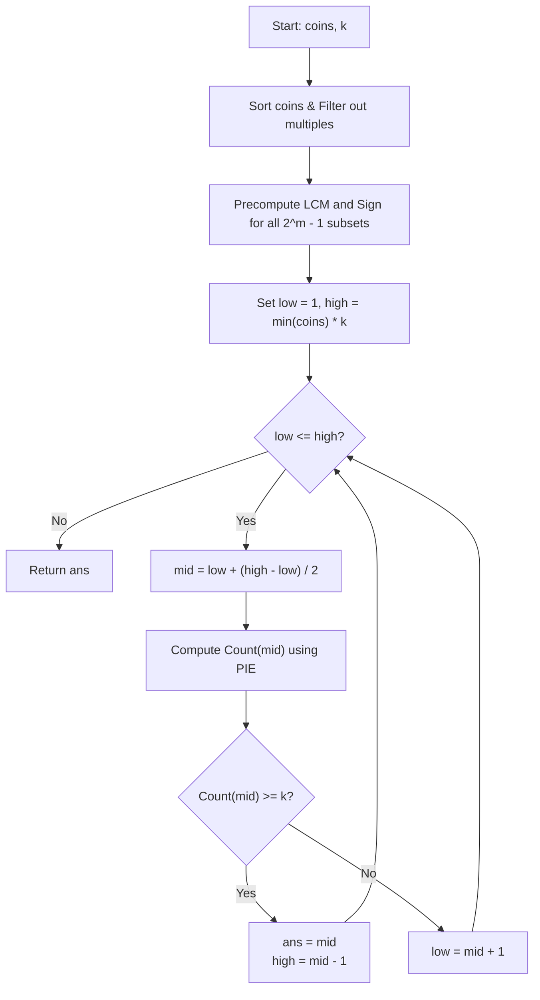

# 💡 Approach — Kth Smallest Amount With Single Denomination Combination

  | 📄 [Problem](./Problem.md) | 💡 [Approach](./Approach.md) | 🧩 [Solution](./Solution.cpp) | 🚀 [Main](./Main.cpp) |
  |:--------------------------:|:-----------------------------:|:------------------------------:|:---------------------:|

## 📊 Metadata

> [!TIP]
> **Core Insight:**
> - The amounts formed by a set of coins are integers divisible by at least one coin denomination.
> - The count of reachable amounts $\le x$ is a monotonically non-decreasing function of $x$. This monotonicity allows us to **Binary Search on the Answer** in the range $[1, \min(\text{coins}) \times k]$.
> - For any candidate value $x$, the number of positive integers $\le x$ divisible by at least one coin is determined using the **Principle of Inclusion-Exclusion (PIE)** over all non-empty subsets of coins:
>   $$\text{Count}(x) = \sum_{\emptyset \neq T \subseteq \text{coins}} (-1)^{|T| - 1} \left\lfloor \frac{x}{\text{LCM}(T)} \right\rfloor$$
> - Since $\text{coins.length} \le 15$, there are at most $2^{15} - 1 = 32767$ non-empty subsets, which can be precomputed in $\mathcal{O}(2^m)$ time.

## 🔩 Step-by-Step Breakdown

1. **Redundancy Pruning**:
   - Sort `coins` in ascending order.
   - Filter out any coin $c$ if there exists an already selected smaller coin $f$ such that $c \pmod f == 0$ (e.g., if we have $3$, then $6$ and $9$ are redundant multiples).
   - This reduces the effective number of coins $m \le n \le 15$.

2. **Precompute Subset LCMs & Signs (PIE)**:
   - Iterate through every bitmask from $1$ to $(1 \ll m) - 1$.
   - For each bitmask:
     - Determine the subset size: $|T| = \text{\_\_builtin\_popcount}(\text{mask})$.
     - Compute the combined $\text{LCM}$ of all coins in the subset: $\text{lcm}(a, b) = \frac{a}{\gcd(a, b)} \times b$.
     - Assign sign $+1$ if $|T|$ is odd, and $-1$ if $|T|$ is even.
     - Store the pair `(LCM, sign)` in a list `subsets`.

3. **Binary Search on Answer**:
   - Search space: $\text{low} = 1$, $\text{high} = \min(\text{coins}) \times k$.
   - While $\text{low} \le \text{high}$:
     - Let $\text{mid} = \text{low} + \lfloor\frac{\text{high} - \text{low}}{2}\rfloor$.
     - Calculate $\text{Count}(\text{mid}) = \sum_{(L, \text{sign}) \in \text{subsets}} \text{sign} \times \lfloor\frac{\text{mid}}{L}\rfloor$.
     - If $\text{Count}(\text{mid}) \ge k$: candidate answer found, record $\text{ans} = \text{mid}$ and search left ($\text{high} = \text{mid} - 1$).
     - Else: $\text{Count}(\text{mid}) < k$, search right ($\text{low} = \text{mid} + 1$).

4. **Return Answer**:
   - Return $\text{ans}$ as the $k^{\text{th}}$ smallest valid amount.

---

## 🔄 Mermaid Flowchart

---

## 🏃‍♂️ Dry Run

Let's trace **Example 2**: `coins = [5, 2]`, `k = 7`

1. **Filtered Coins**: `[2, 5]` ($m = 2$)
2. **Subsets & LCMs**:
   - Mask `01` ($\{2\}$): size $1 \implies \text{sign} = +1, \text{LCM} = 2$
   - Mask `10` ($\{5\}$): size $1 \implies \text{sign} = +1, \text{LCM} = 5$
   - Mask `11` ($\{2, 5\}$): size $2 \implies \text{sign} = -1, \text{LCM} = 10$
3. **Binary Search**: $\text{low} = 1, \text{high} = 2 \times 7 = 14$

| Iteration | `low` | `high` | `mid` | $\lfloor\text{mid}/2\rfloor$ | $\lfloor\text{mid}/5\rfloor$ | $\lfloor\text{mid}/10\rfloor$ | `Count(mid)` | Comparison (`>= 7`) | Next Range |
| :---: | :---: | :---: | :---: | :---: | :---: | :---: | :---: | :---: | :---: |
| 1 | 1 | 14 | 7 | 3 | 1 | 0 | $3 + 1 - 0 = 4$ | $4 < 7$ (False) | `low = 8` |
| 2 | 8 | 14 | 11 | 5 | 2 | 1 | $5 + 2 - 1 = 6$ | $6 < 7$ (False) | `low = 12` |
| 3 | 12 | 14 | 13 | 6 | 2 | 1 | $6 + 2 - 1 = 7$ | $7 \ge 7$ (True) | `ans = 13, high = 12` |
| 4 | 12 | 12 | 12 | 6 | 2 | 1 | $6 + 2 - 1 = 7$ | $7 \ge 7$ (True) | `ans = 12, high = 11` |
| End | 12 | 11 | — | — | — | — | — | Loop ends (`low > high`) | Result: `12` |

**Final Answer:** `12`.

---

## 📊 Complexity Analysis

| Complexity | Analysis |
| :---: | :--- |
| **Time** | $\mathcal{O}(2^m \cdot m + 2^m \cdot \log(\min(\text{coins}) \cdot k))$: Generating $2^m$ subset LCMs takes $\mathcal{O}(m \cdot 2^m)$. Each binary search step evaluates PIE in $\mathcal{O}(2^m)$ time across $\approx 36$ iterations. Total operations $\approx 1.2 \times 10^6 \ll 10^8$ ($< 5\text{ ms}$). |
| **Space** | $\mathcal{O}(2^m)$: Stores $2^m - 1 \le 32767$ precomputed `(LCM, sign)` pairs. |

> *"When brute force cannot count the union, Inclusion-Exclusion divides the chaos into ordered symmetry."*

---

<h3>Happy Coding! 🚀</h3>

