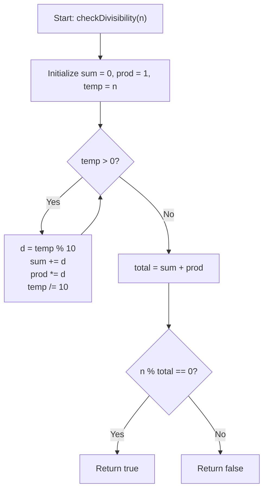

# 💡 Approach — Check Divisibility by Digit Sum and Product

  | 📄 [Problem](./Problem.md) | 💡 [Approach](./Approach.md) | 🧩 [Solution](./Solution.cpp) | 🚀 [Main](./Main.cpp) |
  |:--------------------------:|:-----------------------------:|:------------------------------:|:---------------------:|

## 📊 Metadata

> [!TIP]
> **Core Insight:**
> - To solve this problem, we extract the base-10 digits of $n$ using simple modulo and division operations (`n % 10` and `n / 10`).
> - Maintain two accumulators:
>   1. `sumDigits`: initialized to `0` (adds each extracted digit).
>   2. `prodDigits`: initialized to `1` (multiplies each extracted digit).
> - Compute the divisor as $\text{total} = \text{sumDigits} + \text{prodDigits}$.
> - Since $n \ge 1$, $\text{sumDigits} \ge 1$ and $\text{prodDigits} \ge 0$, guaranteeing $\text{total} \ge 1$ (no division by zero).
> - Return $n \pmod{\text{total}} == 0$.

---

## 🔩 Step-by-Step Breakdown

1. **Initialize Accumulators**:
   - Set `sumDigits = 0` and `prodDigits = 1`.
   - Copy $n$ to a temporary integer variable `temp = n`.

2. **Digit Extraction**:
   - While `temp > 0`:
     - Extract last digit: `d = temp % 10`.
     - Update sum: `sumDigits += d`.
     - Update product: `prodDigits *= d`.
     - Remove last digit: `temp /= 10`.

3. **Check Divisibility**:
   - Calculate `total = sumDigits + prodDigits`.
   - Return `n % total == 0`.

---

## 🔄 Mermaid Flowchart

---

## 🏃‍♂️ Dry Run

### Trace 1: $n = 99$
| Step | `temp` | Extracted Digit `d` | `sumDigits` | `prodDigits` | Next `temp` |
| :---: | :---: | :---: | :---: | :---: | :---: |
| 1 | 99 | 9 | $0 + 9 = 9$ | $1 \times 9 = 9$ | 9 |
| 2 | 9 | 9 | $9 + 9 = 18$ | $9 \times 9 = 81$ | 0 |

- $\text{total} = 18 + 81 = 99$.
- $99 \pmod{99} = 0 \implies$ **`true`**.

---

### Trace 2: $n = 23$
| Step | `temp` | Extracted Digit `d` | `sumDigits` | `prodDigits` | Next `temp` |
| :---: | :---: | :---: | :---: | :---: | :---: |
| 1 | 23 | 3 | $0 + 3 = 3$ | $1 \times 3 = 3$ | 2 |
| 2 | 2 | 2 | $3 + 2 = 5$ | $3 \times 2 = 6$ | 0 |

- $\text{total} = 5 + 6 = 11$.
- $23 \pmod{11} = 1 \ne 0 \implies$ **`false`**.

---

## 📊 Complexity Analysis

| Complexity | Analysis |
| :---: | :--- |
| **Time** | $\mathcal{O}(\log_{10} n)$: The number of loop iterations equals the number of digits in $n$. For $n \le 10^6$, at most $7$ iterations are executed, taking $< 1\ \mu\text{s}$. |
| **Space** | $\mathcal{O}(1)$: Uses only a few 32-bit and 64-bit integer variables. |

> *"Simplicity in algorithm design is the ultimate form of elegance."*

---

<h3>Happy Coding! 🚀</h3>

