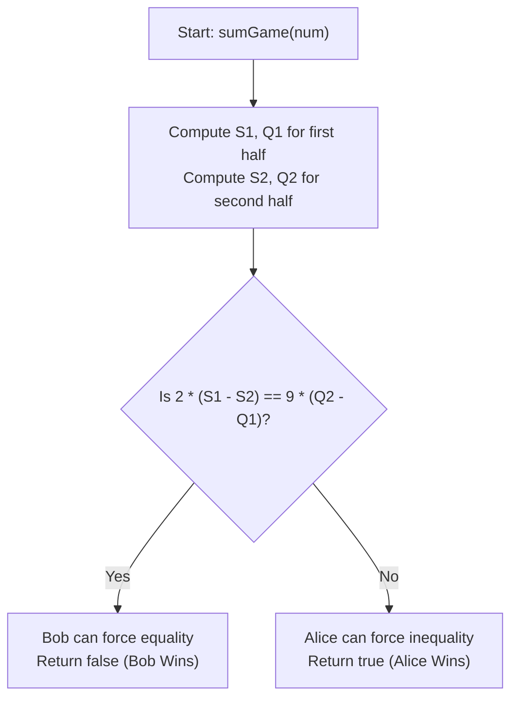

# 💡 Approach — Sum Game

  | 📄 [Problem](./Problem.md) | 💡 [Approach](./Approach.md) | 🧩 [Solution](./Solution.cpp) | 🚀 [Main](./Main.cpp) |
  |:--------------------------:|:-----------------------------:|:------------------------------:|:---------------------:|

## 📊 Metadata

---

> [!TIP]
> **Core Game-Theoretic Insights:**
> - Let $S_1$ and $S_2$ be the sum of existing digits in the **first half** and **second half**, respectively.
> - Let $Q_1$ and $Q_2$ be the count of `'?'` in the **first half** and **second half**, respectively.
>
> 1. **Parity Condition (Odd total '?')**:
>    - If $(Q_1 + Q_2)$ is odd, Alice makes the very last move.
>    - Right before the last move, exactly one `'?'` remains. There is at most **one** single digit in $[0, 9]$ that would make the two halves equal.
>    - Alice has $10$ digits to choose from, so she can always pick a different digit to force an inequality $\implies$ **Alice unconditionally wins**.
>
> 2. **Symmetric Pairing (Even total '?')**:
>    - **Opposite-Side Pairing**: If Alice replaces a `'?'` with digit $x$ on one half, Bob can mirror her move by placing $x$ on a `'?'` in the other half, resulting in a net sum difference change of $0$. Thus, $\min(Q_1, Q_2)$ pairs of `'?'` cancel out.
>    - **Same-Side Pairing**: The remaining $|Q_1 - Q_2|$ question marks all lie on one side. They form $k = \frac{|Q_1 - Q_2|}{2}$ pairs of turns. Whenever Alice chooses digit $x \in [0, 9]$, Bob can always choose the complementary digit $(9 - x) \in [0, 9]$.
>    - Each pair of moves therefore adds **exactly $9$** to that side's sum.
>
> 3. **The Winning Invariant**:
>    - Bob can force the sums to be equal if and only if the extra question marks on the smaller side can exactly bridge the gap:
>      $$S_1 - S_2 = \frac{Q_2 - Q_1}{2} \times 9 \iff 2 \times (S_1 - S_2) = 9 \times (Q_2 - Q_1)$$
>    - Note: If $(Q_1 + Q_2)$ is odd, $(Q_2 - Q_1)$ is odd, making $9 \times (Q_2 - Q_1)$ odd while $2 \times (S_1 - S_2)$ is even (they can never be equal).
>    - Therefore, **Alice wins if and only if $2 \times (S_1 - S_2) \neq 9 \times (Q_2 - Q_1)$**.

---

## 🔩 Step-by-Step Breakdown

1. **Partition the String**:
   - Let $n = \text{num.length()}$.
   - Iterate from $i = 0$ to $n/2 - 1$ (first half):
     - If `num[i] == '?'`, increment $Q_1$.
     - Else, add numeric value `num[i] - '0'` to $S_1$.
   - Iterate from $i = n/2$ to $n - 1$ (second half):
     - If `num[i] == '?'`, increment $Q_2$.
     - Else, add numeric value `num[i] - '0'` to $S_2$.

2. **Evaluate the Winning Condition**:
   - Check the invariant:
     $$2 \times (S_1 - S_2) \neq 9 \times (Q_2 - Q_1)$$
   - Return `true` if Alice wins (condition holds), otherwise `false` (Bob wins).

---

## 🔄 Mermaid Flowchart

---

## 🏃‍♂️ Dry Run

| Input `num` | $S_1, Q_1$ | $S_2, Q_2$ | $2 \times (S_1 - S_2)$ | $9 \times (Q_2 - Q_1)$ | Equal? | Winner / Output |
| :--- | :---: | :---: | :---: | :---: | :---: | :---: |
| `"5023"` | $S_1=5, Q_1=0$ | $S_2=5, Q_2=0$ | $2 \times (5 - 5) = 0$ | $9 \times (0 - 0) = 0$ | $0 == 0$ | Bob $\implies$ **`false`** |
| `"25??"` | $S_1=7, Q_1=0$ | $S_2=0, Q_2=2$ | $2 \times (7 - 0) = 14$ | $9 \times (2 - 0) = 18$ | $14 \neq 18$ | Alice $\implies$ **`true`** |
| `"?3295???"` | $S_1=14, Q_1=1$ | $S_2=5, Q_2=3$ | $2 \times (14 - 5) = 18$ | $9 \times (3 - 1) = 18$ | $18 == 18$ | Bob $\implies$ **`false`** |
| `"?2??"` | $S_1=2, Q_1=1$ | $S_2=0, Q_2=2$ | $2 \times (2 - 0) = 4$ | $9 \times (2 - 1) = 9$ | $4 \neq 9$ (Odd ?) | Alice $\implies$ **`true`** |

---

## 📊 Complexity Analysis

| Complexity | Analysis |
| :---: | :--- |
| **Time** | $\mathcal{O}(n)$: A single linear pass through the string `num` of length $n$ to accumulate sums and counts. |
| **Space** | $\mathcal{O}(1)$: Constant auxiliary space using integer accumulators. |

---

<h3>Happy Coding! 🚀</h3>

