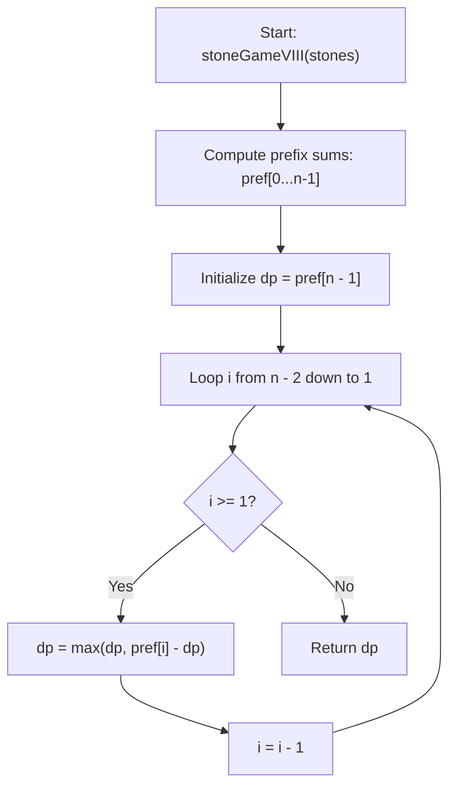

# 💡 Approach — Stone Game VIII

  | 📄 [Problem](./Problem.md) | 💡 [Approach](./Approach.md) | 🧩 [Solution](./Solution.cpp) | 🚀 [Main](./Main.cpp) |
  |:--------------------------:|:-----------------------------:|:------------------------------:|:---------------------:|

## 📊 Metadata

---

> [!TIP]
> **Core Game-Theoretic & Prefix Sum Insights:**
> 1. **Prefix Sum Invariance**:
>    - When a player removes the leftmost $x$ stones ($x \ge 2$), the sum added to their score is $\text{pref}[x - 1]$, where $\text{pref}[i] = \sum_{k=0}^i \text{stones}[k]$.
>    - The removed stones are replaced by a single stone of value $\text{pref}[x - 1]$.
>    - If the next player subsequently takes $y \ge 2$ stones from this new array, they take the merged stone $\text{pref}[x - 1]$ plus the next $y - 1$ original stones $\text{stones}[x \dots x + y - 2]$.
>    - The sum they obtain is $\text{pref}[x - 1] + \sum_{k=x}^{x + y - 2} \text{stones}[k] = \text{pref}[x + y - 2]$.
>    - **Crucial Takeaway**: Every move simply corresponds to picking an index $i \in [1, n - 1]$, gaining $\text{pref}[i]$ points, and forcing the next player to pick an index $j > i$.
>
> 2. **Minimax Recurrence Formulation**:
>    - Let $\text{dp}[i]$ be the maximum relative score difference (current player's score minus other player's score) possible when a player is faced with choosing an index from $i$ to $n - 1$.
>    - At index $i$:
>      - **Option A (Pick index $i$)**: Gain $\text{pref}[i]$ points, while the opponent gets $\text{dp}[i + 1]$ from the remaining range $\implies \text{pref}[i] - \text{dp}[i + 1]$.
>      - **Option B (Skip index $i$ and pick some index $\ge i + 1$)**: The player gets $\text{dp}[i + 1]$.
>    - Therefore:
>      $$\text{dp}[i] = \max(\text{dp}[i + 1],\, \text{pref}[i] - \text{dp}[i + 1])$$
>    - **Base Case**: At the very end (index $n - 1$), the player must take all remaining stones:
>      $$\text{dp}[n - 1] = \text{pref}[n - 1]$$
>    - Since Alice must pick at least 2 stones on her very first move, she chooses an index $i \ge 1$. The final answer is $\text{dp}[1]$.

---

## 🧭 Mathematical Formulation

1. **Prefix Sum Definition**:
   $$\text{pref}[i] = \sum_{k=0}^{i} \text{stones}[k] \quad \text{for } 0 \le i < n$$

2. **DP Recurrence**:
   $$\begin{cases}
   \text{dp}[n - 1] = \text{pref}[n - 1] \\
   \text{dp}[i] = \max(\text{dp}[i + 1],\, \text{pref}[i] - \text{dp}[i + 1]) & \text{for } i = n - 2, n - 3, \dots, 1
   \end{cases}$$

3. **Space Optimization**:
   - Because each $\text{dp}[i]$ depends only on $\text{dp}[i + 1]$, we can maintain a single integer variable `dp`, reducing auxiliary space to $\mathcal{O}(1)$.

---

## 🔩 Step-by-Step Breakdown

1. **Compute Prefix Sums**:
   - Compute the cumulative sums of the array `stones`.

2. **Initialize DP with Base Case**:
   - Set `dp = pref[n - 1]`, representing the only option available when merging all stones.

3. **Transition Backward**:
   - Iterate $i$ from $n - 2$ down to $1$:
     $$\text{dp} = \max(\text{dp},\, \text{pref}[i] - \text{dp})$$

4. **Return Result**:
   - Return `dp` (which now holds $\text{dp}[1]$, Alice's optimal score difference).

---

## 🔄 Mermaid Flowchart

---

## 🏃‍♂️ Dry Run

### Example 1: `stones = [-1, 2, -3, 4, -5]` ($n = 5$)

| Index $i$ | $\text{stones}[i]$ | $\text{pref}[i]$ | Calculation ($\max(\text{dp}, \text{pref}[i] - \text{dp})$) | Updated $\text{dp}$ |
| :---: | :---: | :---: | :--- | :---: |
| **4** | -5 | **-3** | Base Case: $\text{pref}[4] = -3$ | **-3** |
| **3** | 4 | **2** | $\max(-3, 2 - (-3)) = \max(-3, 5)$ | **5** |
| **2** | -3 | **-2** | $\max(5, -2 - 5) = \max(5, -7)$ | **5** |
| **1** | 2 | **1** | $\max(5, 1 - 5) = \max(5, -4)$ | **5** |

- **Output**: $\text{dp}[1] = 5$ ✅

---

## 📊 Complexity Analysis

| Complexity | Analysis |
| :---: | :--- |
| **Time** | $\mathcal{O}(n)$: One forward pass of size $n$ to compute prefix sums and one backward pass from $n - 2$ to $1$. |
| **Space** | $\mathcal{O}(1)$ or $\mathcal{O}(n)$: $\mathcal{O}(n)$ auxiliary space for prefix sums (or $\mathcal{O}(1)$ if computed in-place). |

---

<h3>Happy Coding! 🚀</h3>

