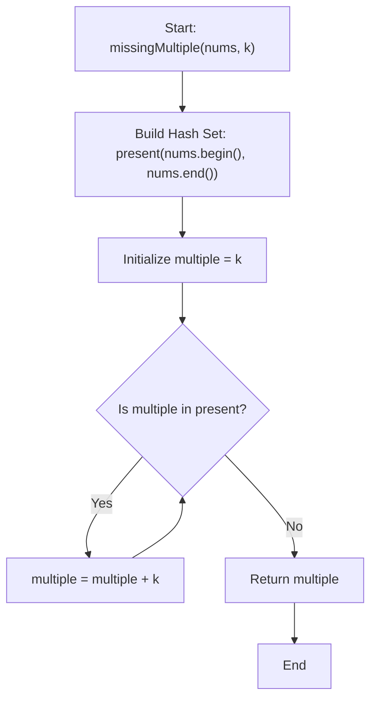

# 💡 Approach — Smallest Missing Multiple of K

  | 📄 [Problem](./Problem.md) | 💡 [Approach](./Approach.md) | 🧩 [Solution](./Solution.cpp) | 🚀 [Main](./Main.cpp) |
  |:--------------------------:|:-----------------------------:|:------------------------------:|:---------------------:|

## 📊 Metadata

---

> [!TIP]
> **Core Algorithmic Insight — Hash Set Membership Lookup:**
> - The problem requires finding the smallest positive integer of the form $m = c \times k$ (where $c \ge 1$) such that $m \notin \text{nums}$.
> - To check membership in $\mathcal{O}(1)$ average time, we insert all elements of `nums` into an `unordered_set<int>` (or a boolean frequency lookup array).
> - We then test candidates sequentially starting from $m = k$, incrementing by $k$ each iteration ($k, 2k, 3k, \dots$) until we find the first candidate that is not present in the set.

---

## 🧭 Intuition & Mathematical Formulation

1. **Definition of Multiples:**
   A positive multiple of $k$ is given by $M_c = c \times k$ for $c \in \{1, 2, 3, \dots\}$.
   The sequence of candidates is strictly increasing: $k, 2k, 3k, 4k, \dots$.

2. **Search Strategy:**
   - Because we want the **smallest** missing multiple, examining candidates in strictly increasing order of $c = 1, 2, 3, \dots$ guarantees that the very first candidate $M_c \notin \text{nums}$ is the global minimum answer.
   - Using a hash set allows each lookup `present.count(multiple)` to execute in $\mathcal{O}(1)$ average time.

3. **Termination Guarantee:**
   - The array `nums` has at most $n$ distinct elements.
   - At most $n$ multiples can exist in `nums`, so the while loop is guaranteed to terminate within at most $n + 1$ iterations.

---

## 🔩 Step-by-Step Breakdown

1. **Step 1: Insert all elements into a hash set for $\mathcal{O}(1)$ membership lookups**:
   - Construct `unordered_set<int> present(nums.begin(), nums.end())`.

2. **Step 2: Test positive multiples of $k$ ($k, 2k, 3k, \dots$) in increasing order**:
   - Initialize `int multiple = k`.
   - While `present.count(multiple)` is non-zero, increment `multiple += k`.

3. **Step 3: Return the smallest missing multiple**:
   - Return `multiple`.

---

## 🔄 Mermaid Flowchart

---

## 🏃‍♂️ Dry Run

Let's trace **Example 1:** `nums = [8, 2, 3, 4, 6]`, `k = 2`:

| Iteration | Candidate `multiple` | In `present` set? | Action |
| :---: | :---: | :---: | :--- |
| **1** | $2$ ($1 \times 2$) | **Yes** ($2 \in \text{nums}$) | `multiple = 2 + 2 = 4` |
| **2** | $4$ ($2 \times 2$) | **Yes** ($4 \in \text{nums}$) | `multiple = 4 + 2 = 6` |
| **3** | $6$ ($3 \times 2$) | **Yes** ($6 \in \text{nums}$) | `multiple = 6 + 2 = 8` |
| **4** | $8$ ($4 \times 2$) | **Yes** ($8 \in \text{nums}$) | `multiple = 8 + 2 = 10` |
| **5** | $10$ ($5 \times 2$) | **No** ($10 \notin \text{nums}$) | **Found! Return 10** |

---

## 📊 Complexity Analysis

| Complexity Metric | Estimation | Rationale |
| :--- | :---: | :--- |
| **Time Complexity** | $\mathcal{O}(n)$ | Inserting $n$ elements into `unordered_set` takes $\mathcal{O}(n)$. The while loop executes at most $n + 1$ times, each taking $\mathcal{O}(1)$ average lookup time. Total time is $\mathcal{O}(n)$. |
| **Auxiliary Space** | $\mathcal{O}(n)$ | Hash set stores at most $n$ distinct elements from `nums`. |

---

> *"Clarity of structure turns the search for answers into a straight path."*

---

<h3>Happy Coding! 🚀</h3>

