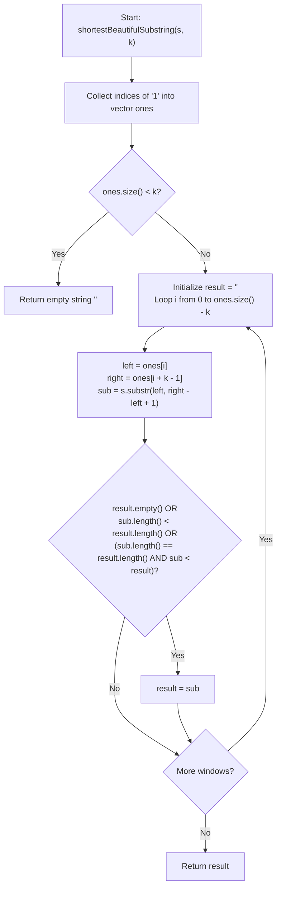

# 💡 Approach — Shortest and Lexicographically Smallest Beautiful String

  | 📄 [Problem](./Problem.md) | 💡 [Approach](./Approach.md) | 🧩 [Solution](./Solution.cpp) | 🚀 [Main](./Main.cpp) |
  |:--------------------------:|:-----------------------------:|:------------------------------:|:---------------------:|

## 📊 Metadata

---

> [!TIP]
> **Core Algorithmic Insight — Index Tracking of Minimal Substrings:**
> - Any **shortest** beautiful substring containing exactly $k$ ones must **start with `'1'`** and **end with `'1'`**.
> - If a substring starts or ends with `'0'`, trimming that `'0'` produces a strictly shorter substring with the exact same number of `1`'s.
> - Therefore, if we record all indices where $s[i] == '1'$ into a list `ones`:
>   - Every candidate minimal beautiful substring corresponds directly to a window of length $k$ in `ones`:
>     $$\text{left} = \text{ones}[i], \quad \text{right} = \text{ones}[i + k - 1]$$
>   - The candidate substring is $s[\text{left} \dots \text{right}]$, having length $\text{len} = \text{right} - \text{left} + 1$.
> - We simply iterate through all valid windows of size $k$ and maintain the shortest (and lexicographically smallest) substring.

---

## 🧭 Intuition & Mathematical Formulation

1. **Boundary Property:**
   - Let a candidate substring have indices $[L, R]$.
   - If $s[L] == '0'$, the substring $[L+1, R]$ has fewer characters and still has $k$ ones.
   - If $s[R] == '0'$, the substring $[L, R-1]$ has fewer characters and still has $k$ ones.
   - Hence, an optimal shortest substring must satisfy $s[L] = '1'$ and $s[R] = '1'$.

2. **Index Collection:**
   - Let $\text{ones} = [p_0, p_1, \dots, p_{m-1}]$ be the 0-indexed positions where $s[p_j] == '1'$.
   - If $m < k$, it is impossible to have $k$ ones $\implies$ return `""`.

3. **Window Traversal:**
   - For every $i \in [0, m - k]$:
     - Form $\text{sub} = s[p_i \dots p_{i+k-1}]$.
     - Length is $p_{i+k-1} - p_i + 1$.
     - Compare with current best `result`:
       - If `sub.length() < result.length()`, update `result = sub`.
       - If `sub.length() == result.length()` and `sub < result`, update `result = sub`.

---

## 🔩 Step-by-Step Breakdown

1. **Step 1: Collect all indices where $s[i] == '1'$**:
   - Iterate over string $s$ and store every index $i$ where $s[i] == '1'$ in `ones`.

2. **Step 2: If total 1's is less than $k$, return empty string**:
   - If `ones.size() < k`, return `""`.

3. **Step 3: Find the shortest and lexicographically smallest beautiful substring**:
   - Initialize `result = ""`.
   - For each window $i$ from $0$ to $\text{ones.size()} - k$:
     - Let $\text{left} = \text{ones}[i]$ and $\text{right} = \text{ones}[i + k - 1]$.
     - Extract $\text{sub} = s.\text{substr}(\text{left}, \text{right} - \text{left} + 1)$.
     - If `result` is empty, or $\text{sub}$ is shorter, or $\text{sub}$ has same length and is lexicographically smaller:
       - Update `result = sub`.

4. **Step 4: Return optimal beautiful substring**:
   - Return `result`.

---

## 🔄 Mermaid Flowchart

---

## 🏃‍♂️ Dry Run

Let's trace **Example 1:** `s = "100011001"`, `k = 3`:

- Indices of `'1'`: `ones = [0, 4, 5, 8]`
- Total 1's $m = 4 \ge 3$.

| Window $i$ | `left` ($\text{ones}[i]$) | `right` ($\text{ones}[i+2]$) | Candidate `sub` | Length | Comparison with `result` | New `result` |
| :---: | :---: | :---: | :---: | :---: | :---: | :---: |
| **0** | $0$ | $5$ | `"100011"` | $6$ | `result` was empty | `"100011"` |
| **1** | $4$ | $8$ | `"11001"` | $5$ | $\text{len } 5 < 6$ (shorter!) | `"11001"` |

- **Final Answer:** `"11001"`

---

## 📊 Complexity Analysis

| Complexity Metric | Estimation | Rationale |
| :--- | :---: | :--- |
| **Time Complexity** | $\mathcal{O}(n^2)$ | Collecting 1s takes $\mathcal{O}(n)$. There are at most $n$ windows of size $k$, and extracting/comparing substrings of length up to $n$ takes $\mathcal{O}(n)$. With $n \le 100$, this executes in $< 1\text{ ms}$. |
| **Auxiliary Space** | $\mathcal{O}(n)$ | Vector `ones` stores at most $n$ indices, and `result` stores a substring of length at most $n$. |

---

> *"Find the true anchors, and the noise between them easily resolves."*

---

<h3>Happy Coding! 🚀</h3>

