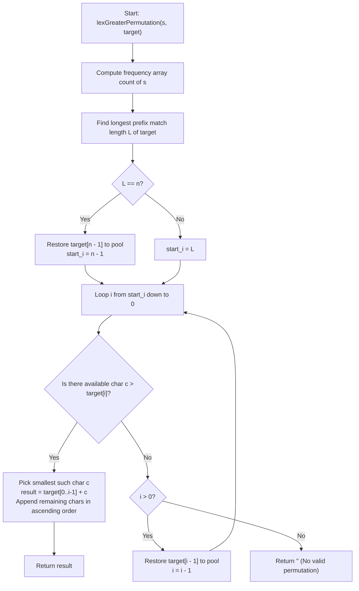

# 💡 Approach — Lexicographically Smallest Permutation Greater Than Target

  | 📄 [Problem](./Problem.md) | 💡 [Approach](./Approach.md) | 🧩 [Solution](./Solution.cpp) | 🚀 [Main](./Main.cpp) |
  |:--------------------------:|:-----------------------------:|:------------------------------:|:---------------------:|

## 📊 Metadata

---

> [!TIP]
> **Core Algorithmic Insight — Maximum Common Prefix & Greedy Divergence:**
> - To make a permutation $P$ of $s$ strictly greater than `target` ($P > \text{target}$) while keeping $P$ **lexicographically minimal**, we should match the prefix of `target` for **as many characters as possible**.
> - **Why?** If $P_1$ diverges at index $i_1$ with $P_1[i_1] > \text{target}[i_1]$ and $P_2$ diverges at index $i_2 > i_1$, then at index $i_1$, $P_2[i_1] = \text{target}[i_1] < P_1[i_1]$. Therefore, $P_2$ is **strictly smaller** than $P_1$, regardless of any subsequent characters!
> - Hence, the optimal permutation is guaranteed to diverge at the **largest possible index** $i \in [0, n - 1]$.
> - At that optimal divergence index $i$:
>   1. Place the **smallest available character** strictly greater than $\text{target}[i]$.
>   2. Fill the remaining suffix $P[i+1 \dots n-1]$ with all unused characters in **ascending sorted order**.

---

## 🧭 Intuition & Mathematical Proof

1. **Proof of Divergence Index Maximization:**
   - Let $P_1$ and $P_2$ be two valid permutations of $s$ strictly greater than `target`.
   - Suppose $P_1$ diverges from `target` at index $i_1$ (meaning $P_1[0 \dots i_1 - 1] = \text{target}[0 \dots i_1 - 1]$ and $P_1[i_1] > \text{target}[i_1]$).
   - Suppose $P_2$ diverges at index $i_2$ where $i_2 > i_1$ (meaning $P_2[0 \dots i_2 - 1] = \text{target}[0 \dots i_2 - 1]$ and $P_2[i_2] > \text{target}[i_2]$).
   - Comparing $P_1$ and $P_2$:
     - For all $j < i_1$: $P_1[j] = \text{target}[j] = P_2[j]$.
     - At index $i_1$: $P_2[i_1] = \text{target}[i_1] < P_1[i_1]$.
   - The first index of difference between $P_1$ and $P_2$ is $i_1$, and $P_2[i_1] < P_1[i_1]$.
   - By the definition of lexicographical order:
     $$P_2 < P_1$$
   - Thus, **any permutation that diverges at a later index is strictly smaller than any permutation diverging earlier**.
   - Therefore, the optimal solution must diverge at the maximum possible index $i$.

2. **Finding the Maximum Candidate Divergence Index:**
   - We first count the frequencies of all characters in $s$ in a count array of size 26.
   - Greedily match characters of `target` from left to right to find the length $L$ of the longest prefix of `target` that can be formed from $s$.
   - Any valid divergence index $i$ must satisfy $0 \le i \le \min(L, n - 1)$:
     - If $L = n$ ($s$ is an exact anagram of `target`), we cannot diverge at $n$ (since strings end at $n - 1$). The start search index is $n - 1$, and we restore $\text{target}[n - 1]$ into the available pool.
     - Otherwise, the start search index is $L$, where $\text{target}[0 \dots L - 1]$ was matched.

3. **Reverse Sweep with $\mathcal{O}(1)$ Backtracking:**
   - Scan $i$ backwards from the start index down to $0$.
   - At each index $i$:
     - Check if there exists an available character $c \in [\text{target}[i] + 1, \text{'z'}]$ with $\text{count}[c] > 0$.
     - If found: this $i$ is guaranteed to be the optimal divergence point! Take the smallest such $c$, append all remaining available characters in ascending order, and return immediately.
     - If not found: we must step back to $i - 1$. We add back $\text{target}[i - 1]$ to the available character pool.
   - If no valid $i$ exists after testing $i = 0$, return `""`.

---

## 🔩 Step-by-Step Breakdown

1. **Step 1: Frequency Count & Longest Prefix Matching**:
   - Count frequencies of all characters in $s$.
   - Match characters with `target` while available, incrementing $L$.
   - If $L == n$, restore `target[n - 1]` and set `start_i = n - 1`; else `start_i = L`.

2. **Step 2: Backward Search for Optimal Divergence Point**:
   - Iterate $i$ from `start_i` down to $0$:
     - Look for the smallest available character $c > \text{target}[i]$.
     - If such $c$ exists:
       - Construct prefix: `target.substr(0, i) + c`.
       - Decrement count of $c$.
       - Append all remaining characters from `'a'` to `'z'`.
       - Return the resulting string.
     - If not found and $i > 0$:
       - Restore `target[i - 1]` to the frequency counts.

3. **Step 3: Return Empty String if Impossible**:
   - If no valid divergence point is found, return `""`.

---

## 🔄 Mermaid Flowchart

---

## 🏃‍♂️ Dry Run

### Example 1: `s = "abc"`, `target = "bba"`
- Initial `count`: `{a: 1, b: 1, c: 1}`.
- Match prefix of `target`:
  - `target[0] = 'b'` $\implies$ matched, remaining `{a: 1, c: 1}`, $L = 1$.
  - `target[1] = 'b'` $\implies$ cannot match (`b` count is 0), stop with $L = 1$.
- `start_i = 1`.
- **Test $i = 1$:**
  - Available characters: `{a: 1, c: 1}`.
  - Current $\text{target}[1] = 'b'$.
  - Is there an available character $> 'b'$? Yes, `'c'`!
  - Smallest is `'c'`.
  - Prefix: $\text{target}[0 \dots 0] + \text{'c'} = \text{"b"} + \text{"c"} = \text{"bc"}$.
  - Remaining: `{'a': 1}` $\implies$ append `"a"`.
  - **Result:** `"bca"`. (Optimal!)

---

### Example 2: `s = "leet"`, `target = "code"`
- Initial `count`: `{e: 2, l: 1, t: 1}`.
- Match prefix of `target`:
  - `target[0] = 'c'` $\implies$ cannot match, stop with $L = 0$.
- `start_i = 0`.
- **Test $i = 0$:**
  - Available characters: `{e: 2, l: 1, t: 1}`.
  - Current $\text{target}[0] = 'c'$.
  - Is there an available character $> 'c'$? Yes: `'e'`, `'l'`, `'t'`.
  - Smallest is `'e'`.
  - Prefix: `""` + `'e'` = `"e"`.
  - Remaining: `{e: 1, l: 1, t: 1}` $\implies$ append sorted `"elt"`.
  - **Result:** `"eelt"`. (Optimal!)

---

### Example 3: `s = "baba"`, `target = "bbaa"`
- Initial `count`: `{a: 2, b: 2}`.
- All 4 characters match $\implies L = 4 = n$.
- Restore $\text{target}[3] = 'a'$, set `start_i = 3`.
- $i = 3$: $\text{target}[3] = 'a'$, available `{a: 1}`. None $> 'a'$. Restore $\text{target}[2] = 'a'$.
- $i = 2$: $\text{target}[2] = 'a'$, available `{a: 2}`. None $> 'a'$. Restore $\text{target}[1] = 'b'$.
- $i = 1$: $\text{target}[1] = 'b'$, available `{a: 2, b: 1}`. None $> 'b'$. Restore $\text{target}[0] = 'b'$.
- $i = 0$: $\text{target}[0] = 'b'$, available `{a: 2, b: 2}`. None $> 'b'$.
- **Result:** `""`.

---

## 📊 Complexity Analysis

| Complexity Metric | Estimation | Rationale |
| :--- | :---: | :--- |
| **Time Complexity** | $\mathcal{O}(n \times \Sigma)$ | Matching prefix takes $\mathcal{O}(n)$. The backward sweep runs at most $n$ times, each checking at most $\Sigma = 26$ characters. Constructing the final string takes $\mathcal{O}(n)$. Overall time is $\mathcal{O}(26n) \approx \mathcal{O}(n)$. |
| **Auxiliary Space** | $\mathcal{O}(\Sigma)$ | We only store fixed frequency arrays of size $26$ for lowercase English letters, which is $\mathcal{O}(1)$ auxiliary space. |

---

> *"Greedy choices aligned with lexicographical order eliminate the need for costly permutations."*

---

<h3>Happy Coding! 🚀</h3>

