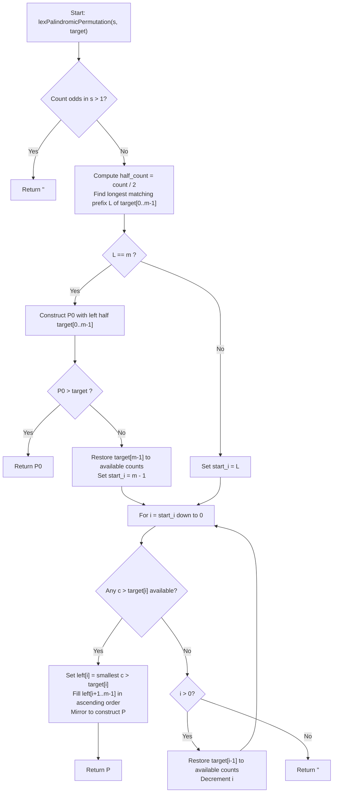

# 💡 Approach — Lexicographically Smallest Palindromic Permutation Greater Than Target

  | 📄 [Problem](./Problem.md) | 💡 [Approach](./Approach.md) | 🧩 [Solution](./Solution.cpp) | 🚀 [Main](./Main.cpp) |
  |:--------------------------:|:-----------------------------:|:------------------------------:|:---------------------:|

## 📊 Metadata

---

> [!TIP]
> **Core Algorithmic Insight — Palindrome Symmetry Reduction & Prefix Greed:**
> - Any palindromic string of length $n$ is completely governed by its **left half** of length $m = \lfloor n / 2 \rfloor$.
> - The characters that can populate the left half are **uniquely fixed**: each character $c$ must appear exactly $\lfloor \text{count}[c] / 2 \rfloor$ times. If $n$ is odd, the unique character with an odd frequency is uniquely constrained to occupy the center index $m$.
> - Because earlier characters carry higher lexicographical weight, minimizing the left half string $P[0 \dots m - 1]$ automatically minimizes the entire palindrome $P$.
> - Therefore, the problem reduces to finding the lexicographically smallest left half $L$ such that the full reconstructed palindrome $P > \text{target}$.

---

## 🧭 Intuition & Mathematical Proof

### 1. Palindrome Feasibility
A multiset of characters can form a palindrome if and only if:
- If $n$ is even: **zero** characters have odd frequencies ($\text{odd\_count} = 0$).
- If $n$ is odd: **exactly one** character has an odd frequency ($\text{odd\_count} = 1$).

If $\text{odd\_count} > 1$, no palindrome can ever be formed from $s$, so we immediately return `""`.

### 2. Left-Half Multiset Invariance
Let $m = \lfloor n / 2 \rfloor$. In any palindrome $P$ formed by rearranging $s$:
- For each $0 \le i < m$, $P[i] = P[n - 1 - i]$.
- Each character $c$ in the left half has a mirrored twin in the right half, contributing $2$ to the total count of $c$ in $s$.
- If $n$ is odd, the center character $P[m]$ is fixed to the unique character with $\text{count}[c] \pmod 2 == 1$.
- Hence, the left half $P[0 \dots m - 1]$ **must be an exact permutation** of the multiset:
  $$\text{half\_count}[c] = \left\lfloor \frac{\text{count}[c]}{2} \right\rfloor \quad \forall c \in ['a', 'z']$$

### 3. Lexicographical Priority: Left Half Determines Order
Suppose two distinct palindromes $A$ and $B$ have left halves $L_A$ and $L_B$.
- If $L_A \ne L_B$, let $k < m$ be the first index where $L_A[k] \ne L_B[k]$. Since $k < m < n$, this is also the first index where $A$ and $B$ differ.
- Thus, $A < B \iff L_A < L_B$.
- If $L_A == L_B$, then because the center (if any) is fixed and the right half is $\text{reverse}(L)$, $A$ and $B$ are identical!
- **Conclusion:** Minimizing the left half lexicographically is equivalent to minimizing the entire palindrome.

### 4. Two Mutually Exhaustive Paths

#### Path 1: Exact Left-Half Match ($L = m$)
Can we form $P[0 \dots m - 1] == \text{target}[0 \dots m - 1]$?
- If $\text{target}[0 \dots m - 1]$ can be formed using $\text{half\_count}$, then there is exactly **one** unique palindrome $P_0$ sharing this left half:
  $$P_0 = \text{target}[0 \dots m - 1] + (\text{odd\_char if odd}) + \text{reverse}(\text{target}[0 \dots m - 1])$$
- If $P_0 > \text{target}$, then $P_0$ matches $\text{target}$ on at least $m$ characters! Any other palindrome strictly greater than $\text{target}$ must diverge at some index $i < m$ with $P[i] > \text{target}[i] == P_0[i]$, which would make it strictly larger than $P_0$.
- Hence, if $P_0 > \text{target}$, **$P_0$ is guaranteed to be the optimal answer**.

#### Path 2: Divergence in the Left Half ($i < m$)
If $P_0$ does not exist or $P_0 \le \text{target}$, the first point of divergence must occur in the left half at some index $i < m$, with $P[i] > \text{target}[i]$.
- To make $P$ as small as possible, we want $P$ to share the longest possible prefix with $\text{target}$ (maximize $i$).
- Let $L$ be the length of the longest prefix of $\text{target}[0 \dots m - 1]$ constructible from $\text{half\_count}$.
- The divergence index $i$ must satisfy $i \le \min(L, m - 1)$.
- We sweep $i$ backward from $\min(L, m - 1)$ down to $0$:
  - At position $i$, we inspect available characters $c$ strictly greater than $\text{target}[i]$.
  - We pick the **smallest available** $c > \text{target}[i]$.
  - The remaining available characters for indices $i + 1 \dots m - 1$ are placed in **ascending order** ('a' to 'z') to minimize the suffix.
  - The full palindrome is then reconstructed and returned.
- If no such $i$ exists, return `""`.

---

## 🔩 Step-by-Step Breakdown

1. **Edge Cases & Validation:**
   - If $n == 0$, return `""`.
   - If $n == 1$, the only palindrome is $s$ itself; return $s > \text{target} ? s : ""$.
   - Compute character frequencies of $s$. Count characters with odd frequencies.
   - If $\text{odd\_count} > 1$, or $(\text{odd\_count} == 1 \land n \text{ is even})$, return `""`.

2. **Form Half Counts:**
   - Build $\text{half\_count}[c] = \text{count}[c] / 2$.
   - Compute the longest matching prefix length $L$ of $\text{target}[0 \dots m - 1]$.

3. **Check Identical Left Half ($L == m$):**
   - Construct $P_0 = \text{target}[0 \dots m - 1] + \text{center} + \text{reverse}(\text{target}[0 \dots m - 1])$.
   - If $P_0 > \text{target}$, return $P_0$.

4. **Backward Sweep for First Divergence:**
   - Set $\text{start\_i} = (L == m) ? m - 1 : L$.
   - If $L == m$, return $\text{target}[m - 1]$ to available counts before starting.
   - For $i = \text{start\_i}$ down to $0$:
     - Check if any $c \in [\text{target}[i] + 1, 'z']$ has available frequency.
     - If yes, assign $P[i] = c$, fill $P[i+1 \dots m - 1]$ in ascending order, construct full palindrome, and return.
     - If no, restore $\text{target}[i - 1]$ into available pool (if $i > 0$) and continue.

5. **Exhaustion:**
   - Return `""`.

---

## 🔄 Mermaid Flowchart

---

## 🏃‍♂️ Dry Run

### Example 1: `s = "baba"`, `target = "abba"`
- $n = 4, m = 2$.
- `count` = `{a: 2, b: 2}`, `half_count` = `{a: 1, b: 1}`.
- Match $\text{target}[0 \dots 1] = \text{"ab"}$: $L = 2 = m$.
- Check $P_0$: $P_0 = \text{"abba"}$.
- Is $P_0 > \text{"abba"}$? False ($P_0 == \text{target}$).
- Backward sweep from $i = m - 1 = 1$:
  - Restore $\text{target}[1] = 'b'$: available = `{b: 1}`.
  - $i = 1$: $\text{target}[1] = 'b'$. Available `{b: 1}`. None $> 'b'$.
  - Restore $\text{target}[0] = 'a'$: available = `{a: 1, b: 1}`.
  - $i = 0$: $\text{target}[0] = 'a'$. Smallest $c > 'a'$ is $'b'$.
  - Left half starts with $'b'$.
  - Remaining: `{a: 1}` $\implies$ left half = `"ba"`.
  - Reconstruct palindrome: `"ba"` + `"ab"` = **`"baab"`**.
- **Output:** `"baab"`.

---

### Example 4: `s = "aac"`, `target = "abb"`
- $n = 3, m = 1$.
- `count` = `{a: 2, c: 1}`, `odd_char` = `'c'`, `half_count` = `{a: 1}`.
- Match $\text{target}[0] = 'a'$: $L = 1 = m$.
- Check $P_0$: $P_0 = \text{"a"} + 'c' + \text{"a"} = \text{"aca"}$.
- Is $P_0 > \text{"abb"}$? Yes! ('c' > 'b' at index 1).
- **Output:** `"aca"`.

---

## 📊 Complexity Analysis

| Complexity Metric | Estimation | Rationale |
| :--- | :---: | :--- |
| **Time Complexity** | $\mathcal{O}(n \times \Sigma)$ | Matching prefix takes $\mathcal{O}(m) \le \mathcal{O}(n)$. The backward sweep visits at most $m$ positions, each checking at most $\Sigma = 26$ characters. Filling and mirroring takes $\mathcal{O}(n)$. With $\Sigma = 26$, total time is $\mathcal{O}(26n) \approx \mathcal{O}(n)$ time, easily running in under $1\text{ ms}$ for $n \le 300$. |
| **Auxiliary Space** | $\mathcal{O}(\Sigma)$ | Frequency tables of fixed size $26$ require $\mathcal{O}(1)$ auxiliary space. |

---

<h3>Happy Coding! 🚀</h3>

