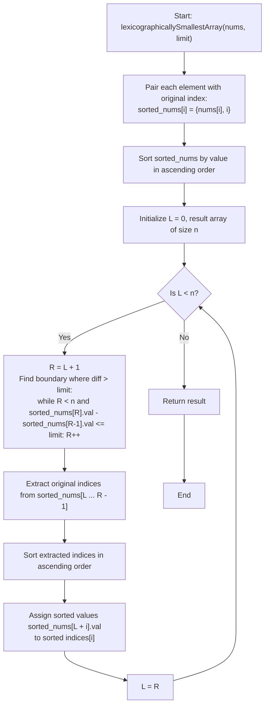

# 💡 Approach — Make Lexicographically Smallest Array by Swapping Elements

  | 📄 [Problem](./Problem.md) | 💡 [Approach](./Approach.md) | 🧩 [Solution](./Solution.cpp) | 🚀 [Main](./Main.cpp) |
  |:--------------------------:|:-----------------------------:|:------------------------------:|:---------------------:|

## 📊 Metadata

---

> [!TIP]
> **Core Algorithmic Insight — Transitivity of Swaps & Contiguous Sorted Components:**
> - **Transitivity of Permutations**: If element $A$ can swap with $B$ and $B$ can swap with $C$, then elements $\{A, B, C\}$ can be rearranged in **any arbitrary permutation** among their indices through a sequence of adjacent swaps.
> - **Contiguous Equivalence Classes**: When all array values are sorted in ascending order $v_0 \le v_1 \le \dots \le v_{n-1}$, two values $v_i$ and $v_{i+1}$ can swap if $v_{i+1} - v_i \le \text{limit}$. If $v_{k+1} - v_k > \text{limit}$, no element in $\{v_0, \dots, v_k\}$ can ever swap with any element in $\{v_{k+1}, \dots, v_{n-1}\}$. Thus, the connected components form **contiguous subsegments** in the sorted value array!
> - **Greedy Placement**: Within each connected component, we gather all original indices occupied by its elements and sort them ascending. Placing the smallest values into the smallest original indices guarantees the lexicographically minimal array.

---

## 🧭 Intuition & Mathematical Proof

### 1. Transitivity & Permutation Invariance
Consider an undirected graph $G = (V, E)$ where vertices represent the indices $\{0, 1, \dots, n-1\}$ and an edge exists between index $i$ and index $j$ if and only if $|\text{nums}[i] - \text{nums}[j]| \le \text{limit}$.
- A swap of $\text{nums}[i]$ and $\text{nums}[j]$ corresponds to a basic transposition in the symmetric group acting on the vertices of a connected component.
- In any connected component of size $k$, transpositions of connected vertices generate the full symmetric group $S_k$.
- Therefore, **any permutation** of the values residing in a connected component across its occupied indices can be achieved.

### 2. Contiguous Segments in Sorted Order
Constructing all pairs $(i, j)$ with $|\text{nums}[i] - \text{nums}[j]| \le \text{limit}$ explicitly would take $\mathcal{O}(n^2)$ time. However, sorting provides an $\mathcal{O}(n \log n)$ reduction:
- Let the sorted values be $v_0 \le v_1 \le v_2 \le \dots \le v_{n-1}$.
- Suppose $v_{k+1} - v_k \le \text{limit}$. Then $v_k$ and $v_{k+1}$ are directly connected. By transitivity, they belong to the same component.
- Now suppose $v_{k+1} - v_k > \text{limit}$. For any $a \le k$ and $b \ge k + 1$:
  $$v_b - v_a \ge v_{k+1} - v_k > \text{limit}$$
  Hence, no element from $\{v_0, \dots, v_k\}$ can connect directly to any element from $\{v_{k+1}, \dots, v_{n-1}\}$.
- Therefore, connected components partition the sorted array into **disjoint contiguous intervals** $[L, R - 1]$ separated by gaps strictly greater than $\text{limit}$.

### 3. Greedy Choice for Lexicographical Minimality
- Lexicographical comparison prioritizes smaller values at earlier indices (starting from index $0$).
- For any component with sorted original indices $\text{idx}_0 < \text{idx}_1 < \dots < \text{idx}_{k-1}$ and sorted values $\text{val}_0 \le \text{val}_1 \le \dots \le \text{val}_{k-1}$:
  - To minimize position $\text{idx}_0$, we must pick the minimum available value in the component, which is $\text{val}_0$.
  - To minimize position $\text{idx}_1$, we pick the minimum remaining value, $\text{val}_1$.
  - By induction, placing $\text{val}_j$ at $\text{idx}_j$ for all $0 \le j < k$ uniquely yields the lexicographically smallest configuration.

---

## 🔩 Step-by-Step Breakdown

1. **Pair Elements with Indices**:
   - Create a list of pairs: `sorted_nums[i] = {nums[i], i}`.

2. **Sort by Value**:
   - Sort `sorted_nums` in ascending order of value (`first`).

3. **Two-Pointer Component Grouping**:
   - Maintain a pointer $L = 0$.
   - Advance pointer $R$ while $R < n$ and `sorted_nums[R].first - sorted_nums[R - 1].first <= limit`.
   - The elements in range $[L, R - 1]$ belong to one connected component.

4. **Sort Indices and Assign**:
   - Extract the original indices from `sorted_nums[L ... R - 1]`.
   - Sort these indices in ascending order: `indices[0] < indices[1] < ... < indices[k - 1]`.
   - For each $0 \le i < k$, assign `result[indices[i]] = sorted_nums[L + i].first`.
   - Update $L = R$ and repeat until all elements are processed.

5. **Return Result**:
   - Return the reconstructed `result` array.

---

## 🔄 Mermaid Flowchart

---

## 🏃‍♂️ Dry Run

### Example 1: $\text{nums} = [1, 5, 3, 9, 8], \; \text{limit} = 2$

1. **Sorted Pairs** (Value, Original Index):
   $$(1, 0), \; (3, 2), \; (5, 1), \; (8, 4), \; (9, 3)$$

2. **Consecutive Differences**:
   - $3 - 1 = 2 \le 2$ (same group)
   - $5 - 3 = 2 \le 2$ (same group)
   - $8 - 5 = 3 > 2$ **(new group!)**
   - $9 - 8 = 1 \le 2$ (same group)

3. **Components & Assignments**:

| Component | Values | Original Indices | Sorted Indices | Final Assignment |
|:---:|:---:|:---:|:---:|:---|
| **$G_0$** | $[1, 3, 5]$ | $\{0, 2, 1\}$ | $[0, 1, 2]$ | $\text{res}[0] = 1, \; \text{res}[1] = 3, \; \text{res}[2] = 5$ |
| **$G_1$** | $[8, 9]$ | $\{4, 3\}$ | $[3, 4]$ | $\text{res}[3] = 8, \; \text{res}[4] = 9$ |

$$\text{Final Result} = [1, 3, 5, 8, 9]$$

---

### Example 2: $\text{nums} = [1, 7, 6, 18, 2, 1], \; \text{limit} = 3$

1. **Sorted Pairs**:
   $$(1, 0), \; (1, 5), \; (2, 4), \; (6, 2), \; (7, 1), \; (18, 3)$$

2. **Consecutive Differences**:
   - $1 - 1 = 0 \le 3$, $2 - 1 = 1 \le 3$ $\implies G_0$
   - $6 - 2 = 4 > 3$ $\implies$ **new group!**
   - $7 - 6 = 1 \le 3$ $\implies G_1$
   - $18 - 7 = 11 > 3$ $\implies$ **new group!** $G_2$

3. **Components & Assignments**:

| Component | Values | Original Indices | Sorted Indices | Final Assignment |
|:---:|:---:|:---:|:---:|:---|
| **$G_0$** | $[1, 1, 2]$ | $\{0, 5, 4\}$ | $[0, 4, 5]$ | $\text{res}[0] = 1, \; \text{res}[4] = 1, \; \text{res}[5] = 2$ |
| **$G_1$** | $[6, 7]$ | $\{2, 1\}$ | $[1, 2]$ | $\text{res}[1] = 6, \; \text{res}[2] = 7$ |
| **$G_2$** | $[18]$ | $\{3\}$ | $[3]$ | $\text{res}[3] = 18$ |

$$\text{Final Result} = [1, 6, 7, 18, 1, 2]$$

---

## 📊 Complexity Analysis

| Complexity Metric | Estimation | Rationale |
| :--- | :---: | :--- |
| **Time Complexity** | $\mathcal{O}(n \log n)$ | Sorting all $n$ elements initially takes $\mathcal{O}(n \log n)$ time. Finding contiguous component boundaries is a linear two-pointer scan taking $\mathcal{O}(n)$. Sorting the indices within each component takes $\sum \mathcal{O}(|G_k| \log |G_k|) \le \mathcal{O}(n \log n)$ since the components partition the $n$ indices. Total time is strictly $\mathcal{O}(n \log n)$. |
| **Auxiliary Space** | $\mathcal{O}(n)$ | We allocate an array of $n$ pairs for sorted values and indices, a temporary index buffer bounded by $n$, and the output array of size $n$. |

---

<h3>Happy Coding! 🚀</h3>

