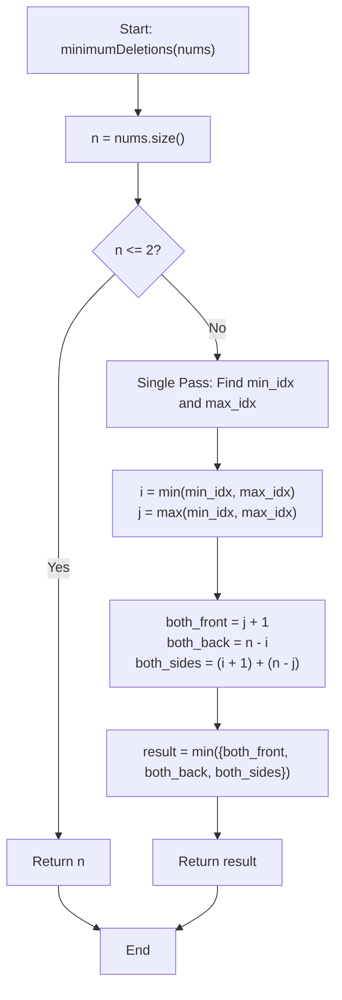

# 💡 Approach — Removing Minimum and Maximum From Array

<div align="center">

  | 📄 [Problem](./Problem.md) | 💡 [Approach](./Approach.md) | 🧩 [Solution](./Solution.cpp) | 🚀 [Main](./Main.cpp) |
  |:--------------------------:|:-----------------------------:|:------------------------------:|:---------------------:|
</div>

## 📊 Metadata


---

> [!TIP]
> **Core Algorithmic Insight — Greedy Choice Over 3 Independent Removal Scenarios:**
> - To remove two targets located at indices `min_idx` and `max_idx`, let $i = \min(\text{min\_idx}, \text{max\_idx})$ and $j = \max(\text{min\_idx}, \text{max\_idx})$ such that $0 \le i \le j < n$.
> - Because deletions can only occur from the **front** or the **back**, there are precisely three mutually exclusive and exhaustive ways to eliminate both elements:
>   1. **Both from the Front**: Delete all elements from index $0$ to $j$ inclusive $\implies j + 1$ deletions.
>   2. **Both from the Back**: Delete all elements from index $n - 1$ down to $i$ inclusive $\implies n - i$ deletions.
>   3. **Both Ends**: Delete from the front to reach $i$ ($i + 1$ deletions) and from the back to reach $j$ ($n - j$ deletions) $\implies (i + 1) + (n - j)$ deletions.
> - The optimal answer is simply the minimum of these three candidacies:
>   $$\text{min\_deletions} = \min(\,j + 1, \; n - i, \; (i + 1) + (n - j)\,)$$

---

## 🧭 Intuition & Mathematical Formulation

Let the array length be $n$.
We find the 0-based indices of the minimum element and the maximum element in a single pass:
$$\text{min\_idx} = \operatorname{argmin}_{0 \le k < n}(nums[k])$$
$$\text{max\_idx} = \operatorname{argmax}_{0 \le k < n}(nums[k])$$

Let $i = \min(\text{min\_idx}, \text{max\_idx})$ and $j = \max(\text{min\_idx}, \text{max\_idx})$.
Notice that $i \le j$.

```
Index:    0    ...    i    ...    j    ...    n - 1
Array:  [ x,   ...,  MIN,  ...,  MAX,  ...,     x   ]
          |<-- i+1 ->|             |<-- n-j -->|
          |<---------- j+1 ------->|
                     |<----------- n-i -------->|
```

### Deletion Options Breakdown:
1. **Remove both from Front:**
   - We delete elements at indices $0, 1, \dots, j$.
   - Since $i \le j$, deleting up to index $j$ automatically removes both elements $i$ and $j$.
   - Cost: $C_1 = j + 1$.

2. **Remove both from Back:**
   - We delete elements at indices $n - 1, n - 2, \dots, i$.
   - Since $j \ge i$, deleting backwards from $n - 1$ to $i$ automatically removes both elements.
   - Cost: $C_2 = n - i$.

3. **Remove $i$ from Front and $j$ from Back:**
   - Deleting from the front to remove $i$ takes $i + 1$ deletions (indices $0 \dots i$).
   - Deleting from the back to remove $j$ takes $n - j$ deletions (indices $j \dots n-1$).
   - Because $i \le j$, these two deletion segments never overlap (except when $i = j$ in $n = 1$, which is handled gracefully by $C_1 = 1$).
   - Cost: $C_3 = (i + 1) + (n - j)$.

Any other combination (e.g., removing $j$ from front and $i$ from back) would require deleting past each other, strictly costing $(j + 1) + (n - i) > n$, which is strictly suboptimal.

Hence:
$$\text{Result} = \min(C_1, C_2, C_3)$$

---

## 🔩 Step-by-Step Breakdown

1. **Handle Base Cases**:
   - If $n \le 2$, we must remove all elements to remove min and max, returning $n$.

2. **Find Indices of Min and Max**:
   - Iterate through `nums` once, keeping track of `min_idx` and `max_idx`.

3. **Order Indices**:
   - Let $i = \min(\text{min\_idx}, \text{max\_idx})$ and $j = \max(\text{min\_idx}, \text{max\_idx})$.

4. **Compute Candidate Deletions**:
   - `both_front = j + 1`
   - `both_back = n - i`
   - `both_sides = (i + 1) + (n - j)`

5. **Return Minimum**:
   - Return $\min(\{both\_front, both\_back, both\_sides\})$.

---

## 🔄 Mermaid Flowchart



---

## 🏃‍♂️ Dry Run

### Example 1: `nums = [2, 10, 7, 5, 4, 1, 8, 6]` ($n = 8$)

- Minimum value: `1` at index `5`
- Maximum value: `10` at index `1`
- Sorted indices: $i = 1$, $j = 5$

| Strategy | Formula | Calculation | Deletions |
|:---|:---|:---:|:---:|
| **Both from Front** | $j + 1$ | $5 + 1$ | $6$ |
| **Both from Back** | $n - i$ | $8 - 1$ | $7$ |
| **Both Sides** | $(i + 1) + (n - j)$ | $(1 + 1) + (8 - 5) = 2 + 3$ | **5** |

$\min(6, 7, 5) = \mathbf{5}$ ✅

---

### Example 2: `nums = [0, -4, 19, 1, 8, -2, -3, 5]` ($n = 8$)

- Minimum value: `-4` at index `1`
- Maximum value: `19` at index `2`
- Sorted indices: $i = 1$, $j = 2$

| Strategy | Formula | Calculation | Deletions |
|:---|:---|:---:|:---:|
| **Both from Front** | $j + 1$ | $2 + 1$ | **3** |
| **Both from Back** | $n - i$ | $8 - 1$ | $7$ |
| **Both Sides** | $(i + 1) + (n - j)$ | $(1 + 1) + (8 - 2) = 2 + 6$ | $8$ |

$\min(3, 7, 8) = \mathbf{3}$ ✅

---

### Example 3: `nums = [101]` ($n = 1$)

- Minimum value: `101` at index `0`
- Maximum value: `101` at index `0`
- Sorted indices: $i = 0$, $j = 0$
- $j + 1 = 1$, $n - i = 1$
- Result: $\mathbf{1}$ ✅

---

## 📊 Complexity Analysis

| Complexity Metric | Estimation | Rationale |
| :--- | :---: | :--- |
| **Time Complexity** | $\mathcal{O}(n)$ | Finding the indices of minimum and maximum elements requires a single pass over the array of size $n$. Evaluating the three mathematical candidate expressions takes $\mathcal{O}(1)$ constant time. Overall time is $\mathcal{O}(n)$. |
| **Auxiliary Space** | $\mathcal{O}(1)$ | Only a few integer variables (`min_idx`, `max_idx`, `i`, `j`) are used. No additional memory or allocations are required. |

---

> *"Simplicity is prerequisite for reliability."* — Edsger W. Dijkstra

---

<div align="center">
<h3>Happy Coding! 🚀</h3>
<a href="../214_Day/Approach.md">
  
</a>
<a href="https://x.com/PankajB42550" target="_blank">
  
</a>
<a href="../216_Day/Approach.md">
  
</a>
</div>
