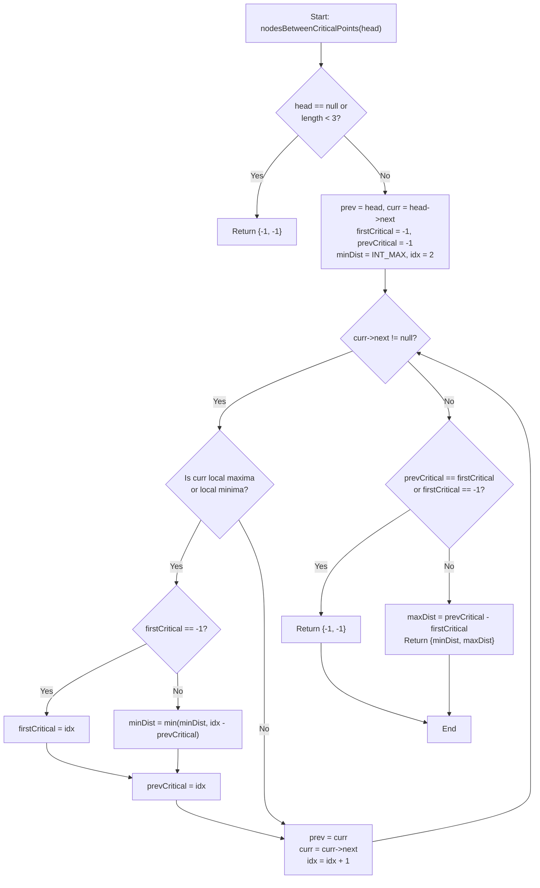

# 💡 Approach — Find the Minimum and Maximum Number of Nodes Between Critical Points

  | 📄 [Problem](./Problem.md) | 💡 [Approach](./Approach.md) | 🧩 [Solution](./Solution.cpp) | 🚀 [Main](./Main.cpp) |
  |:--------------------------:|:-----------------------------:|:------------------------------:|:---------------------:|

## 📊 Metadata

---

> [!TIP]
> **Core Algorithmic Insight — Single-Pass Pointer Traversal:**
> - A critical point requires both a predecessor and a successor. Neither the head nor the tail node can ever be a critical point.
> - As we iterate sequentially through the linked list, critical points are discovered in strictly increasing order of their position indices:
>   $$p_1 < p_2 < p_3 < \dots < p_k$$
> - **Maximum Distance Property:** Because the sequence is monotonically increasing, the maximum distance between *any* two critical points is unconditionally:
>   $$\text{maxDistance} = p_k - p_1 = \text{lastCritical} - \text{firstCritical}$$
> - **Minimum Distance Property:** The minimum difference between any pair in a sorted sequence must occur between two **adjacent** elements:
>   $$\text{minDistance} = \min_{2 \le j \le k} (p_j - p_{j-1})$$
> - Hence, there is no need to store all critical indices in a vector. Tracking just `firstCriticalIndex`, `prevCriticalIndex`, and a running `minDistance` yields an optimal $\mathcal{O}(n)$ time and $\mathcal{O}(1)$ auxiliary space algorithm!

---

## 🧭 Intuition & Mathematical Formulation

Let the nodes of the linked list be indexed $1, 2, \dots, n$.

### 1. Identifying a Critical Point
A node `curr` at index $i$ ($2 \le i \le n - 1$) is:
- **Local Maxima** if:
  $$\text{curr}\to\text{val} > \text{prev}\to\text{val} \quad \text{and} \quad \text{curr}\to\text{val} > \text{curr}\to\text{next}\to\text{val}$$
- **Local Minima** if:
  $$\text{curr}\to\text{val} < \text{prev}\to\text{val} \quad \text{and} \quad \text{curr}\to\text{val} < \text{curr}\to\text{next}\to\text{val}$$

### 2. Distance Calculations on the Fly
Let $idx$ be the index of the current critical node.
- If $firstCritical == -1$:
  - This is the very first critical point discovered. Set $firstCritical = idx$ and $prevCritical = idx$.
- Else:
  - Update $\text{minDist} = \min(\text{minDist}, \; idx - prevCritical)$.
  - Update $prevCritical = idx$.

### 3. Final Result
After traversing the entire list:
- If fewer than 2 critical points were found ($prevCritical == firstCritical$), return `[-1, -1]`.
- Otherwise, return:
  $$[\text{minDist}, \; prevCritical - firstCritical]$$

---

## 🔩 Step-by-Step Breakdown

1. **Check Base Edge Case**:
   - If `head == nullptr || head->next == nullptr || head->next->next == nullptr`, fewer than 3 nodes exist, so no critical point is possible. Return `[-1, -1]`.

2. **Initialize Pointers and State Variables**:
   - `prev = head`, `curr = head->next`
   - `firstCritical = -1`, `prevCritical = -1`
   - `minDist = INT_MAX`
   - `idx = 2` (1-based position of `curr`)

3. **Traverse While `curr->next != nullptr`**:
   - Check if `curr` is a local maxima: `(curr->val > prev->val && curr->val > curr->next->val)`.
   - Check if `curr` is a local minima: `(curr->val < prev->val && curr->val < curr->next->val)`.
   - If either condition is true:
     - If `firstCritical == -1`: set `firstCritical = idx`.
     - Else: set `minDist = min(minDist, idx - prevCritical)`.
     - Update `prevCritical = idx`.
   - Advance: `prev = curr`, `curr = curr->next`, `idx++`.

4. **Return Output**:
   - If `firstCritical == -1 || prevCritical == firstCritical`: return `{-1, -1}`.
   - Return `{minDist, prevCritical - firstCritical}`.

---

## 🔄 Mermaid Flowchart

---

## 🏃‍♂️ Dry Run

### Example 2: `head = [5, 3, 1, 2, 5, 1, 2]`

| Index ($idx$) | Prev Val | Curr Val | Next Val | Type | Condition Check | `firstCritical` | `prevCritical` | `minDist` |
|:---:|:---:|:---:|:---:|:---:|:---:|:---:|:---:|:---:|
| **2** | 5 | 3 | 1 | Neither | $3 < 5$ but $3 > 1$ | $-1$ | $-1$ | $\infty$ |
| **3** | 3 | 1 | 2 | **Local Minima** | $1 < 3$ and $1 < 2$ | **3** | **3** | $\infty$ |
| **4** | 1 | 2 | 5 | Neither | $2 > 1$ but $2 < 5$ | 3 | 3 | $\infty$ |
| **5** | 2 | 5 | 1 | **Local Maxima** | $5 > 2$ and $5 > 1$ | 3 | **5** | $\min(\infty, 5 - 3) = \mathbf{2}$ |
| **6** | 5 | 1 | 2 | **Local Minima** | $1 < 5$ and $1 < 2$ | 3 | **6** | $\min(2, 6 - 5) = \mathbf{1}$ |

- Traversal ends at index 6 (index 7 is the tail node).
- Critical points found at indices: $[3, 5, 6]$.
- `minDist` = $1$.
- `maxDist` = $prevCritical - firstCritical = 6 - 3 = \mathbf{3}$.
- Result: `[1, 3]` ✅

---

## 📊 Complexity Analysis

| Complexity Metric | Estimation | Rationale |
| :--- | :---: | :--- |
| **Time Complexity** | $\mathcal{O}(n)$ | Every node in the linked list of length $n$ is visited exactly once. Checking neighbours and updating distance variables is $\mathcal{O}(1)$. Total time is strictly $\mathcal{O}(n)$. |
| **Auxiliary Space** | $\mathcal{O}(1)$ | Only four scalar tracking variables (`prev`, `curr`, `firstCritical`, `prevCritical`, `minDist`) are maintained. No additional lists or arrays are allocated. |

---

<h3>Happy Coding! 🚀</h3>

