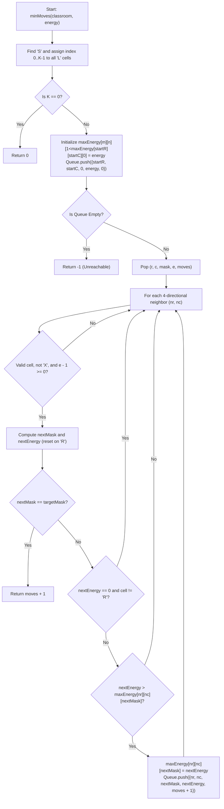

# 💡 Approach — Minimum Moves to Clean the Classroom

  | 📄 [Problem](./Problem.md) | 💡 [Approach](./Approach.md) | 🧩 [Solution](./Solution.cpp) | 🚀 [Main](./Main.cpp) |
  |:--------------------------:|:-----------------------------:|:------------------------------:|:---------------------:|

## 📊 Metadata

---

> [!TIP]
> **Core Algorithmic Insight — State Space Breadth-First Search (BFS) with Dominance Pruning:**
> - Because every move costs exactly 1 unit of distance and we want the **minimum number of moves**, standard **Breadth-First Search (BFS)** guarantees finding the shortest path when states are properly defined.
> - The state must capture:
>   1. Current position $(r, c)$
>   2. Set of collected litter items represented as an integer bitmask $\text{mask} \in [0, 2^K - 1]$ (where $K \le 10$)
>   3. Remaining energy $e \in [0, \text{energy}]$
> - **Dominance Pruning**: BFS visits states in non-decreasing order of moves. If we have already visited $(r, c, \text{mask})$ in fewer or equal moves with energy $e_{\text{prev}} \ge e_{\text{curr}}$, then the current branch is strictly dominated and can be safely pruned!
> - Maintaining a 3D table `maxEnergy[r][c][mask]` reduces the reachable state space dramatically to $\mathcal{O}(m \cdot n \cdot 2^K)$, enabling lightning-fast execution.

---

## 🧭 Intuition & State Transition Design

### 1. Identifying the Entities
- **Start Cell ('S')**: Exactly 1 starting position $(r_0, c_0)$.
- **Litter Cells ('L')**: Up to $K \le 10$ locations. Assign each litter cell an index $i \in [0, K - 1]$. The $i$-th bit of `mask` is 1 if litter $i$ has been collected.
- **Reset Cells ('R')**: Stepping on 'R' instantly restores energy to the maximum capacity `energy`. Can be visited multiple times.
- **Obstacle Cells ('X')**: Impassable walls.
- **Empty Cells ('.')**: Standard walkable tiles.

### 2. State Definition & Invariant
A state is represented as a tuple:
$$\text{State} = (r, c, \text{mask}, e, \text{moves})$$

Where:
- $(r, c)$: Student's coordinate in the grid ($0 \le r < m, 0 \le c < n$).
- $\text{mask}$: $K$-bit integer indicating which litters have been collected. Target mask is $(1 \ll K) - 1$.
- $e$: Current energy level ($0 \le e \le \text{energy}$).
- $\text{moves}$: Number of steps taken from start.

### 3. Transition Rules from $(r, c, \text{mask}, e)$:
For each of the 4 adjacent neighbors $(nr, nc) \in \{(r-1, c), (r+1, c), (r, c-1), (r, c+1)\}$:
1. **Boundary & Obstacle Checks**:
   Ensure $0 \le nr < m$, $0 \le nc < n$, and $\text{classroom}[nr][nc] \ne \text{'X'}$.
2. **Energy Depletion**:
   Moving consumes 1 energy: $e_{\text{rem}} = e - 1$. If $e_{\text{rem}} < 0$, the move cannot be made.
3. **Mask Update**:
   If cell is `'L'`, $\text{nextMask} = \text{mask} \mid (1 \ll \text{id}[nr][nc])$. Otherwise $\text{nextMask} = \text{mask}$.
4. **Energy Update**:
   If cell is `'R'`, $\text{nextEnergy} = \text{energy}$. Otherwise $\text{nextEnergy} = e_{\text{rem}}$.
5. **Goal Verification**:
   If $\text{nextMask} == (1 \ll K) - 1$, the goal is met! Return $\text{moves} + 1$ immediately.
6. **Continuation Condition**:
   If $\text{nextEnergy} == 0$ and the cell is not `'R'`, the student cannot make any subsequent moves from this cell, so we skip pushing it to the queue.
7. **Dominance Check**:
   If $\text{nextEnergy} > \text{maxEnergy}[nr][nc][\text{nextMask}]$:
   - Update $\text{maxEnergy}[nr][nc][\text{nextMask}] = \text{nextEnergy}$.
   - Push $(nr, nc, \text{nextMask}, \text{nextEnergy}, \text{moves} + 1)$ into the BFS queue.

---

## 🔄 Mermaid Flowchart

---

## 🏃‍♂️ Dry Run

### Example: `classroom = ["LS", "RL"], energy = 4`

- Start at $(0, 1)$ ('S') with energy $4$.
- Litter 0 at $(0, 0)$, Litter 1 at $(1, 1)$. $K = 2$, target mask $= (1 \ll 2) - 1 = 3$ (`0b11`).

| Move | From $(r, c)$ | To $(nr, nc)$ | Cell Type | Mask | Energy Before -> After | Action |
|:---:|:---:|:---:|:---:|:---:|:---:|:---|
| **0** | — | $(0, 1)$ | `'S'` | `00` | $4$ | Enqueue initial state |
| **1** | $(0, 1)$ | $(0, 0)$ | `'L'` | `01` | $4 - 1 = 3$ | Collect litter 0, mask becomes `01` |
| **1** | $(0, 1)$ | $(1, 1)$ | `'L'` | `10` | $4 - 1 = 3$ | Collect litter 1, mask becomes `10` |
| **2** | $(0, 0)$ | $(1, 0)$ | `'R'` | `01` | $3 - 1 = 2 \to \mathbf{4}$ | Reset energy to $4$ on `'R'` |
| **3** | $(1, 0)$ | $(1, 1)$ | `'L'` | `11` | $4 - 1 = 3$ | Collect litter 1, mask becomes `11` = **Target Mask!** |

Total moves: $\mathbf{3}$ ✅

---

## 📊 Complexity Analysis

| Complexity Metric | Estimation | Rationale |
| :--- | :---: | :--- |
| **Time Complexity** | $\mathcal{O}(m \cdot n \cdot 2^K)$ | There are at most $m \cdot n \cdot 2^K$ unique $(r, c, \text{mask})$ configurations. With dominance pruning, each cell-mask configuration is updated only when a strictly higher energy is discovered (at most a few times). With $m, n \le 20$ and $K \le 10$, total operations are bounded by $\approx 4 \times 10^5$, executing within milliseconds. |
| **Auxiliary Space** | $\mathcal{O}(m \cdot n \cdot 2^K)$ | 3D array `maxEnergy[20][20][1024]` requires $\approx 400 \times 1024 \times 4$ bytes $\approx 1.6 \text{ MB}$. |

---

<h3>Happy Coding! 🚀</h3>

