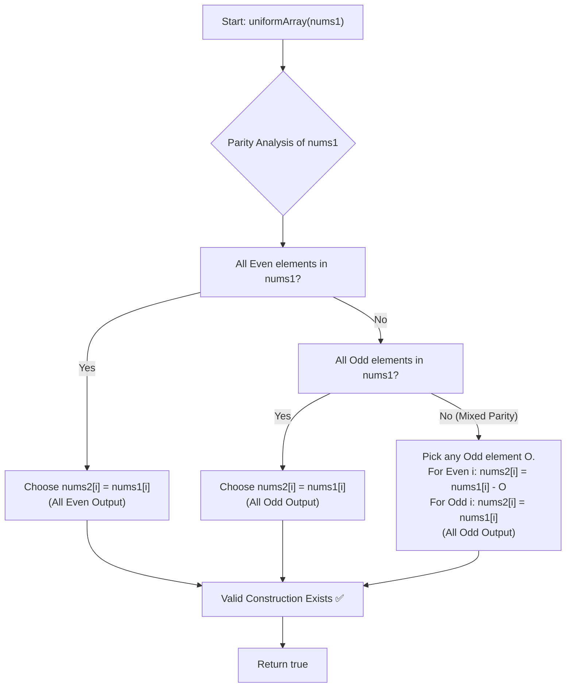

# 💡 Approach — Construct Uniform Parity Array I

  | 📄 [Problem](./Problem.md) | 💡 [Approach](./Approach.md) | 🧩 [Solution](./Solution.cpp) | 🚀 [Main](./Main.cpp) |
  |:--------------------------:|:-----------------------------:|:------------------------------:|:---------------------:|

## 📊 Metadata

---

> [!TIP]
> **Core Parity Insight — Unconditional Solvability:**
> - The problem allows us to either keep an element as `nums1[i]` or replace it with `nums1[i] - nums1[j]` for any $j \neq i$.
> - Recall the fundamental rules of integer parity arithmetic:
>   - $\text{even} - \text{even} = \textbf{even}$
>   - $\text{odd} - \text{odd} = \textbf{even}$
>   - $\text{even} - \text{odd} = \textbf{odd}$
>   - $\text{odd} - \text{even} = \textbf{odd}$
> - **Case 1 (All elements are already even):** We keep `nums2[i] = nums1[i]` for all $i$. All elements are **even**.
> - **Case 2 (All elements are already odd):** We keep `nums2[i] = nums1[i]` for all $i$. All elements are **odd**.
> - **Case 3 (Array contains both odd and even numbers):**
>   - Pick any odd number $nums1[j] = \text{odd}$.
>   - For every **odd** element $i$: set `nums2[i] = nums1[i]` ($\text{odd}$).
>   - For every **even** element $i$: set `nums2[i] = nums1[i] - nums1[j] = \text{even} - \text{odd} = \textbf{odd}`.
>   - Since $j \neq i$ (because $nums1[i]$ is even and $nums1[j]$ is odd), this operation is always strictly valid.
>   - Every element in `nums2` is now **odd**!
> - Therefore, regardless of the input array, a uniform parity array can **always** be constructed. The answer is **always `true`**.

---

## 🧭 Mathematical Proof & Parity Transition Table

Let $O$ denote an odd number and $E$ denote an even number present in `nums1`:

| Current State of `nums1` | Target Uniform Parity | Construction Strategy | Result Parity |
| :--- | :---: | :--- | :---: |
| **All Even** ($\forall x \in \text{nums1}, x \equiv 0 \pmod 2$) | **Even** | $nums2[i] = nums1[i]$ | All Even |
| **All Odd** ($\forall x \in \text{nums1}, x \equiv 1 \pmod 2$) | **Odd** | $nums2[i] = nums1[i]$ | All Odd |
| **Mixed** ($\exists O \text{ and } \exists E$) | **Odd** | - If $nums1[i]$ is odd $\to nums2[i] = nums1[i]$ - If $nums1[i]$ is even $\to nums2[i] = nums1[i] - O$ | All Odd |

Because the operations cover all possible input configurations without contradiction, it is **unconditionally guaranteed** to construct a valid array.

---

## 🔩 Step-by-Step Breakdown

1. **Recognize the Invariant**:
   - The existence of at least one odd number allows transforming any even number into an odd number via $(E - O = \text{odd})$.
   - The absence of odd numbers implies all numbers are even, which is already uniform.
2. **Constant Time Resolution**:
   - Since every possible configuration yields a valid `nums2`, immediately return `true`.

---

## 🔄 Mermaid Flowchart

---

## 🏃‍♂️ Dry Run

### Test Case 1: `nums1 = [2, 3]`
- Elements: $nums1[0] = 2$ (Even), $nums1[1] = 3$ (Odd)
- Mixed parity: pick odd element $O = nums1[1] = 3$.
- $nums2[0] = nums1[0] - nums1[1] = 2 - 3 = -1$ (Odd)
- $nums2[1] = nums1[1] = 3$ (Odd)
- Array $nums2 = [-1, 3]$ $\to$ Uniform Odd parity. $\implies \textbf{true}$ ✅

### Test Case 2: `nums1 = [4, 6]`
- Elements: $nums1[0] = 4$ (Even), $nums1[1] = 6$ (Even)
- All even: $nums2 = [4, 6]$ $\to$ Uniform Even parity. $\implies \textbf{true}$ ✅

### Test Case 3: `nums1 = [1, 5, 9]`
- Elements: All odd: $nums2 = [1, 5, 9]$ $\to$ Uniform Odd parity. $\implies \textbf{true}$ ✅

---

## 📊 Complexity Analysis

| Complexity Metric | Estimation | Rationale |
| :--- | :---: | :--- |
| **Time Complexity** | $\mathcal{O}(1)$ | Returns `true` in constant time without needing to iterate or construct the output array. |
| **Auxiliary Space** | $\mathcal{O}(1)$ | Requires $\mathcal{O}(1)$ additional memory. |

---

> *"The art of programming is the art of organizing complexity."* — **Edsger W. Dijkstra**

---

<h3>Happy Coding! 🚀</h3>

