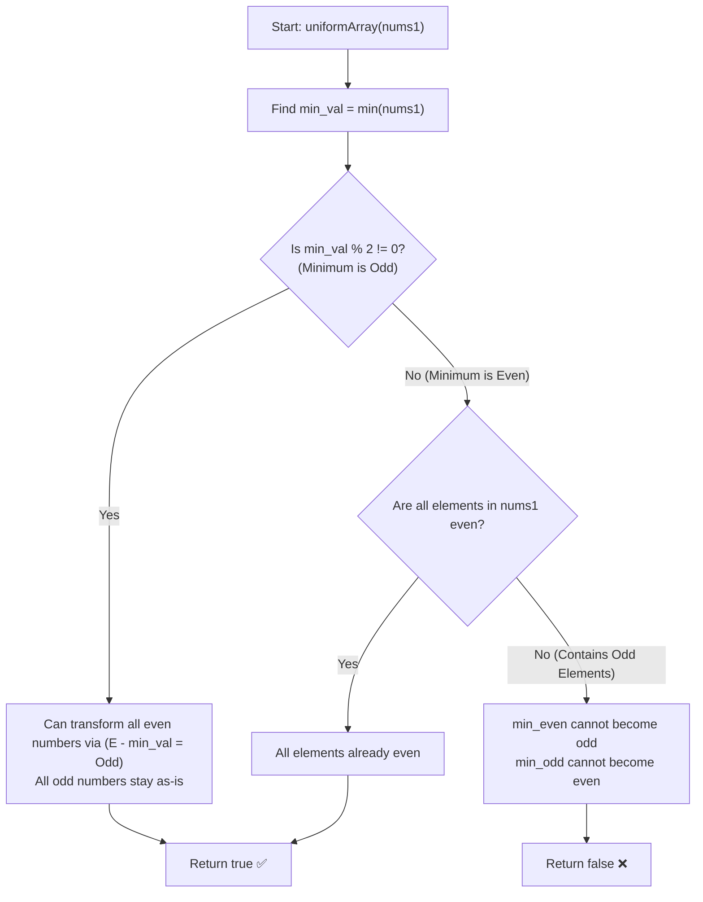

# 💡 Approach — Construct Uniform Parity Array II

  | 📄 [Problem](./Problem.md) | 💡 [Approach](./Approach.md) | 🧩 [Solution](./Solution.cpp) | 🚀 [Main](./Main.cpp) |
  |:--------------------------:|:-----------------------------:|:------------------------------:|:---------------------:|

## 📊 Metadata

---

> [!TIP]
> **Key Constraint Difference (Parity I vs Parity II):**
> - In **Part I**, we could subtract any element $nums1[j]$ without restriction.
> - In **Part II**, we can **only subtract a strictly smaller element**: $\text{nums1}[i] - \text{nums1}[j] \ge 1 \implies \text{nums1}[j] < \text{nums1}[i]$.
>
> **Parity Arithmetic Rules:**
> - $\text{Even} - \text{Even} = \textbf{Even}$
> - $\text{Odd} - \text{Odd} = \textbf{Even}$
> - $\text{Even} - \text{Odd} = \textbf{Odd}$
> - $\text{Odd} - \text{Even} = \textbf{Odd}$

---

## 🧭 Mathematical Proof & Parity Analysis

Let us evaluate the feasibility of achieving each of the two target parities:

### 1. Can we make all elements **ODD**?
- For an element $x \in \text{nums1}$:
  - If $x$ is **already odd**, we simply retain it: $\text{nums2}[i] = x$ (Odd).
  - If $x$ is **even**, to convert it to odd, we must subtract a smaller odd number $O < x$ (since $\text{Even} - \text{Odd} = \text{Odd}$).
  - For this to work for **all** even numbers in `nums1`, the smallest odd number $\text{min\_odd}$ must be strictly smaller than the smallest even number $\text{min\_even}$.
  - This means the **global minimum of `nums1` must be ODD**!
  - If the global minimum is odd, then for any even number $E$, $E > \text{min\_odd}$, so $E - \text{min\_odd} \ge 1$ and produces an odd number.
  - $\implies$ **If the minimum element is odd, we can always make all elements odd (Answer: `true`).**

---

### 2. Can we make all elements **EVEN**?
- For an element $x \in \text{nums1}$:
  - If $x$ is **already even**, we retain it: $\text{nums2}[i] = x$ (Even).
  - If $x$ is **odd**, to convert it to even, we must subtract a smaller odd number $O < x$ (since $\text{Odd} - \text{Odd} = \text{Even}$).
  - However, consider the **smallest odd number** $\text{min\_odd}$ in the array:
    - There is **no odd number strictly smaller** than $\text{min\_odd}$ in `nums1`.
    - Subtracting any smaller even number $E < \text{min\_odd}$ would yield $\text{Odd} - \text{Even} = \text{Odd}$ (still odd).
    - Thus, $\text{min\_odd}$ **can never be converted into an even number**!
  - Therefore, we can make all elements even **if and only if there are NO odd numbers** in `nums1` at all (i.e., all elements are already even).

---

## 🎯 Final Decision Rule

Let $\text{min\_val} = \min(\text{nums1})$:
1. If $\textbf{min\_val is ODD}$: Return $\textbf{true}$ (we can make all elements odd).
2. If $\textbf{min\_val is EVEN}$:
   - If **all elements are even**: Return $\textbf{true}$.
   - If **there is at least one odd element**: Return $\textbf{false}$ (the minimum even cannot become odd, and the smallest odd cannot become even).

---

## 🔄 Mermaid Flowchart

---

## 🏃‍♂️ Dry Run

| Test Case | Array `nums1` | `min_val` | `min_val` Parity | Has Odd Elements? | Decision | Result |
|:---:|:---|:---:|:---:|:---:|:---|:---:|
| **1** | `[1, 4, 7]` | $1$ | **Odd** | Yes ($1, 7$) | $4 - 1 = 3 \implies [1, 3, 7]$ all odd | `true` ✅ |
| **2** | `[2, 3]` | $2$ | **Even** | Yes ($3$) | $2$ cannot subtract; $3$ cannot be even | `false` ❌ |
| **3** | `[4, 6]` | $4$ | **Even** | No | All already even $\implies [4, 6]$ | `true` ✅ |
| **4** | `[5, 9, 3]` | $3$ | **Odd** | Yes (all) | All already odd | `true` ✅ |
| **5** | `[2, 10, 5]` | $2$ | **Even** | Yes ($5$) | $2$ cannot become odd, $5$ cannot become even | `false` ❌ |

---

## 📊 Complexity Analysis

| Complexity Metric | Estimation | Rationale |
| :--- | :---: | :--- |
| **Time Complexity** | $\mathcal{O}(n)$ | Finding the minimum and checking for odd elements takes at most a single linear pass $\mathcal{O}(n)$. |
| **Auxiliary Space** | $\mathcal{O}(1)$ | Only a few primitive scalar variables (`min_val`, loop variables) are used. |

---

> *"Constraints liberate, freeing the mind to focus on what is truly possible."*

---

<h3>Happy Coding! 🚀</h3>

