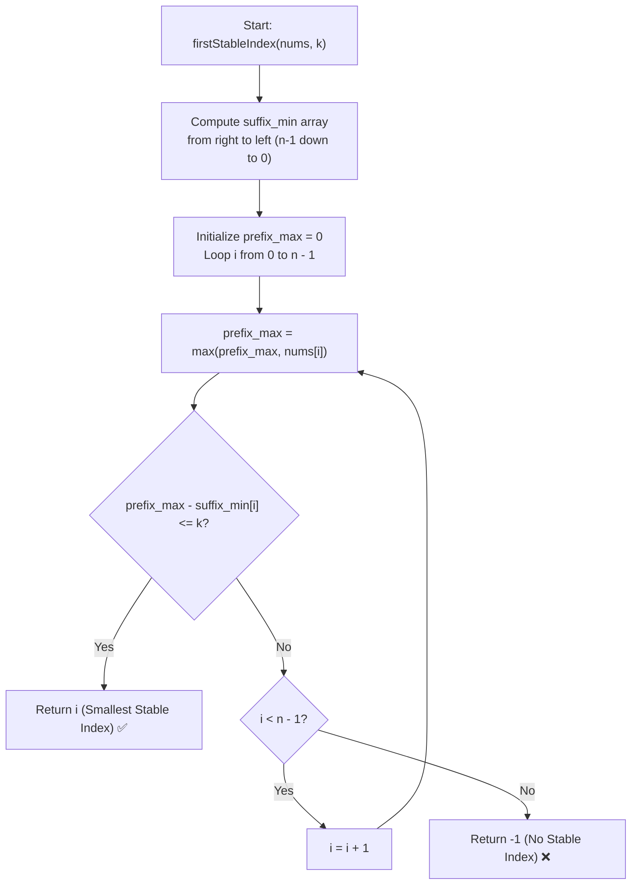

# 💡 Approach — Smallest Stable Index I

  | 📄 [Problem](./Problem.md) | 💡 [Approach](./Approach.md) | 🧩 [Solution](./Solution.cpp) | 🚀 [Main](./Main.cpp) |
  |:--------------------------:|:-----------------------------:|:------------------------------:|:---------------------:|

## 📊 Metadata

---

> [!TIP]
> **Core Intuition — Prefix Maximum & Suffix Minimum Decomposition:**
> - For any index $i \in [0, n - 1]$:
>   - $\text{max\_prefix}(i) = \max(\text{nums}[0 \dots i])$ is monotonically non-decreasing as $i$ increases.
>   - $\text{min\_suffix}(i) = \min(\text{nums}[i \dots n - 1])$ is the minimum element in the suffix from $i$ to $n-1$.
> - The instability score at index $i$ is defined as:
>   $$\text{score}(i) = \text{max\_prefix}(i) - \text{min\_suffix}(i)$$
> - By precomputing the suffix minimums in $\mathcal{O}(n)$ time and maintaining a running prefix maximum during a single forward pass, we can compute the instability score for every index $i$ in $\mathcal{O}(1)$ time.
> - The first (smallest) index $i$ where $\text{score}(i) \le k$ is our answer. If no such index satisfies the condition, return $-1$.

---

## 🔩 Step-by-Step Breakdown

1. **Precompute Suffix Minimums**:
   - Create an array `suffix_min` of size $n$.
   - Set $\text{suffix\_min}[n - 1] = \text{nums}[n - 1]$.
   - Iterate backwards from $i = n - 2$ down to $0$:
     $$\text{suffix\_min}[i] = \min(\text{nums}[i], \text{suffix\_min}[i + 1])$$

2. **Evaluate Instability Scores with Running Prefix Maximum**:
   - Initialize `prefix_max = nums[0]`.
   - Iterate forward from $i = 0$ to $n - 1$:
     - Update $\text{prefix\_max} = \max(\text{prefix\_max}, \text{nums}[i])$.
     - Calculate $\text{instability\_score} = \text{prefix\_max} - \text{suffix\_min}[i]$.
     - If $\text{instability\_score} \le k$, immediately return index $i$ as it is the smallest stable index.

3. **Fallback**:
   - If the loop completes without finding any stable index, return $-1$.

---

## 🔄 Mermaid Flowchart

---

## 🏃‍♂️ Dry Run

### Example 1: $\text{nums} = [5, 0, 1, 4]$, $k = 3$ ($n = 4$)

1. **Precomputing Suffix Minimums:**
   - $\text{suffix\_min}[3] = 4$
   - $\text{suffix\_min}[2] = \min(1, 4) = 1$
   - $\text{suffix\_min}[1] = \min(0, 1) = 0$
   - $\text{suffix\_min}[0] = \min(5, 0) = 0$
   - Array: $\text{suffix\_min} = [0, 0, 1, 4]$

2. **Forward Scan:**

| Index $i$ | $\text{nums}[i]$ | `prefix_max` | `suffix_min[i]` | Instability Score | $\le k=3$? | Action |
|:---:|:---:|:---:|:---:|:---:|:---:|:---:|
| **0** | $5$ | $5$ | $0$ | $5 - 0 = 5$ | ❌ No | Continue |
| **1** | $0$ | $5$ | $0$ | $5 - 0 = 5$ | ❌ No | Continue |
| **2** | $1$ | $5$ | $1$ | $5 - 1 = 4$ | ❌ No | Continue |
| **3** | $4$ | $5$ | $4$ | $5 - 4 = 1$ | ✅ Yes | **Return 3** |

**Final Answer:** $\mathbf{3}$ ✅

---

## 📊 Complexity Analysis

| Complexity Metric | Estimation | Rationale |
| :--- | :---: | :--- |
| **Time Complexity** | $\mathcal{O}(n)$ | Backward pass to compute suffix minimums takes $\mathcal{O}(n)$. Forward pass takes at most $\mathcal{O}(n)$. Overall time is strictly linear. |
| **Auxiliary Space** | $\mathcal{O}(n)$ | Storing the `suffix_min` array requires $\mathcal{O}(n)$ extra space. |

---

> *"Prefix and suffix decompositions turn global window queries into instant local lookups."*

---

<h3>Happy Coding! 🚀</h3>

