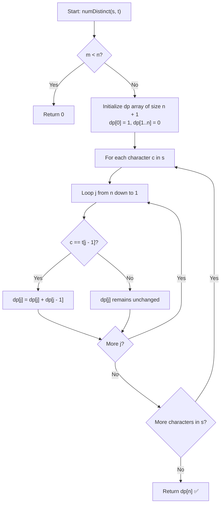

# 💡 Approach — Distinct Subsequences

  | 📄 [Problem](./Problem.md) | 💡 [Approach](./Approach.md) | 🧩 [Solution](./Solution.cpp) | 🚀 [Main](./Main.cpp) |
  |:--------------------------:|:-----------------------------:|:------------------------------:|:---------------------:|

## 📊 Metadata

---

> [!TIP]
> **Core Intuition — Dynamic Programming on String Prefixes:**
> - Let $s$ of length $m$ and $t$ of length $n$ be the source and target strings.
> - We want to find the number of subsequences of $s$ that equal $t$.
> - Let $\text{dp}[i][j]$ denote the number of distinct subsequences of prefix $s[0 \dots i-1]$ that equal prefix $t[0 \dots j-1]$.
> - **Base Cases:**
>   - $\text{dp}[i][0] = 1$ for all $0 \le i \le m$: An empty string $t$ is formed by exactly $1$ subsequence (the empty subsequence $\varepsilon$) from any prefix of $s$.
>   - $\text{dp}[0][j] = 0$ for all $j \ge 1$: A non-empty string $t$ cannot be formed from an empty source string $s$.
> - **State Transitions:**
>   - When evaluating character $s[i-1]$ against $t[j-1]$:
>     1. **If $s[i-1] == t[j-1]$:** We have two choices:
>        - *Match* $s[i-1]$ with $t[j-1]$: Subproblems reduce to finding $t[0 \dots j-2]$ in $s[0 \dots i-2]$, giving $\text{dp}[i-1][j-1]$ ways.
>        - *Skip* $s[i-1]$: Subproblems reduce to finding $t[0 \dots j-1]$ in $s[0 \dots i-2]$, giving $\text{dp}[i-1][j]$ ways.
>        $$\text{dp}[i][j] = \text{dp}[i-1][j-1] + \text{dp}[i-1][j]$$
>     2. **If $s[i-1] \ne t[j-1]$:** We cannot match the characters, so we must skip $s[i-1]$:
>        $$\text{dp}[i][j] = \text{dp}[i-1][j]$$
> - **Space Optimization:**
>   - Notice that $\text{dp}[i][j]$ depends only on the previous row $\text{dp}[i-1]$.
>   - By iterating $j$ in reverse order from $n$ down to $1$, we can compress the 2D DP table into a 1D array of size $n+1$, reducing space from $\mathcal{O}(m \cdot n)$ to $\mathcal{O}(n)$.

---

## 🔩 Step-by-Step Breakdown

1. **Edge Case Handling**:
   - Let $m = s.\text{length}()$ and $n = t.\text{length}()$.
   - If $m < n$, string $s$ is shorter than $t$, so return $0$.

2. **Initialize 1D DP Array**:
   - Create vector `dp` of size $n + 1$ with type `unsigned long long` (to prevent integer overflow during additions).
   - Set $\text{dp}[0] = 1$ (empty target has $1$ match).
   - Set $\text{dp}[j] = 0$ for all $1 \le j \le n$.

3. **Iterate Over Source Characters**:
   - For each character $c$ in string $s$:
     - Traverse target indices $j$ backwards from $n$ down to $1$:
       - If $c == t[j-1]$:
         $$\text{dp}[j] = \text{dp}[j] + \text{dp}[j-1]$$

4. **Return Result**:
   - Return $(\text{int})\text{dp}[n]$.

---

## 🔄 Mermaid Flowchart

---

## 🏃‍♂️ Dry Run

### Example 1: $s = \text{"rabbbit"}$, $t = \text{"rabbit"}$ ($m = 7, n = 6$)

Initial state: `dp = [1, 0, 0, 0, 0, 0, 0]`

| Step | Char $c$ | Target Matching | Updated `dp` Array `[ε, r, a, b, b, i, t]` |
|:---:|:---:|:---|:---|
| **0** | Initial | — | `[1, 0, 0, 0, 0, 0, 0]` |
| **1** | `'r'` | Matches `t[0]='r'` | `[1, 1, 0, 0, 0, 0, 0]` |
| **2** | `'a'` | Matches `t[1]='a'` | `[1, 1, 1, 0, 0, 0, 0]` |
| **3** | `'b'` | Matches `t[2]='b'` | `[1, 1, 1, 1, 0, 0, 0]` |
| **4** | `'b'` | Matches `t[3]='b'`, `t[2]='b'` | `[1, 1, 1, 2, 1, 0, 0]` |
| **5** | `'b'` | Matches `t[3]='b'`, `t[2]='b'` | `[1, 1, 1, 3, 3, 0, 0]` |
| **6** | `'i'` | Matches `t[4]='i'` | `[1, 1, 1, 3, 3, 3, 0]` |
| **7** | `'t'` | Matches `t[5]='t'` | `[1, 1, 1, 3, 3, 3, 3]` |

**Final Result:** $\text{dp}[6] = \mathbf{3}$ ✅

---

## 📊 Complexity Analysis

| Complexity Metric | Estimation | Rationale |
| :--- | :---: | :--- |
| **Time Complexity** | $\mathcal{O}(m \cdot n)$ | Nested loop iterates through $m$ characters of $s$ and $n$ characters of $t$. |
| **Auxiliary Space** | $\mathcal{O}(n)$ | Space-optimized 1D array of length $n + 1$. |

---

> *"Reverse traversal in 1D DP guarantees that previous states represent the prefix without the current character, enabling optimal $\mathcal{O}(n)$ memory."*

---

<h3>Happy Coding! 🚀</h3>

