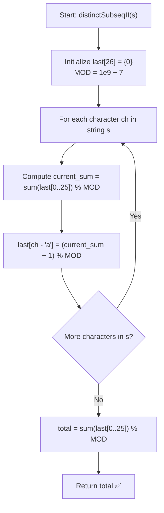

# 💡 Approach — Distinct Subsequences II

  | 📄 [Problem](./Problem.md) | 💡 [Approach](./Approach.md) | 🧩 [Solution](./Solution.cpp) | 🚀 [Main](./Main.cpp) |
  |:--------------------------:|:-----------------------------:|:------------------------------:|:---------------------:|

## 📊 Metadata

---

> [!TIP]
> **Core Intuition — Dynamic Programming by Ending Character:**
> - To avoid counting identical subsequences multiple times (e.g., when duplicate characters exist), we partition all non-empty distinct subsequences formed so far based on their **ending character**.
> - Let `last[c]` be the number of distinct subsequences formed so far that end with character $c \in \{'a', 'b', \dots, 'z'\}$.
> - When we process a new character $s[i]$:
>   - We can take **any** existing distinct subsequence (and also the empty subsequence $\varepsilon$) and append $s[i]$ to it to produce a new distinct subsequence ending in $s[i]$.
>   - The total number of non-empty distinct subsequences formed prior to $s[i]$ is $\sum_{c='a'}^{'z'} \text{last}[c]$.
>   - Adding the empty subsequence $\varepsilon$ gives $1 + \sum_{c='a'}^{'z'} \text{last}[c]$ possible subsequences ending in $s[i]$.
>   - Crucially, this set of newly formed subsequences completely **subsumes and replaces** all previous subsequences ending with $s[i]$.
>   - Therefore, we update:
>     $$\text{last}[s[i]] = \left( 1 + \sum_{c='a'}^{'z'} \text{last}[c] \right) \pmod{10^9 + 7}$$
> - After processing all characters in $s$, the total number of distinct non-empty subsequences is simply:
>   $$\text{Total} = \left( \sum_{c='a'}^{'z'} \text{last}[c] \right) \pmod{10^9 + 7}$$

---

## 🔩 Step-by-Step Breakdown

1. **Initialize Ending Character Counts**:
   - Define array `last[26]` initialized to $0$.
   - Define modulo constant $\text{MOD} = 10^9 + 7$.

2. **Iterate Through Each Character of `s`**:
   - For each character $c$ in string $s$:
     - Compute the sum of all current elements in `last`:
       $$\text{current\_sum} = \left( \sum_{j=0}^{25} \text{last}[j] \right) \pmod{\text{MOD}}$$
     - Update the count for character $c$:
       $$\text{last}[c - 'a'] = (\text{current\_sum} + 1) \pmod{\text{MOD}}$$

3. **Compute Final Answer**:
   - Sum all elements in `last` modulo $\text{MOD}$:
     $$\text{ans} = \left( \sum_{j=0}^{25} \text{last}[j] \right) \pmod{\text{MOD}}$$
   - Return $\text{ans}$.

---

## 🔄 Mermaid Flowchart

---

## 🏃‍♂️ Dry Run

### Example: $s = \text{"aba"}$

| Step $i$ | Char $s[i]$ | Previous Total $\sum \text{last}$ | New Subsequences Formed Ending in $s[i]$ | Updated `last` Table | Total Distinct Subsequences |
|:---:|:---:|:---:|:---|:---|:---:|
| **Initial** | — | $0$ | — | `last = {}` | $0$ |
| **0** | `'a'` | $0$ | Append `'a'` to $\{\varepsilon\} \rightarrow \{\text{"a"}\}$ | `last['a'] = 1` | $1$ |
| **1** | `'b'` | $1$ | Append `'b'` to $\{\varepsilon, \text{"a"}\} \rightarrow \{\text{"b"}, \text{"ab"}\}$ | `last['a'] = 1`, `last['b'] = 2` | $3$ |
| **2** | `'a'` | $3$ | Append `'a'` to $\{\varepsilon, \text{"a"}, \text{"b"}, \text{"ab"}\} \rightarrow \{\text{"a"}, \text{"aa"}, \text{"ba"}, \text{"aba"}\}$ | `last['a'] = 4`, `last['b'] = 2` | $6$ |

**Subsequences Breakdown:**
- Ending in `'a'`: `{"a", "aa", "ba", "aba"}` ($4$ subsequences)
- Ending in `'b'`: `{"b", "ab"}` ($2$ subsequences)
- **Total:** $4 + 2 = \mathbf{6}$ ✅

---

## 📊 Complexity Analysis

| Complexity Metric | Estimation | Rationale |
| :--- | :---: | :--- |
| **Time Complexity** | $\mathcal{O}(n)$ | We process $n$ characters. At each step, summing $26$ fixed values takes $\mathcal{O}(1)$ time. Overall time is $\mathcal{O}(26 \cdot n) = \mathcal{O}(n)$. |
| **Auxiliary Space** | $\mathcal{O}(1)$ | Array of size $26$ to store subsequence counts for each alphabet character. |

---

> *"By indexing dynamic programming states on the last added character, we avoid duplication by ensuring every prefix generated is uniquely identified by its most recent character extension."*

---

<h3>Happy Coding! 🚀</h3>

