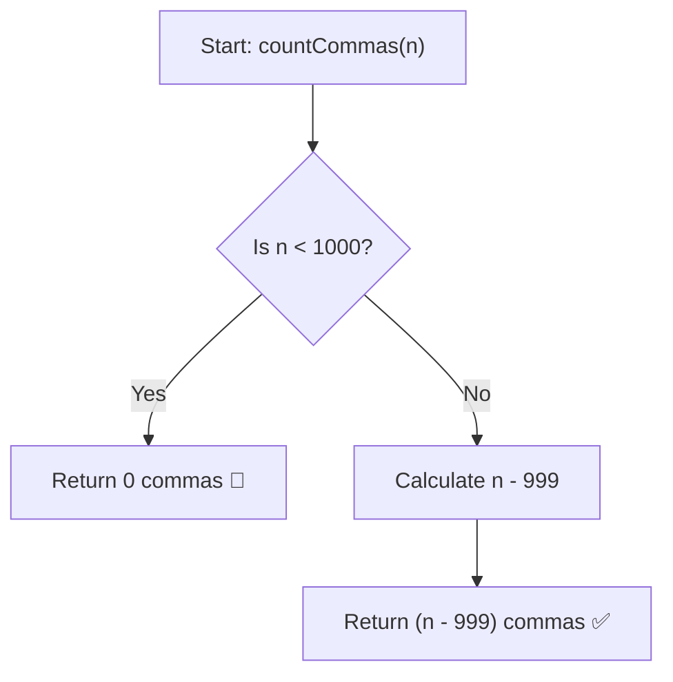

# 💡 Approach — Count Commas in Range

  | 📄 [Problem](./Problem.md) | 💡 [Approach](./Approach.md) | 🧩 [Solution](./Solution.cpp) | 🚀 [Main](./Main.cpp) |
  |:--------------------------:|:-----------------------------:|:------------------------------:|:---------------------:|

## 📊 Metadata

---

> [!TIP]
> **Core Intuition — Digit Group Threshold Counting:**
> - In standard number formatting, a comma is added after every group of 3 digits from the right.
> - Analyzing the number of digits:
>   - $1 \le x \le 999$ (1 to 3 digits): **0 commas**
>   - $1,000 \le x \le 999,999$ (4 to 6 digits): **1 comma**
>   - $1,000,000 \le x \le 999,999,999$ (7 to 9 digits): **2 commas**
>   - In general, every number $x \ge 10^{3k}$ contributes $+1$ comma for each thousand-multiplier tier $k \ge 1$.
> - For the given constraint $n \le 10^5$:
>   - All numbers in the range $[1, n]$ have at most 6 digits.
>   - Thus, any number $\ge 1000$ has exactly **1 comma**, and any number $< 1000$ has **0 commas**.
>   - If $n < 1000$, total commas $= 0$.
>   - If $n \ge 1000$, the numbers containing commas are precisely $[1000, n]$, which totals $n - 1000 + 1 = \mathbf{n - 999}$ commas.

---

## 🔩 Step-by-Step Breakdown

1. **Range Check**:
   - Check if $n < 1000$.
   - If true, no integer in $[1, n]$ has $\ge 4$ digits, so return `0`.

2. **Single Tier Calculation ($n \le 10^5$)**:
   - For $n \ge 1000$, every number from $1000$ to $n$ contains exactly $1$ comma.
   - Total commas $= n - 1000 + 1 = n - 999$.

3. **General Multi-Tier Formulation (Scale to any $n$)**:
   - For arbitrary large $n$, we sum over all tiers $T \in \{10^3, 10^6, 10^9, \dots\}$:
     $$\text{Total Commas} = \sum_{k=1}^{\infty} \max\big(0LL, n - 10^{3k} + 1\big)$$

---

## 🔄 Mermaid Flowchart

---

## 🏃‍♂️ Dry Run

| Input $n$ | Condition | Sub-ranges with Commas | Calculation | Output |
|:---:|:---:|:---|:---:|:---:|
| **998** | $998 < 1000$ | None ($[1, 998]$ all $< 4$ digits) | $0$ | **0** ✅ |
| **1000** | $1000 \ge 1000$ | $[1000, 1000]$ (1 number: "1,000") | $1000 - 999 = 1$ | **1** ✅ |
| **1002** | $1002 \ge 1000$ | $[1000, 1002]$ (3 numbers: "1,000", "1,001", "1,002") | $1002 - 999 = 3$ | **3** ✅ |
| **100000** | $100000 \ge 1000$ | $[1000, 100000]$ (99,001 numbers) | $100000 - 999 = 99001$ | **99001** ✅ |

---

## 📊 Complexity Analysis

| Complexity Metric | Estimation | Rationale |
| :--- | :---: | :--- |
| **Time Complexity** | $\mathcal{O}(1)$ | Simple closed-form arithmetic operation. |
| **Auxiliary Space** | $\mathcal{O}(1)$ | No extra memory or dynamic allocation required. |

---

> *"Understanding how periodic formatting breaks into geometric tiers turns counting into direct subtraction."*

---

<h3>Happy Coding! 🚀</h3>

