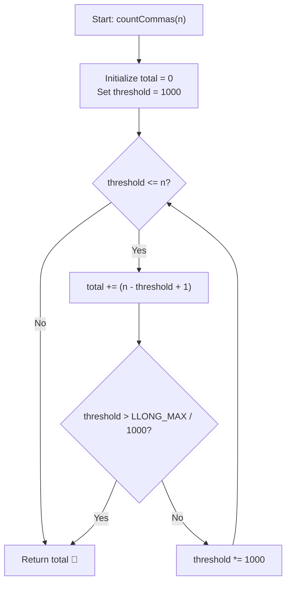

# 💡 Approach — Count Commas in Range II

  | 📄 [Problem](./Problem.md) | 💡 [Approach](./Approach.md) | 🧩 [Solution](./Solution.cpp) | 🚀 [Main](./Main.cpp) |
  |:--------------------------:|:-----------------------------:|:------------------------------:|:---------------------:|

## 📊 Metadata

---

> [!TIP]
> **Core Intuition — Tiered Threshold Decomposition:**
> - In standard number formatting, a comma is inserted every three digits from the right.
> - Consider which numbers contribute commas:
>   - Every number $x \ge 10^3 = 1,000$ contributes at least **1 comma** (for the thousands separator).
>   - Every number $x \ge 10^6 = 1,000,000$ contributes an additional **1 comma** (for the millions separator).
>   - Every number $x \ge 10^9 = 1,000,000,000$ contributes an additional **1 comma** (for the billions separator).
>   - Every number $x \ge 10^{3k}$ contributes $+1$ comma for each thousand-multiplier tier $k \ge 1$.
> - Instead of grouping by exact digit length (which requires tracking interval differences), we count the cumulative contribution of each threshold $T_k = 10^{3k}$:
>   $$\text{Total Commas} = \sum_{k=1, 10^{3k} \le n}^{\infty} (n - 10^{3k} + 1)$$
> - For $n \le 10^{15}$, the thresholds are $10^3, 10^6, 10^9, 10^{12}, 10^{15}$. There are at most **5 iterations**, making the algorithm strictly $\mathcal{O}(\log_{1000} n) \approx \mathcal{O}(1)$ time and space!

---

## 🔩 Step-by-Step Breakdown

1. **Initialize Counters**:
   - Set `total = 0LL`.
   - Set `threshold = 1000LL` ($10^3$).

2. **Iterate Across Geometric Thousand-Tiers**:
   - While `threshold <= n`:
     - The number of integers in $[1, n]$ that are $\ge \text{threshold}$ is $(n - \text{threshold} + 1)$.
     - Add $(n - \text{threshold} + 1)$ to `total`.
     - Check if multiplying by $1000$ will overflow `long long` (`if (threshold > LLONG_MAX / 1000) break`).
     - Multiply `threshold` by $1000$ (`threshold *= 1000`).

3. **Return Total Commas**:
   - Return `total`.

---

## 🔄 Mermaid Flowchart

---

## 🏃‍♂️ Dry Run

### Example 1: $n = 1002$

| Step | Threshold | Condition (`threshold <= n`) | Numbers in Tier $[threshold, n]$ | Added Commas | Cumulative `total` |
|:---:|:---:|:---:|:---:|:---:|:---:|
| $k = 1$ | $1,000$ | $1,000 \le 1002$ (True) | $1002 - 1000 + 1 = 3$ | $+3$ | $3$ |
| $k = 2$ | $1,000,000$ | $1,000,000 \le 1002$ (False) | — | — | **3** |

**Output:** `3` ✅

---

### Example 2: $n = 998$

| Step | Threshold | Condition (`threshold <= n`) | Numbers in Tier | Added Commas | Cumulative `total` |
|:---:|:---:|:---:|:---:|:---:|:---:|
| $k = 1$ | $1,000$ | $1,000 \le 998$ (False) | — | — | **0** |

**Output:** `0` ✅

---

### Example 3: $n = 1,000,005$

| Step | Threshold | Condition (`threshold <= n`) | Numbers in Tier | Added Commas | Cumulative `total` |
|:---:|:---:|:---:|:---:|:---:|:---:|
| $k = 1$ | $1,000$ | $1000 \le 1000005$ (True) | $1000005 - 1000 + 1 = 999,006$ | $+999,006$ | $999,006$ |
| $k = 2$ | $1,000,000$ | $1000000 \le 1000005$ (True) | $1000005 - 1000000 + 1 = 6$ | $+6$ | $999,012$ |
| $k = 3$ | $1,000,000,000$ | $10^9 \le 1000005$ (False) | — | — | **999,012** |

**Output:** `999012` ✅

---

## 📊 Complexity Analysis

| Complexity Metric | Estimation | Rationale |
| :--- | :---: | :--- |
| **Time Complexity** | $\mathcal{O}(\log_{1000} n) \approx \mathcal{O}(1)$ | For $n \le 10^{15}$, the loop executes at most 5 times. |
| **Auxiliary Space** | $\mathcal{O}(1)$ | Only standard 64-bit scalar variables (`long long`) are used. |

---

> *"Counting comma layers directly via geometric thresholds transforms range counting into simple constant-time prefix subtractions."*

---

<h3>Happy Coding! 🚀</h3>

