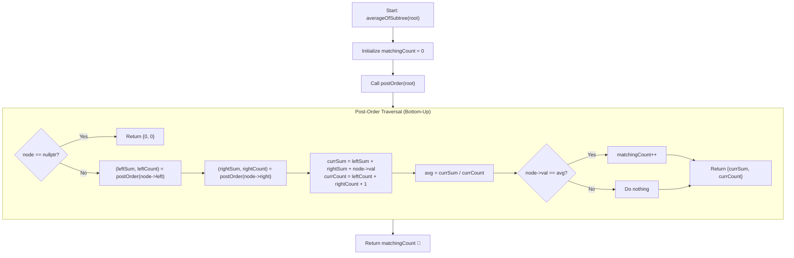

# 💡 Approach — Count Nodes Equal to Average of Subtree

<div align="center">

  | 📄 [Problem](./Problem.md) | 💡 [Approach](./Approach.md) | 🧩 [Solution](./Solution.cpp) | 🚀 [Main](./Main.cpp) |
  |:--------------------------:|:-----------------------------:|:------------------------------:|:---------------------:|
</div>

## 📊 Metadata


---

> [!TIP]
> **Core Intuition — Bottom-Up Post-Order Traversal (DFS):**
> - To determine if a node's value equals the average of its subtree, we must know two values from its subtree:
>   1. The **sum** of all node values in the subtree.
>   2. The **total count** of nodes in the subtree.
> - A naive approach calculating sum and count separately for each node takes $\mathcal{O}(N^2)$ time.
> - By adopting a **bottom-up post-order DFS** (`Left -> Right -> Root`), each subtree recursively returns a pair `(subtreeSum, subtreeCount)` to its parent.
> - The parent computes:
>   $$\text{currSum} = \text{leftSum} + \text{rightSum} + \text{node.val}$$
>   $$\text{currCount} = \text{leftCount} + \text{rightCount} + 1$$
>   $$\text{average} = \lfloor \frac{\text{currSum}}{\text{currCount}} \rfloor$$
> - If $\text{node.val} == \text{average}$, we increment the global matching counter.
> - This visits each tree node exactly once, reducing the time complexity to optimal $\mathcal{O}(N)$!

---

## 🔩 Step-by-Step Breakdown

1. **Initialize Global / Reference Result**:
   - Maintain an integer variable `matchingCount = 0` to record the number of valid subtree roots.

2. **Recursive DFS Function `postOrder(node)`**:
   - **Base Case**: If `node == nullptr`, return `{0, 0}` (sum = 0, count = 0).
   - **Recursive Step**:
     - Compute `(leftSum, leftCount) = postOrder(node->left)`.
     - Compute `(rightSum, rightCount) = postOrder(node->right)`.
   - **Aggregate Subtree Information**:
     - `currSum = leftSum + rightSum + node->val`
     - `currCount = leftCount + rightCount + 1`
   - **Evaluate Subtree Average**:
     - `avg = currSum / currCount`
     - If `node->val == avg`, increment `matchingCount++`.
   - **Return**: Pass `{currSum, currCount}` up to the parent caller.

3. **Entry Point Execution**:
   - Call `postOrder(root)` from the main method.
   - Return `matchingCount`.

---

## 🔄 Mermaid Flowchart



---

## 🏃‍♂️ Dry Run

### Tree: `[4, 8, 5, 0, 1, null, 6]`

```text
       4
     /   \
    8     5
   / \     \
  0   1     6
```

| Node | Left Subtree `(Sum, Count)` | Right Subtree `(Sum, Count)` | Subtree `Sum` | Subtree `Count` | Floor Average ($\lfloor \text{Sum}/\text{Count} \rfloor$) | Node Value | Valid? |
|:---:|:---:|:---:|:---:|:---:|:---:|:---:|:---:|
| **0** | `(0, 0)` | `(0, 0)` | $0 + 0 + 0 = 0$ | $0 + 0 + 1 = 1$ | $0 / 1 = 0$ | $0$ | ✅ Match (`+1`) |
| **1** | `(0, 0)` | `(0, 0)` | $0 + 0 + 1 = 1$ | $0 + 0 + 1 = 1$ | $1 / 1 = 1$ | $1$ | ✅ Match (`+1`) |
| **8** | `(0, 1)` | `(1, 1)` | $0 + 1 + 8 = 9$ | $1 + 1 + 1 = 3$ | $9 / 3 = 3$ | $8$ | ❌ ($3 \neq 8$) |
| **6** | `(0, 0)` | `(0, 0)` | $0 + 0 + 6 = 6$ | $0 + 0 + 1 = 1$ | $6 / 1 = 6$ | $6$ | ✅ Match (`+1`) |
| **5** | `(0, 0)` | `(6, 1)` | $0 + 6 + 5 = 11$ | $0 + 1 + 1 = 2$ | $11 / 2 = 5$ | $5$ | ✅ Match (`+1`) |
| **4** | `(9, 3)` | `(11, 2)` | $9 + 11 + 4 = 24$ | $3 + 2 + 1 = 6$ | $24 / 6 = 4$ | $4$ | ✅ Match (`+1`) |

**Total Matching Nodes:** $1 + 1 + 0 + 1 + 1 + 1 = 5$ ✅

---

## 📊 Complexity Analysis

| Complexity Metric | Estimation | Rationale |
| :--- | :---: | :--- |
| **Time Complexity** | $\mathcal{O}(N)$ | Every node is visited exactly once during the post-order depth-first traversal. |
| **Auxiliary Space** | $\mathcal{O}(H)$ | Space consumed by the recursive call stack, where $H$ is the height of the tree ($\mathcal{O}(N)$ worst-case for a skewed tree, $\mathcal{O}(\log N)$ for balanced). |

---

> *"By collecting subtree aggregates on the way back up in post-order, we eliminate redundant subtree re-evaluations and achieve strictly linear efficiency."*

---

<div align="center">
<h3>Happy Coding! 🚀</h3>
<a href="../225_Day/Approach.md">
  
</a>
<a href="https://x.com/PankajB42550" target="_blank">
  
</a>
<a href="../227_Day/Approach.md">
  
</a>
</div>
