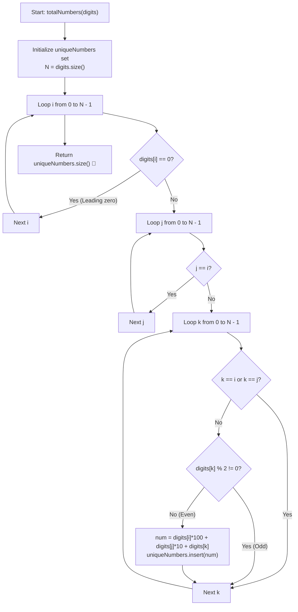

# 💡 Approach — Unique 3-Digit Even Numbers

  | 📄 [Problem](./Problem.md) | 💡 [Approach](./Approach.md) | 🧩 [Solution](./Solution.cpp) | 🚀 [Main](./Main.cpp) |
  |:--------------------------:|:-----------------------------:|:------------------------------:|:---------------------:|

## 📊 Metadata

---

> [!TIP]
> **Core Intuition — Permutations of 3 Distinct Index Triplet:**
> - We are asked to count the number of unique 3-digit even numbers formed by choosing 3 elements at distinct indices $(i, j, k)$ from `digits`.
> - A valid 3-digit number has the form:
>   $$\text{num} = \text{digits}[i] \times 100 + \text{digits}[j] \times 10 + \text{digits}[k]$$
> - **Condition 1 (No Leading Zero):** The hundreds digit must be non-zero ($\text{digits}[i] \neq 0$).
> - **Condition 2 (Even Number):** The units digit must be even ($\text{digits}[k] \pmod 2 == 0$).
> - **Condition 3 (Distinct Indices):** The indices $i, j, k$ must be pairwise distinct ($i \neq j$, $j \neq k$, $i \neq k$).
> - Because $N \le 10$, the maximum number of index triplets is at most $10 \times 9 \times 8 = 720$.
> - We can iterate over all distinct index triplets, form the number, validate the conditions, and insert valid numbers into a `std::unordered_set<int>` to eliminate duplicate numbers automatically.
> - Finally, the size of the set gives the count of distinct 3-digit even numbers.

---

## 🔩 Step-by-Step Breakdown

1. **Initialize a Hash Set**:
   - Create an `unordered_set<int> uniqueNumbers` to store distinct valid numbers.
   - Let $N$ be the size of `digits`.

2. **Enumerate All Index Triplets $(i, j, k)$**:
   - Loop $i$ from $0$ to $N - 1$:
     - If $\text{digits}[i] == 0$, continue (leading zeros not allowed).
     - Loop $j$ from $0$ to $N - 1$:
       - If $j == i$, continue (cannot reuse the same element index).
       - Loop $k$ from $0$ to $N - 1$:
         - If $k == i$ or $k == j$, continue (cannot reuse element indices).
         - If $\text{digits}[k] \% 2 \neq 0$, continue (must be an even number).
         - Form the integer: $\text{num} = \text{digits}[i] \times 100 + \text{digits}[j] \times 10 + \text{digits}[k]$.
         - Insert `num` into `uniqueNumbers`.

3. **Return Count**:
   - Return `uniqueNumbers.size()`.

---

## 🔄 Mermaid Flowchart

---

## 🏃‍♂️ Dry Run

### Example 1: `digits = [1, 2, 3, 4]`

- Available digits: `1, 2, 3, 4`.
- Valid hundreds digits ($i$): `1, 2, 3, 4` (all $\neq 0$).
- Valid units digits ($k$): `2, 4` (even).
- All distinct permutations:
  - Starting with `1`:
    - Units = `2`: tens $\in \{3, 4\} \implies 132, 142$
    - Units = `4`: tens $\in \{2, 3\} \implies 124, 134$
  - Starting with `2`:
    - Units = `4`: tens $\in \{1, 3\} \implies 214, 234$
  - Starting with `3`:
    - Units = `2`: tens $\in \{1, 4\} \implies 312, 342$
    - Units = `4`: tens $\in \{1, 2\} \implies 314, 324$
  - Starting with `4`:
    - Units = `2`: tens $\in \{1, 3\} \implies 412, 432$
- **Total Unique Numbers:** $\{124, 132, 134, 142, 214, 234, 312, 314, 324, 342, 412, 432\} \implies$ Count = **`12`** ✅

---

### Example 2: `digits = [0, 2, 2]`

- Triplet $(i=1, j=0, k=2) \implies \text{digits}[1]=2, \text{digits}[0]=0, \text{digits}[2]=2 \implies 202$
- Triplet $(i=1, j=2, k=0) \implies \text{digits}[1]=2, \text{digits}[2]=2, \text{digits}[0]=0 \implies 220$
- Triplet $(i=2, j=0, k=1) \implies 202$ (duplicate, filtered by Set)
- Triplet $(i=2, j=1, k=0) \implies 220$ (duplicate, filtered by Set)
- **Total Unique Numbers:** $\{202, 220\} \implies$ Count = **`2`** ✅

---

## 📊 Complexity Analysis

| Complexity Metric | Estimation | Rationale |
| :--- | :---: | :--- |
| **Time Complexity** | $\mathcal{O}(N^3) = \mathcal{O}(1)$ | For $N \le 10$, the 3 nested loops execute at most $10 \times 9 \times 8 = 720$ iterations, which runs in less than a millisecond. |
| **Auxiliary Space** | $\mathcal{O}(1)$ | The hash set stores at most 450 distinct 3-digit even numbers (between 100 and 998), requiring $\mathcal{O}(1)$ auxiliary space. |

---

> *"Enumerating index triplets directly enforces single-use constraints while the hash set seamlessly guarantees value uniqueness."*

---

<h3>Happy Coding! 🚀</h3>

