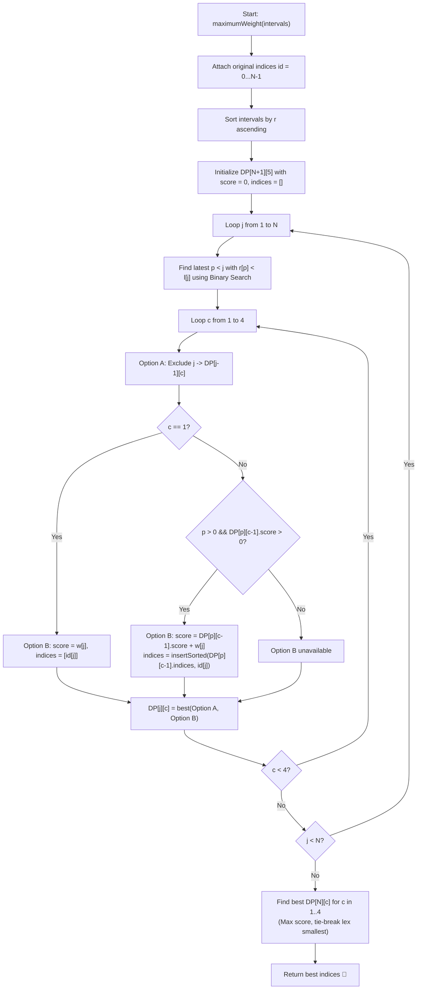

# 💡 Approach — Maximum Score of Non-overlapping Intervals

  | 📄 [Problem](./Problem.md) | 💡 [Approach](./Approach.md) | 🧩 [Solution](./Solution.cpp) | 🚀 [Main](./Main.cpp) |
  |:--------------------------:|:-----------------------------:|:------------------------------:|:---------------------:|

## 📊 Metadata

---

> [!TIP]
> **Core Intuition — Weighted Interval Scheduling DP with Lexicographical Tie-Breaking:**
> - We want to select at most $k=4$ non-overlapping intervals to maximize the total weight, breaking ties by choosing the lexicographically smallest sorted array of original indices.
> - **1. Right-Endpoint Sorting:** Sort all intervals primarily by right endpoint $r_i$ ascending (then by $l_i$, then by $id$). Sorting by right endpoint allows all compatible prior intervals for any interval $j$ to form a contiguous prefix $[0 \dots p]$.
> - **2. Binary Search (`findPrev`):** For interval $j$ with start coordinate $l_j$, use binary search to locate the latest compatible interval $p$ such that $r_p < l_j$. Since intervals sharing points are considered overlapping, we strictly require $r_p < l_j$.
> - **3. DP State Definition:**
>   - Let $DP[j][c]$ store a pair `(score, indices)` representing the best selection of exactly $c$ non-overlapping intervals ($1 \le c \le 4$) among the prefix of first $j$ intervals ($1$-indexed).
> - **4. DP Transitions:**
>   For each interval $j$ and count $c \in \{1, 2, 3, 4\}$:
>   - **Option A (Exclude interval $j$):** Take $DP[j-1][c]$.
>   - **Option B (Include interval $j$):**
>     - If $c = 1$: Score is $w_j$, indices are $\{id_j\}$.
>     - If $c > 1$: If $p \ge 1$ and $DP[p][c-1].\text{score} > 0$, new score is $DP[p][c-1].\text{score} + w_j$, and new indices are formed by inserting $id_j$ into the sorted list $DP[p][c-1].\text{indices}$.
>   - **Selection (`isBetter`):** Compare Option A vs Option B:
>     - Prefer higher score.
>     - If scores are identical, prefer the lexicographically smaller sorted index list.
> - **5. Global Best:** Compare the best results across all valid subset sizes $c \in \{1, 2, 3, 4\}$ from $DP[N][c]$ using the same comparison rule.

---

## 🔩 Step-by-Step Breakdown

1. **Augment and Sort Intervals**:
   - Create an array of struct/tuples `(l, r, weight, id)` storing the original 0-based index `id`.
   - Sort intervals primarily by right endpoint $r$ ascending.

2. **Precompute Compatible Predecessors via Binary Search**:
   - For each interval $j$ (at 1-based index $j$), find the largest 1-based index $p < j$ such that $r_p < l_j$.
   - If no such interval exists, $p = 0$.

3. **Compute DP Table**:
   - Initialize $DP[N+1][5]$ with score $0$ and empty index vectors.
   - For $j = 1$ to $N$:
     - For $c = 1$ to $4$:
       - Initialize candidate as $DP[j-1][c]$ (exclude interval $j$).
       - If $c == 1$:
         - Form candidate with score $w_j$ and indices $\{id_j\}$.
         - Update $DP[j][c] = \text{best}(DP[j][c], \text{candidate})$.
       - If $c > 1$ and $p > 0$ and $DP[p][c-1].\text{score} > 0$:
         - Form candidate with score $DP[p][c-1].\text{score} + w_j$ and indices `insertSorted(DP[p][c-1].indices, id_j)`.
         - Update $DP[j][c] = \text{best}(DP[j][c], \text{candidate})$.

4. **Extract Best Result**:
   - Initialize `bestResult` as an empty choice with score 0.
   - For $c = 1$ to $4$:
     - If $DP[N][c]$ is better than `bestResult`, update `bestResult = DP[N][c]`.
   - Return `bestResult.indices`.

---

## 🔄 Mermaid Flowchart

---

## 🏃‍♂️ Dry Run

### Example 1: `intervals = [[1,3,2],[4,5,2],[1,5,5],[6,9,3],[6,7,1],[8,9,1]]`

1. **Sorted Intervals by $r$**:
   - $j=1$: $[1, 3, 2]$, $id=0$, $r=3$
   - $j=2$: $[4, 5, 2]$, $id=1$, $r=5$
   - $j=3$: $[1, 5, 5]$, $id=2$, $r=5$
   - $j=4$: $[6, 7, 1]$, $id=4$, $r=7$
   - $j=5$: $[6, 9, 3]$, $id=3$, $r=9$
   - $j=6$: $[8, 9, 1]$, $id=5$, $r=9$

2. **DP Iterations**:

| $j$ | Interval $(l, r, w, id)$ | Compatible $p$ ($r_p < l$) | $c=1$ Best `(score, [ids])` | $c=2$ Best `(score, [ids])` | $c=3$ Best `(score, [ids])` | $c=4$ Best `(score, [ids])` |
|:---:|:---:|:---:|:---:|:---:|:---:|:---:|
| **1** | $[1, 3, 2], id=0$ | $0$ (none) | `(2, [0])` | `(0, [])` | `(0, [])` | `(0, [])` |
| **2** | $[4, 5, 2], id=1$ | $1$ ($r_1=3 < 4$) | `(2, [0])` | `(4, [0, 1])` | `(0, [])` | `(0, [])` |
| **3** | $[1, 5, 5], id=2$ | $0$ (none) | `(5, [2])` | `(4, [0, 1])` | `(0, [])` | `(0, [])` |
| **4** | $[6, 7, 1], id=4$ | $3$ ($r_3=5 < 6$) | `(5, [2])` | `(6, [2, 4])` | `(5, [0, 1, 4])` | `(0, [])` |
| **5** | $[6, 9, 3], id=3$ | $3$ ($r_3=5 < 6$) | `(5, [2])` | **`(8, [2, 3])`** | `(7, [0, 1, 3])` | `(0, [])` |
| **6** | $[8, 9, 1], id=5$ | $4$ ($r_4=7 < 8$) | `(5, [2])` | `(8, [2, 3])` | `(7, [0, 1, 3])` | `(0, [])` |

3. **Comparison Across $c \in \{1, 2, 3, 4\}$**:
   - $c=1$: `(5, [2])`
   - $c=2$: `(8, [2, 3])` $\leftarrow$ **Maximum Score = 8**
   - $c=3$: `(7, [0, 1, 3])`
   - $c=4$: `(0, [])`

- **Output:** **`[2, 3]`** ✅

---

## 📊 Complexity Analysis

| Complexity Metric | Estimation | Rationale |
| :--- | :---: | :--- |
| **Time Complexity** | $\mathcal{O}(N \log N)$ | Sorting $N$ intervals takes $\mathcal{O}(N \log N)$. For each of the $N$ intervals, binary search takes $\mathcal{O}(\log N)$, and updating 4 DP states takes $\mathcal{O}(1)$ time with vector sizes $\le 4$. |
| **Auxiliary Space** | $\mathcal{O}(N)$ | The DP table size is $(N+1) \times 5$, where each cell holds a scalar score and an index vector of size $\le 4$. Overall memory is $\approx 8\text{ MB}$, well within standard memory limits. |

---

> *"By pairing right-endpoint sorting with binary search, weighted interval scheduling extends seamlessly to bounded subset counts with strict lexicographical ordering."*

---

<h3>Happy Coding! 🚀</h3>

