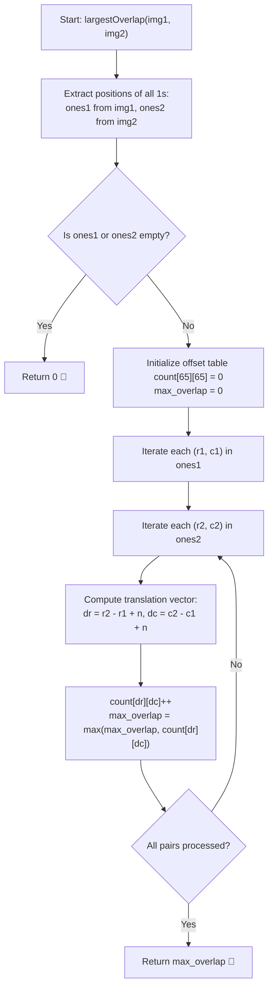

# 💡 Approach — Image Overlap

  | 📄 [Problem](./Problem.md) | 💡 [Approach](./Approach.md) | 🧩 [Solution](./Solution.cpp) | 🚀 [Main](./Main.cpp) |
  |:--------------------------:|:-----------------------------:|:------------------------------:|:---------------------:|

## 📊 Metadata

---

> [!TIP]
> **Core Intuition — Vector Offset Frequency Mapping:**
> - Instead of shifting all pixels of `img1` across all $(2n-1) \times (2n-1)$ possible offsets (which does redundant work over $0$s), we focus strictly on the coordinates where `1`s exist.
> - Let $P_1 = \{(r_1, c_1) \mid \text{img1}[r_1][c_1] = 1\}$ and $P_2 = \{(r_2, c_2) \mid \text{img2}[r_2][c_2] = 1\}$.
> - For any `1` at $(r_1, c_1)$ in `img1` to overlap with a `1` at $(r_2, c_2)$ in `img2`, the translation vector must be:
>   $$\Delta = (\Delta r, \Delta c) = (r_2 - r_1, c_2 - c_1)$$
> - If multiple pairs of `1`s $((r_1, c_1), (r_2, c_2))$ share the **exact same translation vector** $\Delta$, then applying the shift $(\Delta r, \Delta c)$ to `img1` will simultaneously align all of those `1`s with `img2`.
> - Therefore, the maximum overlap is simply the **maximum frequency** of any translation vector $\Delta$ among all pairs $(p_1, p_2) \in P_1 \times P_2$.
> - Since $\Delta r, \Delta c \in [-(n-1), n-1]$, we can use a direct 2D frequency table or flattened offset array for fast $\mathcal{O}(1)$ updates without hashing overhead.

---

## 🔩 Step-by-Step Breakdown

1. **Collect Positions of 1s**:
   - Traverse `img1` and collect coordinates $(r_1, c_1)$ of all `1`s into a list `ones1`.
   - Traverse `img2` and collect coordinates $(r_2, c_2)$ of all `1`s into a list `ones2`.

2. **Early Exit for Empty Images**:
   - If either `ones1` or `ones2` is empty, no overlap is possible; return `0`.

3. **Compute Translation Offsets**:
   - Create a 2D frequency array `offset_count[61][61]` initialized to `0`.
   - The shift range for both rows and columns is from $-(n-1)$ to $+(n-1)$.
   - We apply a bias $+n$ so that indices map to non-negative range $[1, 2n-1]$:
     $$\text{idx}_r = r_2 - r_1 + n, \quad \text{idx}_c = c_2 - c_1 + n$$

4. **Count Pair Translations**:
   - For every point $(r_1, c_1) \in \text{ones1}$:
     - For every point $(r_2, c_2) \in \text{ones2}$:
       - Increment `offset_count[r2 - r1 + n][c2 - c1 + n]`.
       - Track `max_overlap = max(max_overlap, offset_count[...][...])`.

5. **Return Result**:
   - Return `max_overlap`.

---

## 🔄 Mermaid Flowchart

---

## 🏃‍♂️ Dry Run

### Example 1: `img1` and `img2` of size $3 \times 3$

$$\text{img1} = \begin{bmatrix} 1 & 1 & 0 \\ 0 & 1 & 0 \\ 0 & 1 & 0 \end{bmatrix}, \quad \text{img2} = \begin{bmatrix} 0 & 0 & 0 \\ 0 & 1 & 1 \\ 0 & 0 & 1 \end{bmatrix}$$

- **`ones1`**: $(0,0), (0,1), (1,1), (2,1)$ (Size = 4)
- **`ones2`**: $(1,1), (1,2), (2,2)$ (Size = 3)

| $p_1 \in \text{ones1}$ | $p_2 \in \text{ones2}$ | Translation $(\Delta r, \Delta c)$ | Shifted Index $(\Delta r + 3, \Delta c + 3)$ | Current Count of Vector |
|:---:|:---:|:---:|:---:|:---:|
| $(0, 0)$ | $(1, 1)$ | $(+1, +1)$ | $(4, 4)$ | **1** |
| $(0, 0)$ | $(1, 2)$ | $(+1, +2)$ | $(4, 5)$ | 1 |
| $(0, 0)$ | $(2, 2)$ | $(+2, +2)$ | $(5, 5)$ | 1 |
| $(0, 1)$ | $(1, 1)$ | $(+1, 0)$ | $(4, 3)$ | 1 |
| $(0, 1)$ | $(1, 2)$ | $(+1, +1)$ | $(4, 4)$ | **2** |
| $(0, 1)$ | $(2, 2)$ | $(+2, +1)$ | $(5, 4)$ | 1 |
| $(1, 1)$ | $(1, 1)$ | $(0, 0)$ | $(3, 3)$ | 1 |
| $(1, 1)$ | $(1, 2)$ | $(0, +1)$ | $(3, 4)$ | 1 |
| $(1, 1)$ | $(2, 2)$ | $(+1, +1)$ | $(4, 4)$ | **3** |
| $(2, 1)$ | $(1, 1)$ | $(-1, 0)$ | $(2, 3)$ | 1 |
| $(2, 1)$ | $(1, 2)$ | $(-1, +1)$ | $(2, 4)$ | 1 |
| $(2, 1)$ | $(2, 2)$ | $(0, +1)$ | $(3, 4)$ | 2 |

- The vector $(\Delta r, \Delta c) = (+1, +1)$ has maximum frequency **3**.
- **Final Output:** **`3`** ✅

---

## 📊 Complexity Analysis

| Complexity Metric | Estimation | Rationale |
| :--- | :---: | :--- |
| **Time Complexity** | $\mathcal{O}(M_1 \cdot M_2 + n^2)$ | Scanning `img1` and `img2` takes $\mathcal{O}(n^2)$ time. Generating all pair differences takes $\mathcal{O}(M_1 \cdot M_2)$, where $M_1, M_2 \le n^2$. In the worst case ($M_1 = M_2 = n^2$), this is bounded by $n^4 \approx 8.1 \times 10^5$ operations (for $n=30$), which runs in $< 2\text{ms}$. |
| **Auxiliary Space** | $\mathcal{O}(M_1 + M_2 + n^2)$ | Storing the coordinate lists `ones1` and `ones2` takes $\mathcal{O}(M_1 + M_2) \le \mathcal{O}(n^2)$ space. The offset lookup grid is fixed at $\mathcal{O}(n^2)$ size. |

---

> *"Transforming global matrix operations into discrete coordinate differences turns quadratic grid sweeps into sharp point-wise frequency counts."*

---

<h3>Happy Coding! 🚀</h3>

