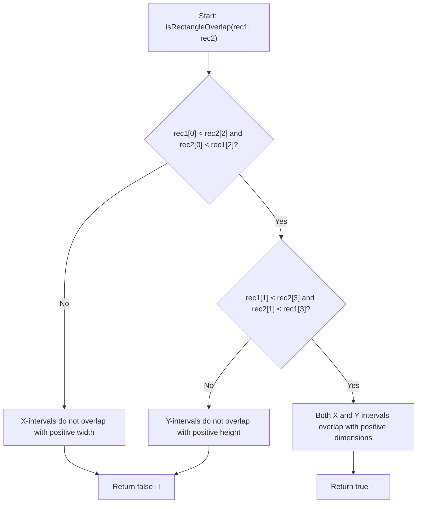

# 💡 Approach — Rectangle Overlap

  | 📄 [Problem](./Problem.md) | 💡 [Approach](./Approach.md) | 🧩 [Solution](./Solution.cpp) | 🚀 [Main](./Main.cpp) |
  |:--------------------------:|:-----------------------------:|:------------------------------:|:---------------------:|

## 📊 Metadata

---

> [!TIP]
> **Core Intuition — 1D Interval Projection (Separating Axis Theorem):**
> - An axis-aligned rectangle in 2D space is the Cartesian product of two 1D intervals:
>   $$\text{Rectangle} = [x_1, x_2] \times [y_1, y_2]$$
> - Two 2D rectangles overlap with **positive area** if and only if their 1D projections overlap with **positive length** along **both** axes:
>   1. **Horizontal Overlap ($X$-axis)**: The interval $[\text{rec1}[0], \text{rec1}[2]]$ overlaps with $[\text{rec2}[0], \text{rec2}[2]]$:
>      $$\max(\text{rec1}[0], \text{rec2}[0]) < \min(\text{rec1}[2], \text{rec2}[2]) \iff \text{rec1}[0] < \text{rec2}[2] \land \text{rec2}[0] < \text{rec1}[2]$$
>   2. **Vertical Overlap ($Y$-axis)**: The interval $[\text{rec1}[1], \text{rec1}[3]]$ overlaps with $[\text{rec2}[1], \text{rec2}[3]]$:
>      $$\max(\text{rec1}[1], \text{rec2}[1]) < \min(\text{rec1}[3], \text{rec2}[3]) \iff \text{rec1}[1] < \text{rec2}[3] \land \text{rec2}[1] < \text{rec1}[3]$$
> - Touching only on borders or corners produces an intersection width or height of $0$, which naturally yields strict inequality failure (`<` instead of $\le$), resulting in `false` as required.

---

## 🔩 Step-by-Step Breakdown

1. **Step 1: Check $X$-Axis Interval Overlap**:
   - The left edge of `rec1` must be to the left of the right edge of `rec2`: `rec1[0] < rec2[2]`.
   - The left edge of `rec2` must be to the left of the right edge of `rec1`: `rec2[0] < rec1[2]`.

2. **Step 2: Check $Y$-Axis Interval Overlap**:
   - The bottom edge of `rec1` must be below the top edge of `rec2`: `rec1[1] < rec2[3]`.
   - The bottom edge of `rec2` must be below the top edge of `rec1`: `rec2[1] < rec1[3]`.

3. **Step 3: Combine Conditions**:
   - Return `true` if and only if both $X$-axis overlap and $Y$-axis overlap conditions evaluate to `true`.

---

## 🔄 Mermaid Flowchart

---

## 🏃‍♂️ Dry Run

### Example 1: `rec1 = [0, 0, 2, 2]`, `rec2 = [1, 1, 3, 3]`

| Axis | Condition Checked | Evaluation | Result |
|:---:|:---|:---:|:---:|
| **X** | $\text{rec1}[0] < \text{rec2}[2] \implies 0 < 3$ | True | — |
| **X** | $\text{rec2}[0] < \text{rec1}[2] \implies 1 < 2$ | True | **X-Overlap: YES** |
| **Y** | $\text{rec1}[1] < \text{rec2}[3] \implies 0 < 3$ | True | — |
| **Y** | $\text{rec2}[1] < \text{rec1}[3] \implies 1 < 2$ | True | **Y-Overlap: YES** |

- Both axes overlap $\implies$ **`true`** ✅

---

### Example 2: `rec1 = [0, 0, 1, 1]`, `rec2 = [1, 0, 2, 1]`

| Axis | Condition Checked | Evaluation | Result |
|:---:|:---|:---:|:---:|
| **X** | $\text{rec1}[0] < \text{rec2}[2] \implies 0 < 2$ | True | — |
| **X** | $\text{rec2}[0] < \text{rec1}[2] \implies 1 < 1$ | **False** | **X-Overlap: NO** (Touching edge) |

- One axis fails positive overlap $\implies$ **`false`** ✅

---

## 📊 Complexity Analysis

| Complexity Metric | Estimation | Rationale |
| :--- | :---: | :--- |
| **Time Complexity** | $\mathcal{O}(1)$ | Constant number of primitive scalar comparisons ($4$ integer checks). |
| **Auxiliary Space** | $\mathcal{O}(1)$ | No dynamic memory allocation or auxiliary data structures required. |

---

> *"Decomposing multidimensional geometric interactions into independent orthogonal projections reduces complex boundary checks to simple interval overlaps."*

---

<h3>Happy Coding! 🚀</h3>

