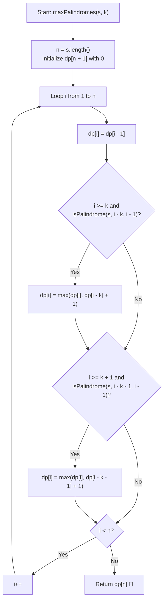

# 💡 Approach — Maximum Number of Non-overlapping Palindrome Substrings

  | 📄 [Problem](./Problem.md) | 💡 [Approach](./Approach.md) | 🧩 [Solution](./Solution.cpp) | 🚀 [Main](./Main.cpp) |
  |:--------------------------:|:-----------------------------:|:------------------------------:|:---------------------:|

## 📊 Metadata

---

> [!TIP]
> **Core Intuition — Minimal Length Reduction & Greedy / DP:**
> 1. **Shortest Valid Palindrome Observation**:
>    - Suppose a substring $s[l \dots r]$ is a palindrome with length $L \ge k$.
>    - If $L = k$ or $L = k + 1$, it is already a valid minimal candidate.
>    - If $L \ge k + 2$, stripping the outer characters yields $s[l + 1 \dots r - 1]$, which is also a palindrome of length $L - 2 \ge k$.
>    - By mathematical induction, **every palindrome of length $\ge k$ contains a concentric palindrome substring of length either $k$ or $k + 1$**.
>    - Since choosing an interval that ends earlier is always optimal (or at least as good) in interval scheduling, we **only need to check for palindromes of lengths $k$ and $k + 1$**.
> 2. **Dynamic Programming / Greedy Scheduling**:
>    - Let `dp[i]` denote the maximum number of non-overlapping valid palindrome substrings in the prefix $s[0 \dots i - 1]$.
>    - For each position $i$ from $1$ to $n$:
>      - **Option 1 (Skip)**: We can skip character $s[i - 1]$: `dp[i] = dp[i - 1]`.
>      - **Option 2 (Length $k$)**: If $i \ge k$ and $s[i - k \dots i - 1]$ is a palindrome, we can take it: `dp[i] = max(dp[i], dp[i - k] + 1)`.
>      - **Option 3 (Length $k + 1$)**: If $i \ge k + 1$ and $s[i - k - 1 \dots i - 1]$ is a palindrome, we can take it: `dp[i] = max(dp[i], dp[i - k - 1] + 1)`.
>    - The final answer is `dp[n]`.

---

## 🔩 Step-by-Step Breakdown

1. **Helper Function `isPalindrome(s, l, r)`**:
   - Compares characters from both ends moving inward: `s[l] == s[r]` until $l \ge r$.
   - Takes $\mathcal{O}(k)$ time for a candidate window of length $k$ or $k + 1$.

2. **DP Array Setup**:
   - Create `vector<int> dp(n + 1, 0)` where `n = s.length()`.
   - Base case: `dp[0] = 0`.

3. **Prefix DP Transitions**:
   - Iterate $i$ from $1$ to $n$:
     - `dp[i] = dp[i - 1]`
     - If $i \ge k$ and `isPalindrome(s, i - k, i - 1)` is `true`:
       $$\text{dp}[i] = \max(\text{dp}[i], \text{dp}[i - k] + 1)$$
     - If $i \ge k + 1$ and `isPalindrome(s, i - k - 1, i - 1)` is `true`:
       $$\text{dp}[i] = \max(\text{dp}[i], \text{dp}[i - (k + 1)] + 1)$$

4. **Return Answer**:
   - Return `dp[n]`.

---

## 🔄 Mermaid Flowchart

---

## 🏃‍♂️ Dry Run

### Example 1: `s = "abaccdbbd"`, $k = 3$, $n = 9$

| $i$ | Substring at $i-1$ | Length $k=3$ Palindrome? | Length $k+1=4$ Palindrome? | `dp[i]` |
|:---:|:---:|:---:|:---:|:---:|
| 0 | `""` | — | — | 0 |
| 1 | `s[0] = 'a'` | — | — | 0 |
| 2 | `s[1] = 'b'` | — | — | 0 |
| 3 | `s[2] = 'a'` | `s[0..2] = "aba"` (Yes! `dp[0]+1=1`) | — | **1** |
| 4 | `s[3] = 'c'` | `s[1..3] = "bac"` (No) | `s[0..3] = "abac"` (No) | 1 |
| 5 | `s[4] = 'c'` | `s[2..4] = "acc"` (No) | `s[1..4] = "bacc"` (No) | 1 |
| 6 | `s[5] = 'd'` | `s[3..5] = "ccd"` (No) | `s[2..5] = "accd"` (No) | 1 |
| 7 | `s[6] = 'b'` | `s[4..6] = "cdb"` (No) | `s[3..6] = "ccdb"` (No) | 1 |
| 8 | `s[7] = 'b'` | `s[5..7] = "dbb"` (No) | `s[4..7] = "cdbb"` (No) | 1 |
| 9 | `s[8] = 'd'` | `s[6..8] = "bbd"` (No) | `s[5..8] = "dbbd"` (Yes! `dp[5]+1 = 1+1=2`) | **2** |

- **Final Answer:** `dp[9] = 2` (Substrings chosen: `"aba"` and `"dbbd"`) ✅

---

## 📊 Complexity Analysis

| Complexity Metric | Estimation | Rationale |
| :--- | :---: | :--- |
| **Time Complexity** | $\mathcal{O}(n \cdot k)$ | For each index $i \in [1, n]$, palindrome checking of lengths $k$ and $k + 1$ requires $\mathcal{O}(k)$ time. With $n \le 2000$, total operations $\approx 2000 \times 2000 \approx 4 \times 10^6 \ll 10^8$ (well under 5 ms). |
| **Auxiliary Space** | $\mathcal{O}(n)$ | Storing the `dp` vector of size $n + 1$. |

---

> *"Any expansive palindrome is born from a minimal seed of length $k$ or $k + 1$; greedily harvesting these minimal seeds yields the globally optimal count."*

---

<h3>Happy Coding! 🚀</h3>

