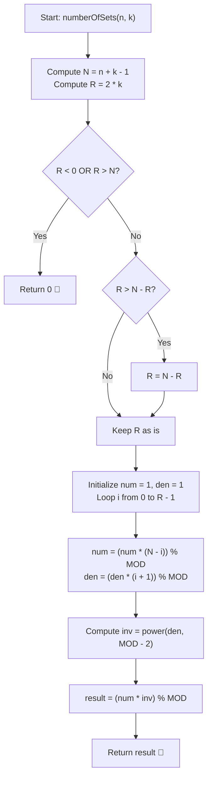

# 💡 Approach — Number of Sets of K Non-Overlapping Line Segments

<div align="center">

  | 📄 [Problem](./Problem.md) | 💡 [Approach](./Approach.md) | 🧩 [Solution](./Solution.cpp) | 🚀 [Main](./Main.cpp) |
  |:--------------------------:|:-----------------------------:|:------------------------------:|:---------------------:|
</div>

## 📊 Metadata


---

> [!TIP]
> **Core Intuition — Combinatorial Bijection via Coordinate Shift:**
> 1. We need to choose $k$ line segments $(s_1, e_1), (s_2, e_2), \dots, (s_k, e_k)$ on the integer line $0, 1, \dots, n-1$.
> 2. Each segment must have non-zero length ($s_m < e_m$), cannot overlap, but **may share endpoints** ($e_m \le s_{m+1}$):
>    $$0 \le s_1 < e_1 \le s_2 < e_2 \le s_3 < \dots \le s_k < e_k \le n - 1$$
> 3. Notice the non-strict inequalities $e_m \le s_{m+1}$. We can transform this into a **strictly increasing sequence** of $2k$ distinct integers by shifting coordinates:
>    $$\begin{aligned}
>    s'_m &= s_m + (m - 1) \\
>    e'_m &= e_m + (m - 1)
>    \end{aligned}$$
> 4. Under this transformation, the inequalities become strictly increasing:
>    $$0 \le s'_1 < e'_1 < s'_2 < e'_2 < \dots < s'_k < e'_k \le (n - 1) + (k - 1) = n + k - 2$$
> 5. Choosing $2k$ strictly distinct points from the integer range $[0, n + k - 2]$ (which contains $n + k - 1$ points) is given directly by the binomial coefficient:
>    $$\text{Total Ways} = \binom{n + k - 1}{2k} \pmod{10^9 + 7}$$

---

## 🔩 Step-by-Step Breakdown

1. **Calculate Combinatorial Parameters**:
   - Total items $N = n + k - 1$.
   - Items to choose $R = 2k$.

2. **Modular Combinations Calculation ($\binom{N}{R} \pmod{10^9 + 7}$)**:
   - If $R < 0$ or $R > N$, return $0$.
   - Utilize symmetry: if $R > N - R$, set $R = N - R$.
   - Compute numerator: $\prod_{i=0}^{R-1} (N - i) \pmod{10^9 + 7}$.
   - Compute denominator: $\prod_{i=0}^{R-1} (i + 1) \pmod{10^9 + 7}$.

3. **Modular Inverse via Fermat's Little Theorem**:
   - Since $\text{MOD} = 10^9 + 7$ is prime, compute $\text{denominator}^{-1} \equiv \text{denominator}^{\text{MOD} - 2} \pmod{\text{MOD}}$ using binary exponentiation in $\mathcal{O}(\log \text{MOD})$ time.

4. **Return Answer**:
   - Return $(\text{numerator} \times \text{denominator}^{-1}) \pmod{10^9 + 7}$.

---

## 🔄 Mermaid Flowchart



---

## 🏃‍♂️ Dry Run

### Example 1: $n = 4, k = 2$

- $N = n + k - 1 = 4 + 2 - 1 = 5$
- $R = 2k = 2 \times 2 = 4$
- We need to compute $\binom{5}{4}$:

| Iteration ($i$) | $N - i$ | Running `num` | $i + 1$ | Running `den` |
|:---:|:---:|:---:|:---:|:---:|
| $i = 0$ | $5 - 0 = 5$ | $1 \times 5 = 5$ | $1$ | $1 \times 1 = 1$ |
| $i = 1$ | $5 - 1 = 4$ | $5 \times 4 = 20$ | $2$ | $1 \times 2 = 2$ |
| $i = 2$ | $5 - 2 = 3$ | $20 \times 3 = 60$ | $3$ | $2 \times 3 = 6$ |
| $i = 3$ | $5 - 3 = 2$ | $60 \times 2 = 120$ | $4$ | $6 \times 4 = 24$ |

- $\text{num} = 120$, $\text{den} = 24$
- $\text{Result} = \frac{120}{24} = 5$ ✅

### The 5 Visual Configurations on Points $\{0, 1, 2, 3\}$:
```
1.  [0 ====== 2] [2 === 3]        -> {(0, 2), (2, 3)}
2.  [0 === 1]    [1 ======= 3]    -> {(0, 1), (1, 3)}
3.  [0 === 1]    [2 === 3]        -> {(0, 1), (2, 3)}
4.  [1 === 2]    [2 === 3]        -> {(1, 2), (2, 3)}
5.  [0 === 1]    [1 === 2]        -> {(0, 1), (1, 2)}
```

---

## 📊 Complexity Analysis

| Complexity Metric | Estimation | Rationale |
| :--- | :---: | :--- |
| **Time Complexity** | $\mathcal{O}(k)$ | Iterating up to $R = 2k$ takes $2k$ modular multiplications, plus one $\mathcal{O}(\log \text{MOD})$ call for modular inversion. Overall time is $\mathcal{O}(k + \log \text{MOD}) = \mathcal{O}(k)$. |
| **Auxiliary Space** | $\mathcal{O}(1)$ | Only a few `long long` variables are allocated for arithmetic accumulation. |

---

> *"Transforming touching boundaries into disjoint choices reduces complex sequential segment arrangements to a single combination formula."*

---

<div align="center">
<h3>Happy Coding! 🚀</h3>
<a href="../231_Day/Approach.md">
  
</a>
<a href="https://x.com/PankajB42550" target="_blank">
  
</a>
<a href="../233_Day/Approach.md">
  
</a>
</div>
