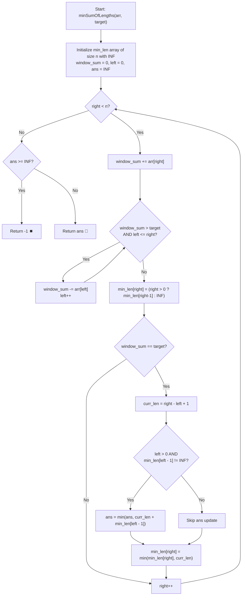

# 💡 Approach — Find Two Non-overlapping Sub-arrays Each With Target Sum

  | 📄 [Problem](./Problem.md) | 💡 [Approach](./Approach.md) | 🧩 [Solution](./Solution.cpp) | 🚀 [Main](./Main.cpp) |
  |:--------------------------:|:-----------------------------:|:------------------------------:|:---------------------:|

## 📊 Metadata

---

> [!TIP]
> **Core Intuition — Sliding Window & Dynamic Programming Prefix Minimums:**
> 1. **Monotonicity from Positive Elements:** Because all elements are strictly positive ($\text{arr}[i] \ge 1$), subarray sums grow strictly monotonically as the right boundary expands. This enables a classic two-pointer **Sliding Window** to find every subarray summing to `target` in amortized $\mathcal{O}(1)$ per element.
> 2. **Non-overlapping Invariant:** Suppose a valid subarray is found spanning indices $[\text{left}, \text{right}]$ with $\sum = \text{target}$ and length $L = \text{right} - \text{left} + 1$. Any preceding non-overlapping valid subarray must completely end at or before index $\text{left} - 1$.
> 3. **Dynamic Programming Memoization:** We maintain an array `min_len[i]` that stores the minimum length among all valid subarrays ending at or before index $i$:
>    $$\text{min\_len}[i] = \min(\text{min\_len}[i - 1], \text{length of valid subarray ending at } i)$$
> 4. **Pair Evaluation:** At each valid window $[\text{left}, \text{right}]$, if $\text{left} > 0$ and $\text{min\_len}[\text{left} - 1] \neq \infty$, we form a candidate pair of total length:
>    $$\text{total} = L + \text{min\_len}[\text{left} - 1]$$
>    We update the global minimum with $\min(\text{ans}, \text{total})$.

---

## 🔩 Step-by-Step Breakdown

1. **State & Table Initialization**:
   - Let $n = \text{arr.size}()$.
   - Create a DP array `min_len` of size $n$, initialized to $\infty$ (`1e9`).
   - Initialize `window_sum = 0`, `left = 0`, and `ans = 1e9`.

2. **Sliding Window Sweep**:
   - Iterate `right` from $0$ to $n - 1$:
     - Add $\text{arr}[\text{right}]$ to `window_sum`.
     - While `window_sum > target` and `left <= right`:
       - Subtract $\text{arr}[\text{left}]$ from `window_sum`.
       - Increment `left++`.
     - Carry forward the prefix minimum length from the previous position:
       $$\text{min\_len}[\text{right}] = (\text{right} > 0) \ ? \ \text{min\_len}[\text{right} - 1] : \infty$$
     - If `window_sum == target`:
       - Subarray length is $\text{curr\_len} = \text{right} - \text{left} + 1$.
       - Check if a valid non-overlapping subarray existed earlier:
         - If $\text{left} > 0$ and $\text{min\_len}[\text{left} - 1] \neq \infty$:
           $$\text{ans} = \min(\text{ans}, \text{curr\_len} + \text{min\_len}[\text{left} - 1])$$
       - Update the prefix minimum at index `right`:
         $$\text{min\_len}[\text{right}] = \min(\text{min\_len}[\text{right}], \text{curr\_len})$$

3. **Final Result**:
   - If `ans >= 1e9`, return $-1$ (less than two non-overlapping valid subarrays exist).
   - Otherwise, return `ans`.

---

## 🔄 Mermaid Flowchart

---

## 🏃‍♂️ Dry Run

### Example 1: `arr = [3, 2, 2, 4, 3]`, `target = 3`

- Initial: `ans = INF`, `left = 0`, `window_sum = 0`, `min_len = [INF, INF, INF, INF, INF]`

| `right` | `arr[right]` | `left` | `window_sum` | `window_sum == target` | `curr_len` | Non-overlapping Check (`left > 0`) | `ans` | `min_len[right]` |
|:---:|:---:|:---:|:---:|:---:|:---:|:---:|:---:|:---:|
| 0 | 3 | 0 | 3 | **Yes** (left=0) | $0 - 0 + 1 = 1$ | $0 > 0$ is False | `INF` | $\min(\infty, 1) = 1$ |
| 1 | 2 | 1 | 2 | No | - | - | `INF` | `min_len[0] = 1` |
| 2 | 2 | 2 | 2 | No | - | - | `INF` | `min_len[1] = 1` |
| 3 | 4 | 4 | 0 | No | - | - | `INF` | `min_len[2] = 1` |
| 4 | 3 | 4 | 3 | **Yes** (left=4) | $4 - 4 + 1 = 1$ | $4 > 0 \implies \text{min\_len}[3] = 1$ | $\min(\infty, 1 + 1) = 2$ | $\min(1, 1) = 1$ |

- **Minimum Combined Length:** `2` ✅

---

## 📊 Complexity Analysis

| Complexity Metric | Estimation | Rationale |
| :--- | :---: | :--- |
| **Time Complexity** | $\mathcal{O}(n)$ | The `right` pointer increments $n$ times. The `left` pointer increments at most $n$ times across the entire loop. All window adjustments and DP transitions are $\mathcal{O}(1)$. |
| **Auxiliary Space** | $\mathcal{O}(n)$ | The `min_len` prefix array requires $\mathcal{O}(n)$ space. No extra hash map overhead or rehashing costs are incurred. |

---

> *"Decomposing non-overlapping subproblems across monotonic partitions turns a quadratic pair search into two coordinated linear scans."*

---

<h3>Happy Coding! 🚀</h3>

