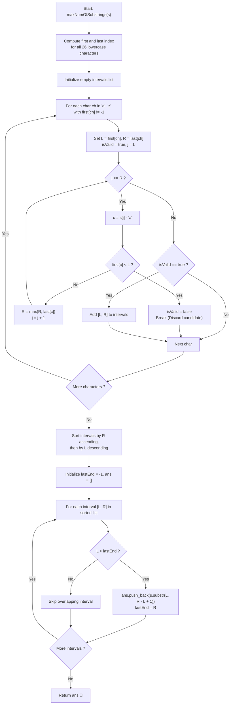

# 💡 Approach — Maximum Number of Non-Overlapping Substrings

<div align="center">

  | 📄 [Problem](./Problem.md) | 💡 [Approach](./Approach.md) | 🧩 [Solution](./Solution.cpp) | 🚀 [Main](./Main.cpp) |
  |:--------------------------:|:-----------------------------:|:------------------------------:|:---------------------:|
</div>

## 📊 Metadata


---

> [!TIP]
> **Core Intuition — Boundary Expansion & Greedy Interval Scheduling:**
> 1. **All-Occurrences Invariant:** If a character $c$ is part of a valid substring, the substring's interval $[L, R]$ must satisfy $L \le \text{first}[c]$ and $R \ge \text{last}[c]$.
> 2. **Candidate Start Points:** Any valid substring must start at the **first occurrence** of some character. If a substring started at index $i$ where $i > \text{first}[s[i]]$, the rule forces the substring to extend backwards to include $\text{first}[s[i]]$, which contradicts $i$ being the left boundary. Hence, there are at most **26 possible starting positions**!
> 3. **Interval Expansion & Pruning:**
>    - For each character $c$, start with $[L, R] = [\text{first}[c], \text{last}[c]]$.
>    - Scan each index $j \in [L, R]$:
>      - If any character $ch = s[j]$ has $\text{first}[ch] < L$, then this window would need to expand to the left of $L$. Thus, no minimal valid substring can begin at $L$, and we can safely discard this candidate.
>      - Otherwise, extend the right boundary: $R = \max(R, \text{last}[ch])$.
> 4. **Laminar Forest Structure:** Valid intervals are either completely disjoint or strictly nested. A larger enclosing interval can never be superior to an enclosed valid interval because the inner interval is strictly shorter (satisfying the minimum total length condition) and leaves more space for other non-overlapping substrings.
> 5. **Greedy Activity Selection:** Sorting valid candidate intervals by their right endpoint $R$ in ascending order (and tie-breaking by $L$ descending for smaller length) allows classic greedy interval scheduling: picking the interval that finishes earliest provably maximizes the total count of non-overlapping substrings.

---

## 🔩 Step-by-Step Breakdown

1. **Precompute Occurrence Boundaries**:
   - Create two arrays of size 26: `first` initialized to $-1$, and `last` initialized to $-1$.
   - Iterate through $s$ from index $0$ to $n - 1$:
     - If `first[s[i] - 'a'] == -1`, set `first[s[i] - 'a'] = i`.
     - Set `last[s[i] - 'a'] = i`.

2. **Generate Valid Candidate Intervals**:
   - For each character $i \in [0, 25]$ present in $s$:
     - Let $L = \text{first}[i]$ and $R = \text{last}[i]$.
     - Flag `isValid = true`.
     - Scan $j$ from $L$ to $R$:
       - Let $c = s[j] - \text{'a'}$.
       - If $\text{first}[c] < L$: the window must expand before $L$, which violates the left boundary. Set `isValid = false` and `break`.
       - Update $R = \max(R, \text{last}[c])$.
     - If `isValid == true`, add the interval $[L, R]$ to our candidate list.

3. **Sort Candidate Intervals**:
   - Sort intervals primarily by right endpoint $R$ in ascending order.
   - Tie-break equal right endpoints by left endpoint $L$ in descending order (shorter length first):
     ```cpp
     sort(intervals.begin(), intervals.end(), [](const pair<int,int>& a, const pair<int,int>& b) {
         if (a.second != b.second) return a.second < b.second;
         return a.first > b.first;
     });
     ```

4. **Greedy Selection**:
   - Maintain `lastEnd = -1` and an answer list `vector<string> result`.
   - For each candidate $[L, R]$:
     - If $L > \text{lastEnd}$:
       - Append $s[L..R]$ to `result`.
       - Update $\text{lastEnd} = R$.
   - Return `result`.

---

## 🔄 Mermaid Flowchart



---

## 🏃‍♂️ Dry Run

### Example 1: `s = "adefaddaccc"`

#### 1. Character Occurrence Boundaries:

| Char | First Index | Last Index | Initial Span |
| :---: | :---: | :---: | :---: |
| `'a'` | 0 | 7 | `[0, 7]` |
| `'d'` | 1 | 6 | `[1, 6]` |
| `'e'` | 2 | 2 | `[2, 2]` |
| `'f'` | 3 | 3 | `[3, 3]` |
| `'c'` | 8 | 10 | `[8, 10]` |

#### 2. Candidate Intervals Evaluation:
- **`'a'`:** $L=0, R=7$. Characters within range are `'a', 'd', 'e', 'f'`. None have `first < 0`. $\implies [0, 7]$ (`"adefadda"`) **Valid**.
- **`'d'`:** $L=1, R=6$. At index $4$, character is `'a'`. $\text{first}['a'] = 0 < 1$. $\implies$ **Invalid** (discarded).
- **`'e'`:** $L=2, R=2$. Only `'e'`. $\implies [2, 2]$ (`"e"`) **Valid**.
- **`'f'`:** $L=3, R=3$. Only `'f'`. $\implies [3, 3]$ (`"f"`) **Valid**.
- **`'c'`:** $L=8, R=10$. Only `'c'`. $\implies [8, 10]$ (`"ccc"`) **Valid**.

#### 3. Sorted Candidates by End Point $R$:
1. $[2, 2]$ (`"e"`, $R=2$)
2. $[3, 3]$ (`"f"`, $R=3$)
3. $[0, 7]$ (`"adefadda"`, $R=7$)
4. $[8, 10]$ (`"ccc"`, $R=10$)

#### 4. Greedy Selection:
- Pick $[2, 2]$: `ans = ["e"]`, `lastEnd = 2`.
- Check $[3, 3]$: $3 > 2 \implies$ Pick $[3, 3]$: `ans = ["e", "f"]`, `lastEnd = 3`.
- Check $[0, 7]$: $0 \le 3 \implies$ Skip (overlaps).
- Check $[8, 10]$: $8 > 3 \implies$ Pick $[8, 10]$: `ans = ["e", "f", "ccc"]`, `lastEnd = 10`.

- **Result:** `["e", "f", "ccc"]` ✅ (Count: 3, Total Length: $1 + 1 + 3 = 5$)

---

### Example 2: `s = "abbaccd"`

#### 1. Candidate Generation:
- `'a'`: `[0, 3]` (`"abba"`) $\to$ Valid.
- `'b'`: `[1, 2]` (`"bb"`) $\to$ Valid.
- `'c'`: `[4, 5]` (`"cc"`) $\to$ Valid.
- `'d'`: `[6, 6]` (`"d"`) $\to$ Valid.

#### 2. Sorted Candidates:
1. $[1, 2]$ (`"bb"`, $R=2$)
2. $[0, 3]$ (`"abba"`, $R=3$)
3. $[4, 5]$ (`"cc"`, $R=5$)
4. $[6, 6]$ (`"d"`, $R=6$)

#### 3. Greedy Selection:
- Pick $[1, 2]$ (`"bb"`), `lastEnd = 2`.
- Check $[0, 3]$ (`"abba"`): $0 \le 2 \implies$ Skip! (The longer containing interval is discarded).
- Pick $[4, 5]$ (`"cc"`), `lastEnd = 5`.
- Pick $[6, 6]$ (`"d"`), `lastEnd = 6`.

- **Result:** `["bb", "cc", "d"]` ✅ (Count: 3, Total Length: $2 + 2 + 1 = 5$)

---

## 📊 Complexity Analysis

| Complexity Metric | Estimation | Rationale |
| :--- | :---: | :--- |
| **Time Complexity** | $\mathcal{O}(n)$ | Finding the first and last occurrences of all characters takes $\mathcal{O}(n)$ time. Expanding at most 26 candidate ranges scans at most $\mathcal{O}(26 \cdot n) = \mathcal{O}(n)$ characters. Sorting at most 26 candidate intervals takes $\mathcal{O}(26 \log 26) = \mathcal{O}(1)$ time. Greedy selection takes $\mathcal{O}(26) = \mathcal{O}(1)$ iterations. |
| **Auxiliary Space** | $\mathcal{O}(1)$ | Fixed arrays of size 26 for `first`, `last`, and at most 26 candidate intervals. The auxiliary space is $\mathcal{O}(\Sigma)$ where alphabet size $\Sigma = 26$, which is strictly constant $\mathcal{O}(1)$. |

---

> *"By transforming character completeness constraints into interval dependencies, the greedy choice of earliest completion naturally yields maximum cardinality and minimal span."*

---

<div align="center">
<h3>Happy Coding! 🚀</h3>
<a href="../233_Day/Approach.md">
  
</a>
<a href="https://x.com/PankajB42550" target="_blank">
  
</a>
<a href="../235_Day/Approach.md">
  
</a>
</div>
