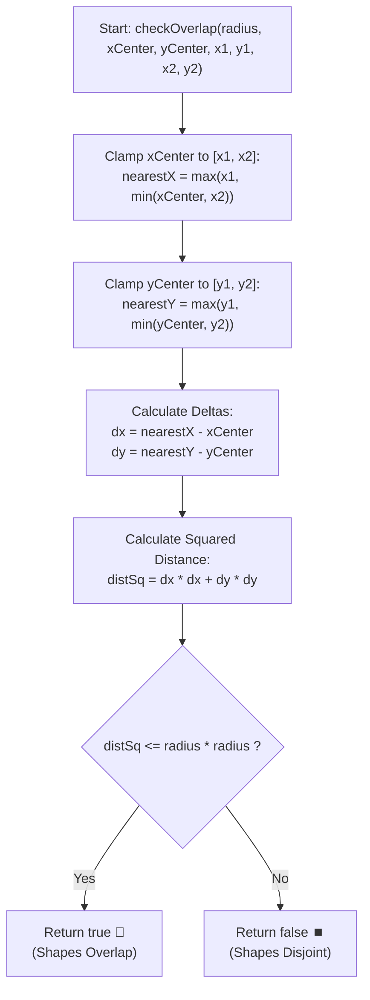

# 💡 Approach — Circle and Rectangle Overlapping

<div align="center">

  | 📄 [Problem](./Problem.md) | 💡 [Approach](./Approach.md) | 🧩 [Solution](./Solution.cpp) | 🚀 [Main](./Main.cpp) |
  |:--------------------------:|:-----------------------------:|:------------------------------:|:---------------------:|
</div>

## 📊 Metadata


---

> [!TIP]
> **Core Intuition — Orthogonal Clamping & Closest Point Projection:**
> 1. **Geometric Formulation:** An axis-aligned rectangle consists of all coordinates $(x, y)$ satisfying $x_1 \le x \le x_2$ and $y_1 \le y \le y_2$. The circle encompasses all points where the Euclidean distance to $(xCenter, yCenter)$ is at most $radius$.
> 2. **Dimension Separability:** The squared distance from any point $(x, y)$ in the rectangle to the circle center $(x_c, y_c)$ is:
>    $$D(x, y) = (x - x_c)^2 + (y - y_c)^2$$
>    Notice that $x$ and $y$ are completely independent orthogonal dimensions! Minimizing $D(x, y)$ over the rectangle decomposes into minimizing $(x - x_c)^2$ over $[x_1, x_2]$ and $(y - y_c)^2$ over $[y_1, y_2]$ separately.
> 3. **Interval Clamping:** For any 1D interval $[A, B]$, the point closest to target $T$ is:
>    $$\operatorname{clamp}(T, A, B) = \max(A, \min(T, B))$$
>    - If $T < A$, the nearest point is the left boundary $A$.
>    - If $T > B$, the nearest point is the right boundary $B$.
>    - If $A \le T \le B$, the nearest point is $T$ itself (distance along this axis is $0$).
> 4. **Overlap Condition:** The point $(x_{\text{nearest}}, y_{\text{nearest}})$ represents the single closest point in the rectangle to the circle center. If and only if the distance to this closest point is $\le radius$, the shapes overlap:
>    $$(x_{\text{nearest}} - x_c)^2 + (y_{\text{nearest}} - y_c)^2 \le radius^2$$
> 5. **Integer Arithmetic Precision:** By squaring both sides of the inequality, we avoid `sqrt()` and floating-point roundoff issues entirely.

---

## 🔩 Step-by-Step Breakdown

1. **Find Nearest $x$-coordinate**:
   - Clamp $xCenter$ into the range $[x_1, x_2]$:
     $$nearestX = \max(x_1, \min(xCenter, x_2))$$

2. **Find Nearest $y$-coordinate**:
   - Clamp $yCenter$ into the range $[y_1, y_2]$:
     $$nearestY = \max(y_1, \min(yCenter, y_2))$$

3. **Compute Axis Deltas**:
   - $\Delta x = nearestX - xCenter$
   - $\Delta y = nearestY - yCenter$

4. **Verify Overlap via Squared Distance**:
   - Compute squared distance:
     $$\text{distSq} = \Delta x^2 + \Delta y^2$$
   - Return $\text{distSq} \le radius \times radius$.

---

## 🔄 Mermaid Flowchart



---

## 🏃‍♂️ Dry Run

### Example 1: `radius = 1, xCenter = 0, yCenter = 0, x1 = 1, y1 = -1, x2 = 3, y2 = 1`

```text
Rectangle: [1, 3] x [-1, 1]
Circle: Center (0, 0), Radius 1

       y
       ▲
     1 ┼───┌───────┐
       │   │   R   │
     0 ┼─C─┼───────┤   Circle Center C = (0, 0)
       │   │       │   Nearest Point P = (1, 0)
    -1 ┼───└───────┘
       ┼───┼───┼───┼──► x
      -1   0   1   2   3
```

#### Step-by-Step Trace:

| Step | Operation | Value | Rationale |
| :---: | :--- | :---: | :--- |
| 1 | `nearestX = max(1, min(0, 3))` | `1` | $xCenter = 0 < x_1 = 1$, so clamped to $x_1$. |
| 2 | `nearestY = max(-1, min(0, 1))` | `0` | $y_1 \le yCenter \le y_2$ ($-1 \le 0 \le 1$), so clamped to $yCenter$. |
| 3 | `dx = nearestX - xCenter` | `1 - 0 = 1` | Horizontal distance from center to rectangle. |
| 4 | `dy = nearestY - yCenter` | `0 - 0 = 0` | Vertical distance from center to rectangle. |
| 5 | `distSq = dx*dx + dy*dy` | `1*1 + 0*0 = 1` | Squared Euclidean distance. |
| 6 | `radiusSq = radius * radius` | `1 * 1 = 1` | Squared radius. |
| 7 | `distSq <= radiusSq` | `1 <= 1` $\to$ **`true`** | Closest point $(1, 0)$ is on circle circumference. ✅ |

---

## 📊 Complexity Analysis

| Complexity Metric | Estimation | Rationale |
| :--- | :---: | :--- |
| **Time Complexity** | $\mathcal{O}(1)$ | Only a fixed sequence of basic arithmetic, clamping (`std::min`, `std::max`), and comparison operations are executed. |
| **Auxiliary Space** | $\mathcal{O}(1)$ | Requires only four integer scalar variables (`nearestX`, `nearestY`, `dx`, `dy`) without any dynamic allocation. |

---

> *"The shortest distance between two shapes is found where orthogonal constraints intersect."*

---

<div align="center">
<h3>Happy Coding! 🚀</h3>
<a href="../234_Day/Approach.md">
  
</a>
<a href="https://x.com/PankajB42550" target="_blank">
  
</a>
<a href="../236_Day/Approach.md">
  
</a>
</div>
