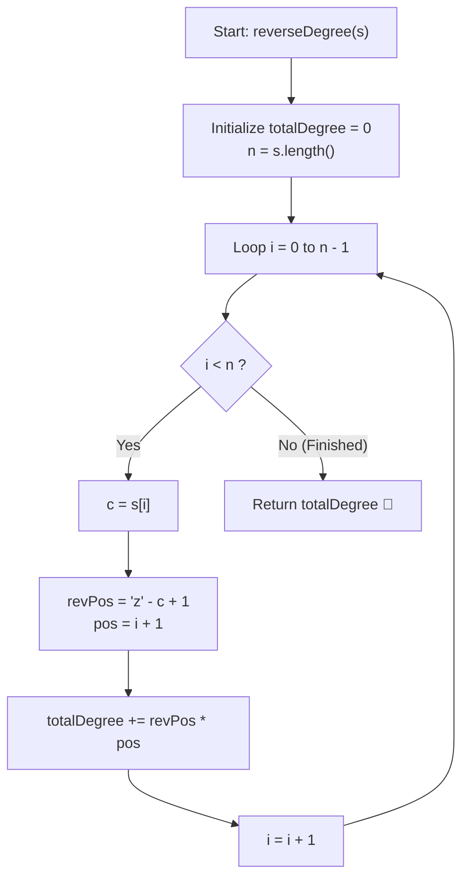

# 💡 Approach — Reverse Degree of a String

  | 📄 [Problem](./Problem.md) | 💡 [Approach](./Approach.md) | 🧩 [Solution](./Solution.cpp) | 🚀 [Main](./Main.cpp) |
  |:--------------------------:|:-----------------------------:|:------------------------------:|:---------------------:|

## 📊 Metadata

---

> [!TIP]
> **Core Intuition — Linear Simulation & Mathematical Mapping:**
> 1. **Alphabet Inversion Invariant:** In the standard English alphabet, character positions are given by $(c - \text{'a'} + 1)$ with `'a' \to 1` and `'z' \to 26`.
>    In the **reversed alphabet**, `'a' \to 26`, `'b' \to 25`, $\dots$, `'z' \to 1$.
>    This yields a direct closed-form mapping:
>    $$\text{revPos}(c) = 26 - (c - \text{'a'}) = \text{'z'} - c + 1$$
> 2. **1-Based Indexing Alignment:** In standard 0-indexed string iteration, the $i$-th character sits at 1-based index $(i + 1)$.
> 3. **Weighted Summation:** The problem translates to calculating the scalar product of two sequences:
>    $$\text{Reverse Degree} = \sum_{i=0}^{|s|-1} \Big( (\text{'z'} - s[i] + 1) \times (i + 1) \Big)$$
> 4. **Constant Auxiliary Space:** No intermediate string copies or auxiliary arrays are needed; a single accumulator variable tracks the running total during a single linear scan.

---

## 🔩 Step-by-Step Breakdown

1. **Initialize Accumulator**:
   - Create an integer `totalDegree = 0` to hold the cumulative sum of products.

2. **Iterate Through the String**:
   - Loop index $i$ from $0$ to $|s| - 1$:
     - Extract current character $c = s[i]$.
     - Calculate reverse alphabet weight:
       $$\text{weight} = \text{'z'} - c + 1$$
     - Multiply weight by 1-based position $(i + 1)$:
       $$\text{product} = \text{weight} \times (i + 1)$$
     - Add product to `totalDegree`:
       $$\text{totalDegree} \mathrel{+}= \text{product}$$

3. **Return Cumulative Degree**:
   - After visiting all characters, return `totalDegree`.

---

## 🔄 Mermaid Flowchart

---

## 🏃‍♂️ Dry Run

### Example 1: `s = "abc"` ($|s| = 3$)

| Index $i$ | $s[i]$ | $\text{revPos} = \text{'z'} - s[i] + 1$ | 1-based Pos $(i + 1)$ | Product | Running `totalDegree` |
| :---: | :---: | :---: | :---: | :---: | :---: |
| $0$ | `'a'` | $26 - 0 = \mathbf{26}$ | $1$ | $26 \times 1 = 26$ | $26$ |
| $1$ | `'b'` | $26 - 1 = \mathbf{25}$ | $2$ | $25 \times 2 = 50$ | $26 + 50 = 76$ |
| $2$ | `'c'` | $26 - 2 = \mathbf{24}$ | $3$ | $24 \times 3 = 72$ | $76 + 72 = \mathbf{148}$ |

**Result:** `148` ✅

---

### Example 2: `s = "zaza"` ($|s| = 4$)

| Index $i$ | $s[i]$ | $\text{revPos} = \text{'z'} - s[i] + 1$ | 1-based Pos $(i + 1)$ | Product | Running `totalDegree` |
| :---: | :---: | :---: | :---: | :---: | :---: |
| $0$ | `'z'` | $26 - 25 = \mathbf{1}$ | $1$ | $1 \times 1 = 1$ | $1$ |
| $1$ | `'a'` | $26 - 0 = \mathbf{26}$ | $2$ | $26 \times 2 = 52$ | $1 + 52 = 53$ |
| $2$ | `'z'` | $26 - 25 = \mathbf{1}$ | $3$ | $1 \times 3 = 3$ | $53 + 3 = 56$ |
| $3$ | `'a'` | $26 - 0 = \mathbf{26}$ | $4$ | $26 \times 4 = 104$ | $56 + 104 = \mathbf{160}$ |

**Result:** `160` ✅

---

## 📊 Complexity Analysis

| Complexity Metric | Estimation | Rationale |
| :--- | :---: | :--- |
| **Time Complexity** | $\mathcal{O}(|s|)$ | A single linear loop visits each character in the string exactly once. Each character's position and product calculation takes constant $\mathcal{O}(1)$ arithmetic. |
| **Auxiliary Space** | $\mathcal{O}(1)$ | Only scalar variables (`totalDegree`, `i`, `revPos`) are used, requiring strictly constant extra space. |

---

> *"Linear mappings illuminate patterns; by pairing alphabet inversion with positional progression, a complex simulation collapses into a single elegant pass."*

---

<h3>Happy Coding! 🚀</h3>

