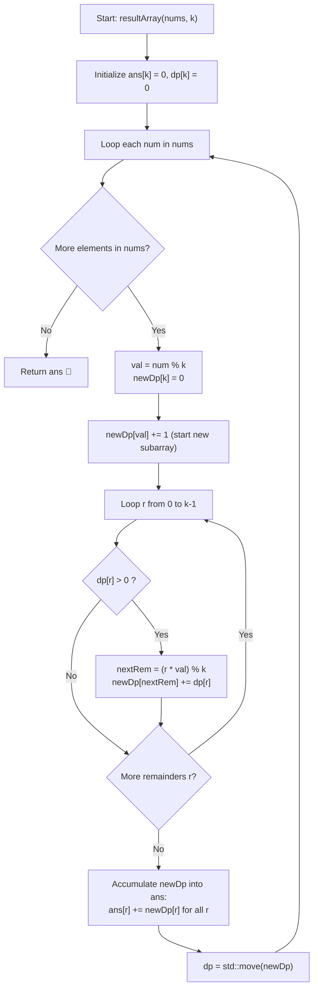

# 💡 Approach — Find X Value of Array I

  | 📄 [Problem](./Problem.md) | 💡 [Approach](./Approach.md) | 🧩 [Solution](./Solution.cpp) | 🚀 [Main](./Main.cpp) |
  |:--------------------------:|:-----------------------------:|:------------------------------:|:---------------------:|

## 📊 Metadata

---

> [!TIP]
> **Core Intuition — Subarray Equivalence & Modular Rolling Dynamic Programming:**
> 1. **Structural Equivalence to Contiguous Subarrays:** Removing a non-overlapping prefix $[0 \dots i-1]$ and suffix $[j+1 \dots n-1]$ leaving a non-empty array is mathematically isomorphic to choosing any non-empty contiguous subarray `nums[i .. j]` where $0 \le i \le j < n$.
> 2. **The Bottleneck of Naive Evaluation:** There are $\frac{n(n+1)}{2}$ subarrays. For $n = 10^5$, this is $\approx 5 \times 10^9$ combinations. Direct evaluation of every subarray would result in Time Limit Exceeded (TLE).
> 3. **The Power of Modulo $k$:** Since $k \le 5$, the number of possible remainders modulo $k$ is extremely small (at most 5 distinct states: $\{0, 1, \dots, k-1\}$).
> 4. **Rolling DP State Formulation:**
>    - Let `dp[r]` be the number of non-empty subarrays ending at the previous position whose product leaves remainder $r$ modulo $k$.
>    - When reading element `num` with `val = num % k`:
>      - **Start new subarray**: The single-element subarray `[num]` has remainder `val`. So `newDp[val] += 1`.
>      - **Extend existing subarrays**: Any subarray ending at the previous position with product remainder $r$ now has product remainder $(r \times \text{val}) \pmod k$. So we add `dp[r]` to `newDp[(r * val) % k]`.
> 5. **Answer Accumulation:** At each index, all subarrays ending at that index are counted in `newDp`. Adding `newDp[r]` into `ans[r]` yields the final total count for each remainder in linear time.

---

## 🔩 Step-by-Step Breakdown

1. **Initialize State and Answer Containers**:
   - Allocate `ans` of size $k$ with 64-bit zeros (`long long`) to handle counts up to $5 \times 10^9$.
   - Allocate `dp` of size $k$ initialized with 0s.

2. **Iterate Through Elements in `nums`**:
   - For each integer `num` in `nums`:
     - Compute base remainder: $\text{val} = \text{num} \pmod k$.
     - Initialize `newDp` array of size $k$ with 0s.
     - Account for the new single-element subarray:
       $$\text{newDp}[\text{val}] = \text{newDp}[\text{val}] + 1$$
     - Extend all previously ending subarrays:
       - For each remainder $r \in [0, k-1]$:
         - If $\text{dp}[r] > 0$:
           $$\text{nextRem} = (r \times \text{val}) \pmod k$$
           $$\text{newDp}[\text{nextRem}] = \text{newDp}[\text{nextRem}] + \text{dp}[r]$$
     - Accumulate counts into the answer vector:
       - For each $r \in [0, k-1]$: $\text{ans}[r] = \text{ans}[r] + \text{newDp}[r]$.
     - Transition state: $\text{dp} = \text{move}(\text{newDp})$.

3. **Return Answer Vector**:
   - Return `ans` of size $k$.

---

## 🔄 Mermaid Flowchart

---

## 🏃‍♂️ Dry Run

### Example 1: `nums = [1, 2, 3, 4, 5], k = 3`

Total subarrays: $\frac{5 \times 6}{2} = 15$.

| Step / Num | `val = num % 3` | Previous `dp` | `newDp` Computation | Current `newDp` | Cumulative `ans` |
| :---: | :---: | :---: | :--- | :---: | :---: |
| **Initial** | — | `[0, 0, 0]` | — | — | `[0, 0, 0]` |
| **`num = 1`** | $1$ | `[0, 0, 0]` | Single: `newDp[1] += 1` | `[0, 1, 0]` | `[0, 1, 0]` |
| **`num = 2`** | $2$ | `[0, 1, 0]` | Single: `newDp[2] += 1` Extend $r=1$: $(1 \times 2) \% 3 = 2 \implies \text{newDp}[2] += 1$ | `[0, 0, 2]` | `[0, 1, 2]` |
| **`num = 3`** | $0$ | `[0, 0, 2]` | Single: `newDp[0] += 1` Extend $r=2$: $(2 \times 0) \% 3 = 0 \implies \text{newDp}[0] += 2$ | `[3, 0, 0]` | `[3, 1, 2]` |
| **`num = 4`** | $1$ | `[3, 0, 0]` | Single: `newDp[1] += 1` Extend $r=0$: $(0 \times 1) \% 3 = 0 \implies \text{newDp}[0] += 3$ | `[3, 1, 0]` | `[6, 2, 2]` |
| **`num = 5`** | $2$ | `[3, 1, 0]` | Single: `newDp[2] += 1` Extend $r=0$: $(0 \times 2) \% 3 = 0 \implies \text{newDp}[0] += 3$ Extend $r=1$: $(1 \times 2) \% 3 = 2 \implies \text{newDp}[2] += 1$ | `[3, 0, 2]` | `[9, 2, 4]` |

Final Output: `ans = [9, 2, 4]` ✅ (Sum = $9 + 2 + 4 = 15$)

---

## 📊 Complexity Analysis

| Complexity Metric | Estimation | Rationale |
| :--- | :---: | :--- |
| **Time Complexity** | $\mathcal{O}(n \cdot k)$ | We process $n$ numbers. For each number, we iterate over the $k$ possible remainder states and perform $\mathcal{O}(1)$ modular arithmetic operations. Since $k \le 5$, the loop body runs at most 5 times per element ($\approx 5 \times 10^5$ operations total), running in under $5\text{ ms}$. |
| **Auxiliary Space** | $\mathcal{O}(k)$ | Only two small vectors of size $k$ (`dp` and `newDp`) are maintained across iterations. For $k \le 5$, this consumes negligible memory ($\mathcal{O}(1)$ practical memory). |

---

> *"When a combinatorial problem asks about prefix and suffix removals, what remains is an intact contiguous core—and through the lens of modular congruence, infinite products collapse into finite states."*

---

<h3>Happy Coding! 🚀</h3>

