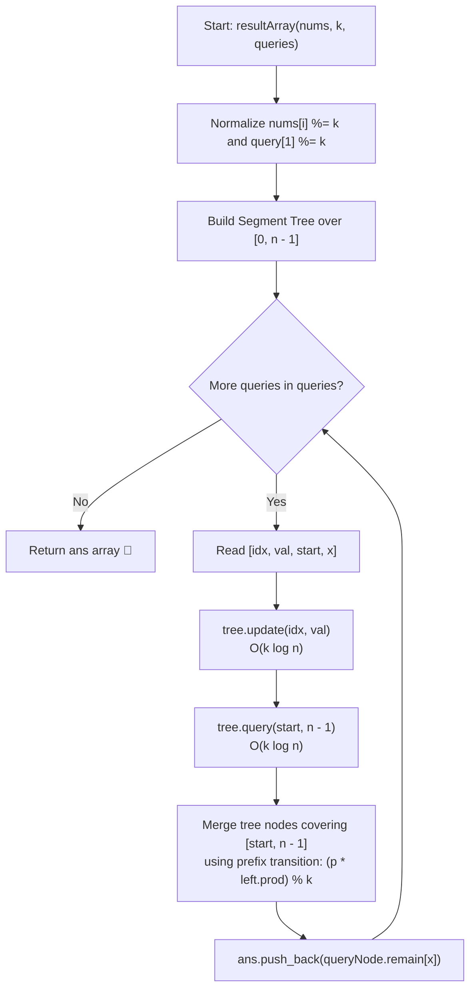

# 💡 Approach — Find X Value of Array II

<div align="center">

  | 📄 [Problem](./Problem.md) | 💡 [Approach](./Approach.md) | 🧩 [Solution](./Solution.cpp) | 🚀 [Main](./Main.cpp) |
  |:--------------------------:|:-----------------------------:|:------------------------------:|:---------------------:|
</div>

## 📊 Metadata


---

> [!TIP]
> **Core Intuition — Segment Tree with Prefix Remainder Convolution:**
> 1. **Prefix-Product Formulation:** Removing prefix $nums[0 \dots start_i - 1]$ restricts our focus to subarray $nums[start_i \dots n - 1]$. Removing any valid suffix that leaves the subarray non-empty corresponds to choosing an end index $R \in [start_i, n - 1]$. The remaining elements are $nums[start_i \dots R]$, with product $P(start_i, R) = \prod_{j=start_i}^R nums[j] \pmod k$.
> 2. **Segment Representation:** Because point updates are dynamic and persistent, a **Segment Tree** over $[0, n - 1]$ is the ideal data structure. Each tree node covering a range $[L, R]$ maintains:
>    - `prod`: The total product of elements in $[L, R]$ modulo $k$.
>    - `remain[r]`: The number of prefixes of $[L, R]$ (starting at index $L$) whose product modulo $k$ equals $r$, for $0 \le r < k$.
> 3. **Algebraic Merge Invariant:** When merging two adjacent disjoint segments $A$ (left) and $B$ (right):
>    - The combined product is $(A.\text{prod} \times B.\text{prod}) \pmod k$.
>    - Any prefix of $A \cup B$ is either a prefix of $A$ or the concatenation of the entire segment $A$ and a non-empty prefix of $B$.
>    - A prefix entirely inside $A$ has remainder $r$ with multiplicity $A.\text{remain}[r]$.
>    - A prefix of $B$ with product $p$ is scaled by the total product of segment $A$, giving a new remainder $(p \times A.\text{prod}) \pmod k$.
>    - Thus: $\text{merged.remain}[(p \times A.\text{prod}) \pmod k] \mathrel{+}= B.\text{remain}[p]$.
> 4. **Querying Range $[start, n - 1]$:** Querying the segment tree for range $[start, n - 1]$ returns a synthesized node whose `remain[x]` directly gives the answer in $\mathcal{O}(k \log n)$ time.

---

## 🔩 Step-by-Step Breakdown

1. **Modular Normalization**:
   - Every input value in `nums` and in the query values can be replaced by its remainder modulo $k$ immediately: `num %= k`.

2. **Segment Tree Node Structure**:
   ```cpp
   struct Node {
       int remain[5] = {0}; // frequency of prefix remainders modulo k
       int prod = 1;        // total product of elements in segment modulo k
   };
   ```

3. **Leaf Node Base Case**:
   - For a single element at index $i$ with value $v = nums[i] \pmod k$:
     - `remain[v] = 1`, all other `remain[r] = 0`.
     - `prod = v`.

4. **Tree Merging**:
   - To merge `left` and `right`:
     - Initialize `merged.prod = (left.prod * right.prod) % k`.
     - Copy left counts: for $r \in [0, k-1]$, `merged.remain[r] = left.remain[r]`.
     - Shift right counts: for $p \in [0, k-1]$, `merged.remain[(p * left.prod) % k] += right.remain[p]`.

5. **Process Queries**:
   - For each query `[index, value, start, x]`:
     1. Perform point update: `tree.update(index, value % k)`.
     2. Query the segment tree for the interval $[start, n - 1]$.
     3. Extract and record `resultNode.remain[x]`.

---

## 🔄 Mermaid Flowchart



---

## 🏃‍♂️ Dry Run

### Example 1:
- `nums = [1, 2, 3, 4, 5]`, `k = 3`
- Pre-mod 3: `[1, 2, 0, 1, 2]`

#### Query 0: `[2, 2, 0, 2]`
- Update index 2: `nums[2] = 2 % 3 = 2`.
- Current array mod 3: `[1, 2, 2, 1, 2]`.
- Query interval $[start, n - 1] = [0, 4]$, target $x = 2$:
  - Prefix $[0 \dots 0]$: $1 \pmod 3 = 1$
  - Prefix $[0 \dots 1]$: $(1 \times 2) \pmod 3 = 2$
  - Prefix $[0 \dots 2]$: $(2 \times 2) \pmod 3 = 1$
  - Prefix $[0 \dots 3]$: $(1 \times 1) \pmod 3 = 1$
  - Prefix $[0 \dots 4]$: $(1 \times 2) \pmod 3 = 2$
  - Remainder counts:
    - `remain[0] = 0`
    - `remain[1] = 3` (prefixes $[0 \dots 0], [0 \dots 2], [0 \dots 3]$)
    - `remain[2] = 2` (prefixes $[0 \dots 1], [0 \dots 4]$)
  - Target $x = 2 \implies \mathbf{2}$ ✅

#### Query 1: `[3, 3, 3, 0]`
- Update index 3: `nums[3] = 3 % 3 = 0`.
- Current array mod 3: `[1, 2, 2, 0, 2]`.
- Query interval $[start, n - 1] = [3, 4]$, target $x = 0$:
  - Prefix $[3 \dots 3]$: $0 \pmod 3 = 0$
  - Prefix $[3 \dots 4]$: $(0 \times 2) \pmod 3 = 0$
  - Remainder counts:
    - `remain[0] = 2`
    - `remain[1] = 0`
    - `remain[2] = 0`
  - Target $x = 0 \implies \mathbf{2}$ ✅

#### Query 2: `[0, 1, 0, 1]`
- Update index 0: `nums[0] = 1 % 3 = 1`.
- Current array mod 3: `[1, 2, 2, 0, 2]`.
- Query interval $[start, n - 1] = [0, 4]$, target $x = 1$:
  - Prefix $[0 \dots 0]$: $1 \pmod 3 = 1$
  - Prefix $[0 \dots 1]$: $2 \pmod 3 = 2$
  - Prefix $[0 \dots 2]$: $1 \pmod 3 = 1$
  - Prefix $[0 \dots 3]$: $0 \pmod 3 = 0$
  - Prefix $[0 \dots 4]$: $0 \pmod 3 = 0$
  - Target $x = 1 \implies \text{remain}[1] = \mathbf{2}$ ✅

- Result: `[2, 2, 2]` ✅

---

## 📊 Complexity Analysis

| Complexity Metric | Estimation | Rationale |
| :--- | :---: | :--- |
| **Time Complexity** | $\mathcal{O}(k \cdot (n + q \log n))$ | Building the segment tree visits $\mathcal{O}(n)$ nodes with $\mathcal{O}(k)$ operations per merge. Each of the $q$ queries executes one point update and one range query, traversing $\mathcal{O}(\log n)$ nodes where each node merge takes $\mathcal{O}(k)$ time. Since $k \le 5$, this is exceptionally fast. |
| **Auxiliary Space** | $\mathcal{O}(n \cdot k)$ | The segment tree requires $4n$ nodes, where each node stores a static array of size $5$ and an integer `prod`. |

---

> *"When prefixes fold under associative laws, the entire continuum of subarray products reduces to a compact state transition across tree nodes."*

---

<div align="center">
<h3>Happy Coding! 🚀</h3>
<a href="../237_Day/Approach.md">
  
</a>
<a href="https://x.com/PankajB42550" target="_blank">
  
</a>
<a href="../239_Day/Approach.md">
  
</a>
</div>
