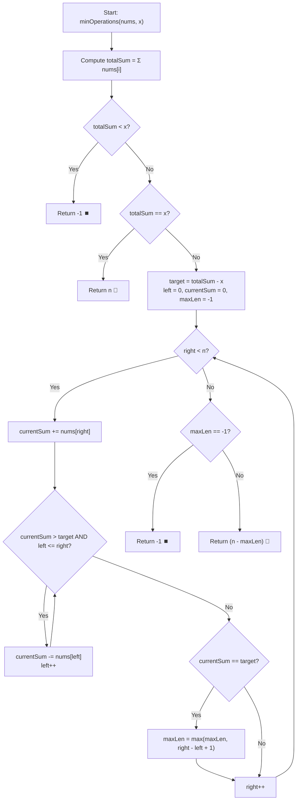

# 💡 Approach — Minimum Operations to Reduce X to Zero

  | 📄 [Problem](./Problem.md) | 💡 [Approach](./Approach.md) | 🧩 [Solution](./Solution.cpp) | 🚀 [Main](./Main.cpp) |
  |:--------------------------:|:-----------------------------:|:------------------------------:|:---------------------:|

## 📊 Metadata

---

> [!TIP]
> **Core Intuition — Inverting to Maximum Subarray Sum via Sliding Window:**
> 1. **Complementary Subarray Equivalence:** Removing a prefix of length $L$ and a suffix of length $R$ whose elements sum to $x$ leaves a single unbroken, contiguous subarray in the center of length $W = n - (L + R)$.
> 2. **Target Inversion:** If the removed boundary elements sum to $x$, the preserved center subarray must sum to:
>    $$\text{target} = \sum_{i=0}^{n-1} \text{nums}[i] - x$$
> 3. **Minimizing Operations $\leftrightarrow$ Maximizing Subarray Length:** Since total operations equals $n - W$, **minimizing operations is mathematically equivalent to maximizing the length $W$ of a contiguous subarray with sum equal to $\text{target}$**.
> 4. **Monotonicity via Positive Elements:** Because all numbers in `nums` are strictly positive ($\text{nums}[i] \ge 1$), any subarray sum is strictly monotonically increasing as the right pointer advances and strictly decreasing as the left pointer advances. This enables a classical two-pointer **Sliding Window** in $\mathcal{O}(n)$ time and $\mathcal{O}(1)$ auxiliary space.

---

## 🔩 Step-by-Step Breakdown

1. **Compute Total Array Sum**:
   - Calculate $S = \sum_{i=0}^{n-1} \text{nums}[i]$ using 64-bit integer (`long long`).

2. **Handle Immediate Edge Cases**:
   - If $S < x$: Total sum is insufficient to reach $x$, return `-1`.
   - If $S == x$: Must remove all elements, return $n$.

3. **Establish Sliding Window Parameters**:
   - Define $\text{target} = S - x$.
   - Maintain `left = 0`, `currentSum = 0`, and `maxLen = -1`.

4. **Sliding Window Traversal**:
   - Iterate with pointer `right` from $0$ to $n - 1$:
     - Add `nums[right]` to `currentSum`.
     - While `currentSum > target` and `left <= right`:
       - Subtract `nums[left]` from `currentSum`.
       - Increment `left`.
     - If `currentSum == target`:
       - Update `maxLen = max(maxLen, right - left + 1)`.

5. **Return Final Result**:
   - If `maxLen == -1`: No valid contiguous subarray sums to $\text{target}$, return `-1`.
   - Otherwise, return $n - \text{maxLen}$.

---

## 🔄 Mermaid Flowchart

---

## 🏃‍♂️ Dry Run

### Example 1: `nums = [1, 1, 4, 2, 3]`, `x = 5`

- Total sum $S = 1 + 1 + 4 + 2 + 3 = 11$.
- $\text{target} = S - x = 11 - 5 = 6$.

| Step | `right` | `nums[right]` | `currentSum` | Window Condition | `left` | Window Subarray | `maxLen` |
| :---: | :---: | :---: | :---: | :---: | :---: | :---: | :---: |
| 1 | 0 | 1 | 1 | $< 6$ | 0 | `[1]` | -1 |
| 2 | 1 | 1 | 2 | $< 6$ | 0 | `[1, 1]` | -1 |
| 3 | 2 | 4 | 6 | $== 6$ (Match!) | 0 | `[1, 1, 4]` | $\max(-1, 3) = \mathbf{3}$ |
| 4 | 3 | 2 | 8 | $> 6 \to$ shrink | 1 (sub 1: 7) $\to$ 2 (sub 1: 6) | `[4, 2]` | $\max(3, 2) = 3$ |
| 5 | 4 | 3 | 9 | $> 6 \to$ shrink | 3 (sub 4: 5) | `[2, 3]` | 3 |

- Maximum subarray length with sum $6$ is $W = 3$ (subarray `[1, 1, 4]`).
- Minimum operations $= n - W = 5 - 3 = 2$ (removing suffix `[2, 3]`).

---

## 📊 Complexity Analysis

| Complexity Metric | Estimation | Rationale |
| :--- | :---: | :--- |
| **Time Complexity** | $\mathcal{O}(n)$ | Both `left` and `right` pointers traverse the array from $0$ to $n-1$ at most once. Each element is added and subtracted at most once. |
| **Auxiliary Space** | $\mathcal{O}(1)$ | Only scalar variables (`totalSum`, `currentSum`, `left`, `right`, `maxLen`) are used; no extra collections or hash maps. |

---

> *"When removing from both ends feels complex, focus on the unbroken center that remains."*

---

<h3>Happy Coding! 🚀</h3>

