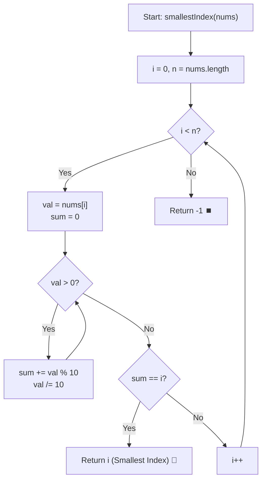

# 💡 Approach — Smallest Index With Digit Sum Equal to Index

  | 📄 [Problem](./Problem.md) | 💡 [Approach](./Approach.md) | 🧩 [Solution](./Solution.cpp) | 🚀 [Main](./Main.cpp) |
  |:--------------------------:|:-----------------------------:|:------------------------------:|:---------------------:|

## 📊 Metadata

---

> [!TIP]
> **Core Intuition — Linear Scan with Early Termination:**
> 1. **Index-Ordered Search Invariant:** The problem asks for the **smallest** index $i$ satisfying $\text{digitSum}(\text{nums}[i]) == i$. By scanning the array sequentially from left to right (indices $0, 1, 2, \dots, n-1$), the first index that satisfies the equality is unconditionally guaranteed to be the smallest valid index.
> 2. **Digit Sum Extraction:** For any non-negative integer $v$, its digit sum is computed by repeatedly extracting the least significant digit ($v \pmod{10}$) and truncating ($v \leftarrow \lfloor v / 10 \rfloor$) until $v = 0$.
> 3. **Bounded Iterations:** Given $0 \le \text{nums}[i] \le 1000$, every number has at most 4 decimal digits ($\log_{10}(1000) \le 4$). Therefore, computing the digit sum takes $\mathcal{O}(1)$ operations, making the entire search strictly linear $\mathcal{O}(n)$.

---

## 🔩 Step-by-Step Breakdown

1. **Helper Function `computeDigitSum(val)`**:
   - Initialize `sum = 0`.
   - While `val > 0`:
     - Accumulate last digit: `sum += val % 10`.
     - Shift right: `val /= 10`.
   - Return `sum`. Special case: when `val == 0`, loop doesn't execute and returns `0` (which is correct, as $0$ has digit sum $0$).

2. **Iterate Sequentially**:
   - Loop index $i$ from $0$ to $n - 1$:
     - Compute $S = \text{computeDigitSum}(\text{nums}[i])$.
     - Check condition: if $S == i$:
       - Immediately return $i$.

3. **Fallback Exhaustion**:
   - If the loop completes without finding any matching index, return `-1`.

---

## 🔄 Mermaid Flowchart

---

## 🏃‍♂️ Dry Run

### Example 2: `nums = [1, 10, 11]`

Array size $n = 3$.

| Index $i$ | $\text{nums}[i]$ | Digit Extraction Steps | Digit Sum | Condition Check: $\text{sum} == i$? | Action |
| :---: | :---: | :--- | :---: | :---: | :---: |
| **0** | $1$ | $1 \pmod{10} = 1$ | $1$ | $1 == 0 \implies \text{False}$ | Continue to $i = 1$ |
| **1** | $10$ | $10 \pmod{10} = 0$, $1 \pmod{10} = 1 \to 0 + 1$ | $1$ | $1 == 1 \implies \mathbf{True}$ | **Immediate Return 1 🏁** |

- Notice index $i = 2$ also has $\text{nums}[2] = 11 \to 1 + 1 = 2 == 2$, but because we scanned from left to right, we stopped immediately at $i = 1$, ensuring the smallest index is returned.

---

## 📊 Complexity Analysis

| Complexity Metric | Estimation | Rationale |
| :--- | :---: | :--- |
| **Time Complexity** | $\mathcal{O}(n \cdot \log_{10}(\max(\text{nums})))$ | We traverse the array at most once ($n$ elements). For each element, extracting decimal digits takes at most $\lfloor \log_{10}(\text{nums}[i]) \rfloor + 1 \le 4$ operations. Hence, overall time is $\mathcal{O}(n)$. |
| **Auxiliary Space** | $\mathcal{O}(1)$ | Only scalar primitive variables (`i`, `sum`, `val`) are used throughout execution; no additional memory allocation. |

---

> *"In the search for the earliest harmony between index and value, the first resonance found is the only one needed."*

---

<h3>Happy Coding! 🚀</h3>

