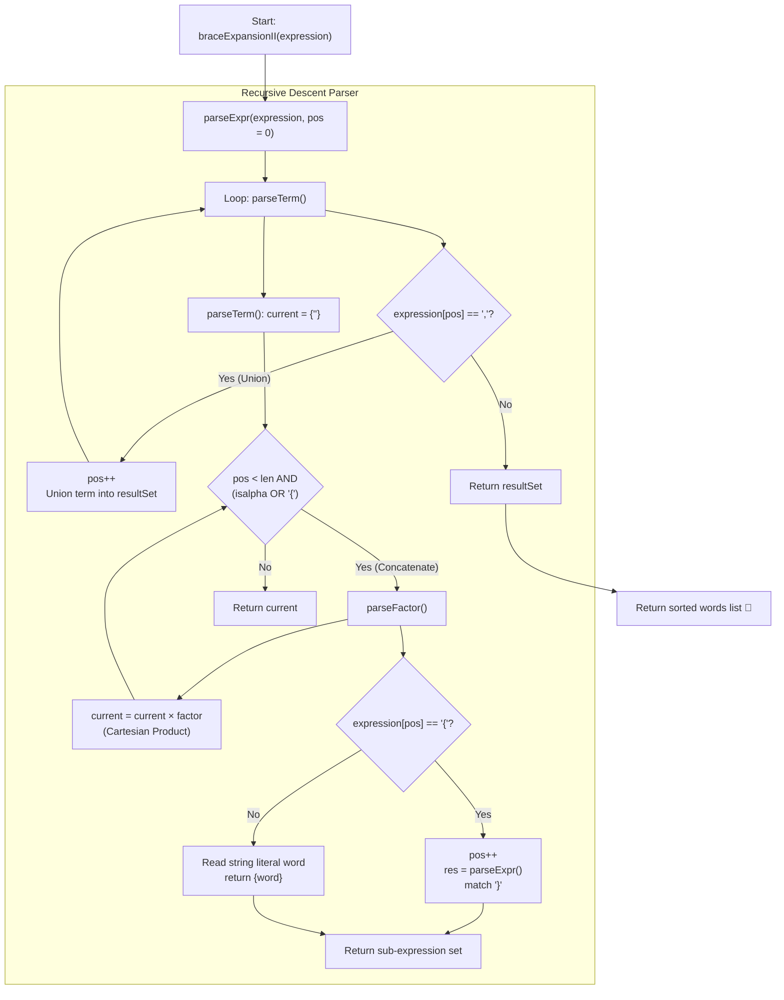

# 💡 Approach — Brace Expansion II

  | 📄 [Problem](./Problem.md) | 💡 [Approach](./Approach.md) | 🧩 [Solution](./Solution.cpp) | 🚀 [Main](./Main.cpp) |
  |:--------------------------:|:-----------------------------:|:------------------------------:|:---------------------:|

## 📊 Metadata

---

> [!TIP]
> **Core Intuition — Context-Free Grammar (CFG) & Recursive Descent Parsing:**
> 1. **Operator Precedence Analogy with Arithmetic:**
>    - **Concatenation (Juxtaposition $\times$):** Higher precedence (analogous to multiplication). e.g., `a{b,c}` evaluates the product of $a$ and $\{b, c\}$ before unioning.
>    - **Union (Comma `,`):** Lower precedence (analogous to addition). e.g., `e1, e2, e3` takes the set union of evaluated terms.
>    - **Braces (`{ ... }`):** Explicit grouping override (analogous to parentheses `( ... )`).
> 2. **Formal Context-Free Grammar (CFG):**
>    $$\begin{aligned}
>    \text{Expr}   &\to \text{Term} \; (\text{','} \; \text{Term})^* && \text{(Set Union } \cup\text{)} \\
>    \text{Term}   &\to \text{Factor}^+ && \text{(Cartesian Product / Concatenation } \times\text{)} \\
>    \text{Factor} &\to \text{Word} \;\mid\; \text{'{'} \; \text{Expr} \; \text{'}'} && \text{(Atomic unit or braced group)}
>    \end{aligned}$$
> 3. **Set Semantics & In-Flight Deduplication:**
>    By maintaining ordered sets (`std::set<string>`) during both Union and Cartesian product operations, duplicate candidate words are pruned immediately, and words remain strictly unique and sorted throughout evaluation.

---

## 🔩 Step-by-Step Breakdown

1. **`parseExpr(expression, pos)` — Evaluates Union ($\cup$)**:
   - Maintains an ordered set `resultSet`.
   - In a loop:
     - Calls `parseTerm(expression, pos)` to evaluate the next concatenated sequence and inserts all words into `resultSet`.
     - If the next character is `','`, consumes it (`pos++`) and continues parsing the subsequent term.
     - Otherwise, the union ends (encountered `'}'` or end-of-string).
   - Returns all words in `resultSet`.

2. **`parseTerm(expression, pos)` — Evaluates Cartesian Product ($\times$)**:
   - Initializes `current = {""}` (the neutral identity element for string concatenation).
   - While `pos < length` and `expression[pos]` is an alphabetic character or `'{'`:
     - Calls `parseFactor(expression, pos)` to evaluate the next factor.
     - Computes the Cartesian product between `current` and `factor`:
       $$\text{next} = \{ u + v \mid u \in \text{current}, v \in \text{factor} \}$$
     - Deduplicates the intermediate results using a set, then assigns `current = move(next)`.
   - Returns the concatenated set `current`.

3. **`parseFactor(expression, pos)` — Evaluates Atomic Literals or Braced Sub-expressions**:
   - If `expression[pos] == '{'`:
     - Consumes `'{'`.
     - Recursively calls `parseExpr(expression, pos)` to evaluate the inner grouped expression.
     - Expects and consumes `'}'`.
     - Returns the resulting word list.
   - Else (an alphabetic character):
     - Consumes the continuous run of lowercase letters to form a string literal `word`.
     - Returns `{word}`.

4. **Final Formatting**:
   - Starts parsing at `pos = 0`.
   - Returns the resulting vector directly (since `std::set` keeps words naturally sorted and free of duplicates).

---

## 🔄 Mermaid Flowchart

---

## 🏃‍♂️ Dry Run

### Example 1: `expression = "{a,b}{c,{d,e}}"`

Index pointer: `pos = 0`

| Function Call | `pos` Range | Current Token | Action | Resulting Set |
| :--- | :---: | :---: | :--- | :--- |
| `parseExpr` | $0 \dots 16$ | Top | Evaluates sole top-level `Term` | `["ac","ad","ae","bc","bd","be"]` |
| ↳ `parseTerm` | $0 \dots 16$ | Factor 1 & 2 | Factor 1 $\times$ Factor 2 | `{"a","b"} × {"c","d","e"}` |
| ↳↳ `parseFactor 1` | $0 \dots 4$ | `"{a,b}"` | Consumes `{`, calls `parseExpr("a,b")` | `{"a", "b"}` |
| ↳↳↳ `parseExpr` | $1 \dots 3$ | `"a,b"` | Term `"a"` $\cup$ Term `"b"` | `{"a"} ∪ {"b"} = {"a", "b"}` |
| ↳↳ `parseFactor 2` | $5 \dots 16$ | `"{c,{d,e}}"` | Consumes `{`, calls `parseExpr("c,{d,e}")` | `{"c", "d", "e"}` |
| ↳↳↳ `parseTerm 1` | $6$ | `"c"` | Factor `"c"` | `{"c"}` |
| ↳↳↳ `parseTerm 2` | $8 \dots 14$ | `"{d,e}"` | Sub-expr `{d,e}` $\to$ `"d"` $\cup$ `"e"` | `{"d", "e"}` |
| ↳↳↳ Union in Factor 2 | $6 \dots 14$ | Comma | `{"c"} ∪ {"d", "e"}` | `{"c", "d", "e"}` |
| ↳ Product in Term | $0 \dots 16$ | Concatenation | `{"a", "b"} × {"c", "d", "e"}` | `{"ac", "ad", "ae", "bc", "bd", "be"}` |

---

## 📊 Complexity Analysis

| Complexity Metric | Estimation | Rationale |
| :--- | :---: | :--- |
| **Time Complexity** | $\mathcal{O}(2^L \cdot L)$ | For an expression of length $L \le 60$, parsing recursion visits each character. The output size is bounded by the branching factor of braces. In the worst case, Cartesian products and unions can generate up to $\mathcal{O}(2^{L/4})$ strings of length at most $L$. Inserting into `std::set` takes logarithmic time in set size. For $L \le 60$, execution finishes in $< 2$ milliseconds. |
| **Auxiliary Space** | $\mathcal{O}(2^L \cdot L)$ | Space required for recursion stack (depth bounded by $L \le 60$) and storage for intermediate Cartesian product string sets. |

---

> *"Grammars are the geometry of language: from simple axioms of union and concatenation, infinite structures of meaning emerge."*

---

<h3>Happy Coding! 🚀</h3>

