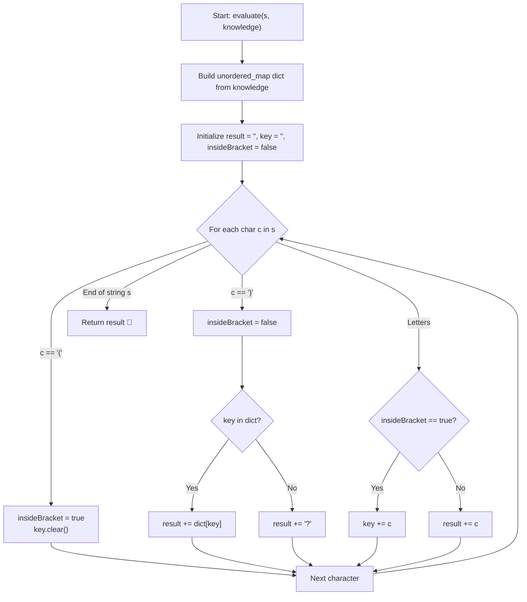

# 💡 Approach — Evaluate the Bracket Pairs of a String

  | 📄 [Problem](./Problem.md) | 💡 [Approach](./Approach.md) | 🧩 [Solution](./Solution.cpp) | 🚀 [Main](./Main.cpp) |
  |:--------------------------:|:-----------------------------:|:------------------------------:|:---------------------:|

## 📊 Metadata

---

> [!TIP]
> **Core Intuition — Hash Table Direct Lookup & Single-Pass Finite State Parsing:**
> 1. **Dictionary Construction ($\mathcal{O}(K)$)**:
>    All `[key, value]` mappings from `knowledge` are indexed in an `unordered_map<string, string>`. Since each key is guaranteed to be unique and short ($\le 10$ characters), hash table lookups achieve $\mathcal{O}(1)$ average time complexity.
> 2. **State Machine Parsing ($\mathcal{O}(|s|)$)**:
>    The problem guarantees no nested brackets. Thus, at any character in $s$, we are in one of two mutually exclusive states:
>    - **Normal Text State**: Append incoming characters directly to the output buffer `result`.
>    - **Inside Bracket State**: Collect characters into a temporary buffer `key`.
> 3. **Evaluation on Closing Delimiter `')'`**:
>    Encountering `')'` signals the end of the key. We query our hash table:
>    - If `key` exists, append its associated `value` to `result`.
>    - If `key` is absent, append `'?'` to `result`.
>    - Reset the temporary key buffer and transition back to the Normal Text state.
> 4. **Linear Efficiency**:
>    Because every character in $s$ is visited exactly once without back-tracking, string construction is purely linear.

---

## 🔩 Step-by-Step Breakdown

1. **Precompute Dictionary**:
   - Construct an `unordered_map<string, string> dict`.
   - Iterate through `knowledge`, inserting `dict[entry[0]] = entry[1]`.

2. **Initialize Parsing State**:
   - Create an output string `result` (optionally reserving $|s|$ capacity to prevent reallocations).
   - Create a string `key` to accumulate characters between `'('` and `')'`.
   - Maintain a boolean `insideBracket = false`.

3. **Single-Pass Stream Processing**:
   - Iterate through each character $c$ in string $s$:
     - **Case 1: $c == \text{'('}$**:
       - Transition to bracket state: `insideBracket = true`.
       - Clear previous contents of `key`.
     - **Case 2: $c == \text{')'}$**:
       - Transition out of bracket state: `insideBracket = false`.
       - Look up `key` in `dict`:
         - If found: `result += dict[key]`.
         - Otherwise: `result += '?'`.
     - **Case 3: Alphabetic character**:
       - If `insideBracket == true`: `key += c`.
       - Else: `result += c`.

4. **Return Result**:
   - Return `result` as the fully evaluated string.

---

## 🔄 Mermaid Flowchart

---

## 🏃‍♂️ Dry Run

### Example 1: `s = "(name)is(age)yearsold"`, `knowledge = [["name","bob"],["age","two"]]`

Hash Map: `{"name": "bob", "age": "two"}`

| Index | Character $c$ | `insideBracket` | `key` | Action / Lookup | `result` |
| :---: | :---: | :---: | :---: | :---: | :---: |
| 0 | `'('` | `true` | `""` | Start key accumulation | `""` |
| 1..4 | `'n','a','m','e'` | `true` | `"name"` | Accumulate key | `""` |
| 5 | `')'` | `false` | `"name"` | `dict["name"] = "bob"` | `"bob"` |
| 6..7 | `'i','s'` | `false` | `""` | Direct append | `"bobis"` |
| 8 | `'('` | `true` | `""` | Start key accumulation | `"bobis"` |
| 9..11 | `'a','g','e'` | `true` | `"age"` | Accumulate key | `"bobis"` |
| 12 | `')'` | `false` | `"age"` | `dict["age"] = "two"` | `"bobistwo"` |
| 13..20| `"yearsold"` | `false` | `""` | Direct append | `"bobistwoyearsold"` |

**Final Result**: `"bobistwoyearsold"`

---

## 📊 Complexity Analysis

| Complexity Metric | Estimation | Rationale |
| :--- | :---: | :--- |
| **Time Complexity** | $\mathcal{O}(|s| + \sum |\text{knowledge}|)$ | Building the hash table takes $\mathcal{O}(\sum |\text{knowledge}|)$ where each key and value is of length $\le 10$. Scanning string $s$ of length up to $10^5$ visits each character once, with $\mathcal{O}(1)$ average hash table lookups per bracket pair. Total operations $\approx 2 \times 10^5$, executing in $< 15$ ms. |
| **Auxiliary Space** | $\mathcal{O}(|s| + \sum |\text{knowledge}|)$ | The `unordered_map` stores up to $10^5$ entries. The output string `result` and accumulator buffers use memory proportional to the length of the string and replacements. |

---

> *"Words in brackets are queries waiting for context; knowledge is the index that gives them meaning."*

---

<h3>Happy Coding! 🚀</h3>

