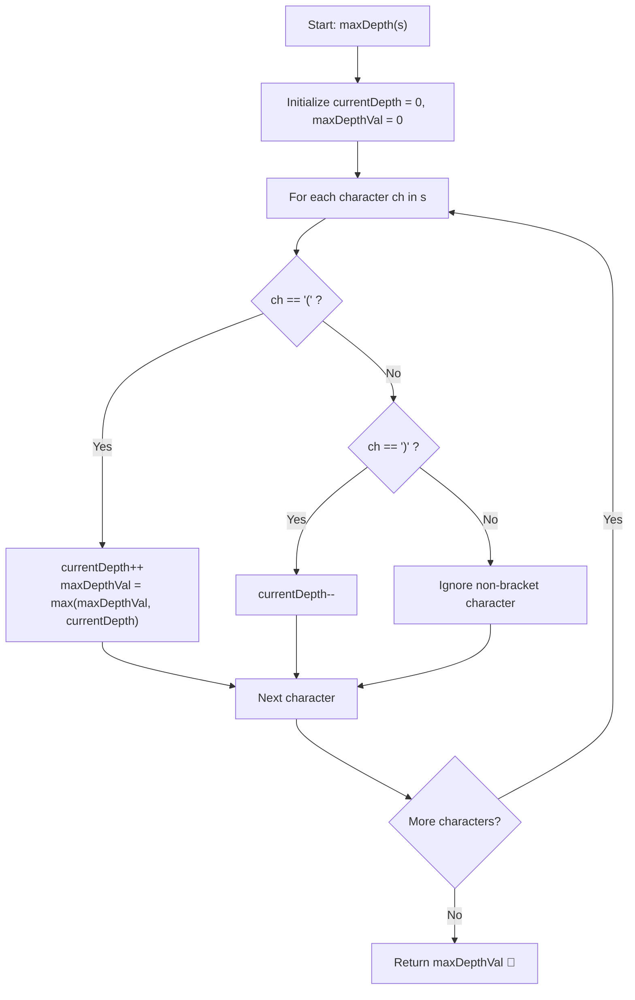

# 💡 Approach — Maximum Nesting Depth of the Parentheses

  | 📄 [Problem](./Problem.md) | 💡 [Approach](./Approach.md) | 🧩 [Solution](./Solution.cpp) | 🚀 [Main](./Main.cpp) |
  |:--------------------------:|:-----------------------------:|:------------------------------:|:---------------------:|

## 📊 Metadata

---

> [!TIP]
> **Core Intuition — Counter-Based Depth Tracking ($\mathcal{O}(n)$ Time, $\mathcal{O}(1)$ Auxiliary Space):**
> 1. **Understanding Nesting Depth**:
>    The nesting depth of any character in a Valid Parentheses String (VPS) corresponds to the number of unmatched open parentheses `'('` that precede it.
> 2. **Stack vs. Integer Counter**:
>    While a stack is standard for general bracket validation problems (such as checking matching pairs of different types `()`, `[]`, `{}`), here:
>    - The string is already guaranteed to be a VPS.
>    - There is only one type of parenthesis: `'('` and `')'`.
>    - We only need to know how many open parentheses are currently active, not their positions or contents.
>    - Therefore, a simple integer counter `currentDepth` completely replaces a physical stack data structure, saving unnecessary memory allocations and achieving an optimal $\mathcal{O}(1)$ auxiliary space complexity.
> 3. **Non-parenthesis Characters**:
>    Digits and arithmetic operators (`+`, `-`, `*`, `/`) do not change the level of nesting and can be skipped without affecting depth calculation.

---

## 🔩 Step-by-Step Breakdown

1. **State Initialization**:
   - Initialize `currentDepth = 0` to track the current level of nested parentheses.
   - Initialize `maxDepthVal = 0` to store the highest depth seen throughout the traversal.

2. **Single Pass Traversal**:
   - Iterate character-by-character through string `s`:
     - If `ch == '('`:
       - Increment `currentDepth` by $1$.
       - Update `maxDepthVal = max(maxDepthVal, currentDepth)`.
     - Else if `ch == ')'`:
       - Decrement `currentDepth` by $1$.
     - Any other character (digit or operator) is ignored.

3. **Return Result**:
   - Once the iteration completes, return `maxDepthVal`.

---

## 🔄 Mermaid Flowchart

---

## 🏃‍♂️ Dry Run

### Tracing Example 1: `s = "(1+(2*3)+((8)/4))+1"`

| Index | Character `ch` | `currentDepth` | `maxDepthVal` | Action Taken |
|:---:|:---:|:---:|:---:|:---|
| 0 | `'('` | 1 | 1 | Open paren: `currentDepth++` |
| 1 | `'1'` | 1 | 1 | Digit: ignored |
| 2 | `'+'` | 1 | 1 | Operator: ignored |
| 3 | `'('` | 2 | 2 | Open paren: `currentDepth++` |
| 4 | `'2'` | 2 | 2 | Digit: ignored |
| 5 | `'*'` | 2 | 2 | Operator: ignored |
| 6 | `'3'` | 2 | 2 | Digit: ignored |
| 7 | `')'` | 1 | 2 | Close paren: `currentDepth--` |
| 8 | `'+'` | 1 | 2 | Operator: ignored |
| 9 | `'('` | 2 | 2 | Open paren: `currentDepth++` |
| 10 | `'('` | 3 | 3 | Open paren: `currentDepth++` (Peak depth) |
| 11 | `'8'` | 3 | 3 | Digit: inside deepest nesting |
| 12 | `')'` | 2 | 3 | Close paren: `currentDepth--` |
| 13 | `'/'` | 2 | 3 | Operator: ignored |
| 14 | `'4'` | 2 | 3 | Digit: ignored |
| 15 | `')'` | 1 | 3 | Close paren: `currentDepth--` |
| 16 | `')'` | 0 | 3 | Close paren: `currentDepth--` |
| 17 | `'+'` | 0 | 3 | Operator: ignored |
| 18 | `'1'` | 0 | 3 | Digit: ignored |

**Final Output:** `3`

---

## ⏱️ Complexity Analysis

| Parameter | Complexity | Details |
| :--- | :---: | :--- |
| **Time Complexity** | $\mathcal{O}(n)$ | Single linear scan through the string of length $n$. |
| **Auxiliary Space** | $\mathcal{O}(1)$ | Only two integer counters (`currentDepth`, `maxDepthVal`) used. |

---

<h3>Happy Coding! 🚀</h3>

