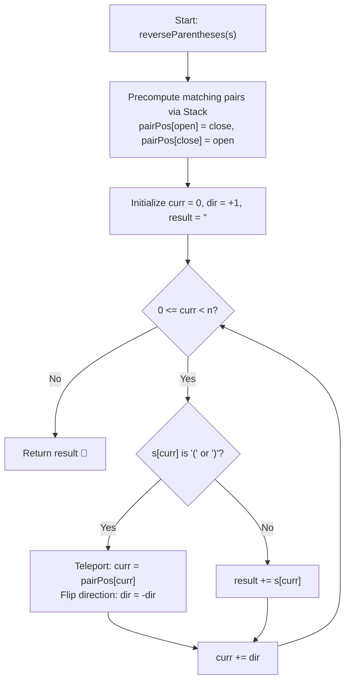

# 💡 Approach — Reverse Substrings Between Each Pair of Parentheses

  | 📄 [Problem](./Problem.md) | 💡 [Approach](./Approach.md) | 🧩 [Solution](./Solution.cpp) | 🚀 [Main](./Main.cpp) |
  |:--------------------------:|:-----------------------------:|:------------------------------:|:---------------------:|

## 📊 Metadata

---

> [!TIP]
> **Core Intuition — The "Wormhole Teleportation" Portal Algorithm ($\mathcal{O}(n)$):**
> 1. **The Naive Approach ($\mathcal{O}(n^2)$)**:
>    A straightforward approach uses a stack to store character indices. When encountering `')'`, pop the corresponding `'('` index and physically reverse the substring `s[open + 1 ... close - 1]`. While acceptable for $n \le 2000$, repeatedly reversing substrings takes quadratic $\mathcal{O}(n^2)$ time in the worst case (e.g., nested parentheses `((((...))))`).
> 2. **The Portal / Wormhole Insight ($\mathcal{O}(n)$)**:
>    Observe what reversing a substring actually means:
>    - When we enter an opening parenthesis `'('` at index $i$, we traverse its enclosed content from back to front in the reversed output.
>    - This is equivalent to **teleporting** directly to the matching closing parenthesis `')'` at index $j$, and **flipping our walking direction** ($\text{dir} = -\text{dir}$).
>    - If we encounter another parenthesis inside (either `'('` or `')'`), we again jump through the wormhole to its matching counterpart and flip direction again!
>    - When we encounter regular lowercase letters, we simply append them to our output string.
> 3. **Single Pass Construction**:
>    Because each character is visited exactly once, this transforms the problem from $\mathcal{O}(n^2)$ physical reversals into an elegant, optimal $\mathcal{O}(n)$ single-pass traversal.

---

## 🔩 Step-by-Step Breakdown

1. **Parenthesis Pairing (Precomputation)**:
   - Create an array `pairPos` of size $n$.
   - Iterate through `s` with a stack:
     - When seeing `'('`, push index $i$ onto the stack.
     - When seeing `')'`, pop the matching opening index $j$ from the stack.
     - Record the bidirectional portal: `pairPos[i] = j` and `pairPos[j] = i`.

2. **Wormhole Traversal**:
   - Initialize pointer `curr = 0`, direction `dir = 1`, and empty string `result`.
   - While $0 \le \text{curr} < n$:
     - If `s[curr] == '(' || s[curr] == ')'`:
       - Jump through the portal: `curr = pairPos[curr]`.
       - Invert movement direction: `dir = -dir`.
     - Else:
       - Append `s[curr]` to `result`.
     - Advance pointer: `curr += dir`.

3. **Termination**:
   - The traversal naturally exits when `curr` falls outside $[0, n - 1]$.
   - Return `result`.

---

## 🔄 Mermaid Flowchart

---

## 🏃‍♂️ Dry Run

### Tracing Example 2: `s = "(u(love)i)"`

- String length $n = 10$.
- Parenthesis Pairs:
  - Index $0$ `'('` pairs with Index $9$ `')'` $\implies \text{pairPos}[0] = 9, \text{pairPos}[9] = 0$
  - Index $2$ `'('` pairs with Index $7$ `')'` $\implies \text{pairPos}[2] = 7, \text{pairPos}[7] = 2$

| Step | `curr` | `s[curr]` | Action | New `curr` | `dir` | Partial `result` |
|:---:|:---:|:---:|:---|:---:|:---:|:---|
| 0 | 0 | `'('` | Teleport to 9, flip `dir` to -1 | 9 | -1 | `""` |
| 1 | 8 | `'i'` | Append `'i'` | 8 | -1 | `"i"` |
| 2 | 7 | `')'` | Teleport to 2, flip `dir` to +1 | 2 | +1 | `"i"` |
| 3 | 3 | `'l'` | Append `'l'` | 3 | +1 | `"il"` |
| 4 | 4 | `'o'` | Append `'o'` | 4 | +1 | `"ilo"` |
| 5 | 5 | `'v'` | Append `'v'` | 5 | +1 | `"ilov"` |
| 6 | 6 | `'e'` | Append `'e'` | 6 | +1 | `"ilove"` |
| 7 | 7 | `')'` | Teleport to 2, flip `dir` to -1 | 2 | -1 | `"ilove"` |
| 8 | 1 | `'u'` | Append `'u'` | 1 | -1 | `"iloveu"` |
| 9 | 0 | `'('` | Teleport to 9, flip `dir` to +1 | 9 | +1 | `"iloveu"` |
| 10 | 10 | — | `curr == 10 >= n` $\implies$ Stop | — | — | `"iloveu"` |

**Final Result**: `"iloveu"` (Matches Expected Output!)

---

## 📊 Complexity Analysis

| Complexity Metric | Estimation | Rationale |
| :--- | :---: | :--- |
| **Time Complexity** | $\mathcal{O}(n)$ | Precomputing the matching bracket pairs takes one pass of $\mathcal{O}(n)$ time. The wormhole traversal visits each character at most twice (once entering, once leaving a bracket portal) and appends letters in a single pass. Total time is strictly $\mathcal{O}(n)$. |
| **Auxiliary Space** | $\mathcal{O}(n)$ | The `pairPos` array requires $\mathcal{O}(n)$ memory, the stack takes at most $\mathcal{O}(n)$ space for open brackets, and the result string holds at most $n$ characters. |

---

<h3>Happy Coding! 🚀</h3>

