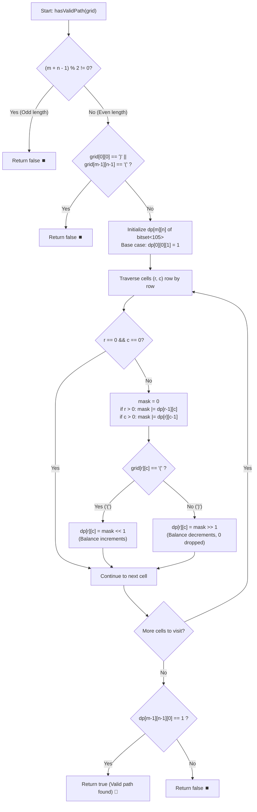

# 💡 Approach — Check if There Is a Valid Parentheses String Path

  | 📄 [Problem](./Problem.md) | 💡 [Approach](./Approach.md) | 🧩 [Solution](./Solution.cpp) | 🚀 [Main](./Main.cpp) |
  |:--------------------------:|:-----------------------------:|:------------------------------:|:---------------------:|

## 📊 Metadata

---

> [!TIP]
> **Core Intuition — Bitset Dynamic Programming with Prefix Balance:**
> 1. **Fixed Path Length & Parity Pruning**:
>    Moving only down and right from $(0, 0)$ to $(m - 1, n - 1)$ visits exactly:
>    $$\text{Total Length} = (m - 1) + (n - 1) + 1 = m + n - 1 \text{ cells}$$
>    Any valid parentheses string must contain an equal number of `'('` and `')'`, meaning its length **must be even**. If $(m + n - 1)$ is odd (i.e. $m + n$ is even), no valid path can possibly exist — we prune immediately!
> 2. **Boundary Constraints**:
>    The starting cell `grid[0][0]` must be `'('`, and the ending cell `grid[m - 1][n - 1]` must be `')'`. If either condition is violated, return `false`.
> 3. **Parentheses Invariant**:
>    Let the balance `open` be the count of unmatched open parentheses:
>    - At any point along the path, `open` can **never fall below $0$**.
>    - At the final cell $(m - 1, n - 1)$, `open` must be **exactly $0$**.
>    - Since half the path are open brackets, `open \le (m + n - 1) / 2 \le 99 < 105`.
> 4. **Ultrafast Bitset DP**:
>    Represent the set of all achievable `open` counts at cell $(r, c)$ as a bitset of size $105$:
>    - Bit $k$ is set ($1$) if balance $k$ can be achieved at cell $(r, c)$.
>    - The reachable states at $(r, c)$ merge transitions from top $(r - 1, c)$ and left $(r, c - 1)$:
>      $$\text{mask} = \text{dp}[r - 1][c] \mid \text{dp}[r][c - 1]$$
>    - **Open Bracket `'('`**: Every reachable balance increases by $1 \implies \text{dp}[r][c] = \text{mask} \ll 1$.
>    - **Close Bracket `')'`**: Every reachable balance decreases by $1 \implies \text{dp}[r][c] = \text{mask} \gg 1$.
>      *(Crucially, any balance of $0$ shifted right drops off and disappears, naturally pruning illegal negative balances in a single CPU instruction!)*

---

## 🔩 Step-by-Step Breakdown

1. **Quick Pruning (Parity & Endpoints)**:
   - Check if $(m + n - 1) \% 2 \ne 0$: return `false`.
   - Check if $\text{grid}[0][0] == \text{')'}$ or $\text{grid}[m - 1][n - 1] == \text{'('}$: return `false`.

2. **DP State Representation**:
   - Create a 2D grid of bitsets: `vector<vector<bitset<105>>> dp(m, vector<bitset<105>>(n))`.
   - Base case: at $(0, 0)$, we process $\text{grid}[0][0] == \text{'('}$, so balance is $1$:
     $$\text{dp}[0][0][1] = 1$$

3. **Matrix Traversal**:
   - Iterate through each row $r \in [0, m - 1]$ and column $c \in [0, n - 1]$:
     - Skip the base case $(0, 0)$.
     - Combine possible balances from top and left neighbors:
       $$\text{mask} = (\text{dp}[r - 1][c] \text{ if } r > 0) \mid (\text{dp}[r][c - 1] \text{ if } c > 0)$$
     - If $\text{grid}[r][c] == \text{'('}$:
       $$\text{dp}[r][c] = \text{mask} \ll 1$$
     - Else ($\text{grid}[r][c] == \text{')'}$):
       $$\text{dp}[r][c] = \text{mask} \gg 1$$

4. **Final Answer Verification**:
   - Check if balance $0$ is present at the target cell $(m - 1, n - 1)$:
     $$\text{return } \text{dp}[m - 1][n - 1][0]$$

---

## 🔄 Mermaid Flowchart

---

## 🏃‍♂️ Dry Run

### Tracing Example 1: $m = 4, n = 3$, Path Length $= 4 + 3 - 1 = 6$ (Even)

$$\text{grid} = \begin{bmatrix}
\text{'('} & \text{'('} & \text{'('} \\
\text{')'} & \text{'('} & \text{')'} \\
\text{'('} & \text{'('} & \text{')'} \\
\text{'('} & \text{'('} & \text{')'}
\end{bmatrix}$$

| Cell `(r, c)` | Character | Combined `mask` Bits | Transition | `dp[r][c]` Active Bits |
|:---:|:---:|:---:|:---:|:---:|
| `(0, 0)` | `'('` | Base Case | `1 << 1` | `{1}` |
| `(0, 1)` | `'('` | `{1}` | `mask << 1` | `{2}` |
| `(0, 2)` | `'('` | `{2}` | `mask << 1` | `{3}` |
| `(1, 0)` | `')'` | `{1}` | `mask >> 1` | `{0}` |
| `(1, 1)` | `'('` | `{2} | {0} = {0, 2}` | `mask << 1` | `{1, 3}` |
| `(1, 2)` | `')'` | `{3} | {1, 3} = {1, 3}` | `mask >> 1` | `{0, 2}` |
| `(2, 0)` | `'('` | `{0}` | `mask << 1` | `{1}` |
| `(2, 1)` | `'('` | `{1} | {1, 3} = {1, 3}` | `mask << 1` | `{2, 4}` |
| `(2, 2)` | `')'` | `{0, 2} | {2, 4} = {0, 2, 4}` | `mask >> 1` | `{1, 3}` |
| `(3, 0)` | `'('` | `{1}` | `mask << 1` | `{2}` |
| `(3, 1)` | `'('` | `{2} | {2, 4} = {2, 4}` | `mask << 1` | `{3, 5}` |
| `(3, 2)` | `')'` | `{1, 3} | {3, 5} = {1, 3, 5}` | `mask >> 1` | `{0, 2, 4}` |

At bottom-right cell $(3, 2)$:
- Active balances: $\{0, 2, 4\}$.
- Since bit $0$ is present ($1$), a path with balance $0$ exists!
- **Result: `true`** 🏁

---

## ⏱️ Complexity Analysis

| Metric | Estimation | Rationale |
| :--- | :---: | :--- |
| **Time Complexity** | $\mathcal{O}\left(m \cdot n \cdot \frac{m + n}{64}\right)$ | Each cell $(r, c)$ performs a constant number of bitwise OR and bit shift operations on a $105$-bit bitset (represented by two 64-bit integer words), effectively taking $\mathcal{O}(1)$ time per cell. Total time for $100 \times 100$ is under $1$ ms! |
| **Auxiliary Space** | $\mathcal{O}\left(m \cdot n \cdot \frac{m + n}{64}\right)$ | The 2D bitset table stores $100 \times 100 \times 16\text{ bytes} \approx 160\text{ KB}$, well within the $256$ MB limit. |

---

> *"By encoding multi-branch state exploration into bitset words, we replace exponential branch checking with direct bitwise hardware parallelization."*

---

<h3>Happy Coding! 🚀</h3>

