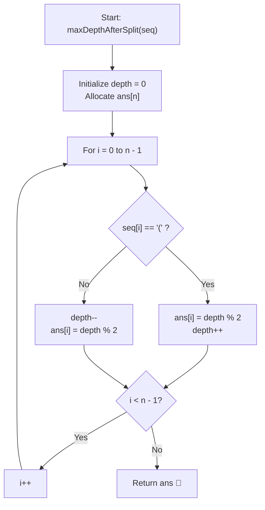

# 💡 Approach — Maximum Nesting Depth of Two Valid Parentheses Strings

  | 📄 [Problem](./Problem.md) | 💡 [Approach](./Approach.md) | 🧩 [Solution](./Solution.cpp) | 🚀 [Main](./Main.cpp) |
  |:--------------------------:|:-----------------------------:|:------------------------------:|:---------------------:|

## 📊 Metadata

---

> [!TIP]
> **Core Intuition — Depth-Level Parity Partitioning:**
> 1. **Nesting Depth Invariant**:
>    At each index $i$, a parenthesis character belongs to a specific nesting depth level $d$.
>    - When encountering an opening `'('`, it opens a new nesting level $d$.
>    - When encountering a closing `')'`, it closes the corresponding nesting level $d$.
> 2. **Equitable Split Strategy**:
>    To minimize $\max(\text{depth}(A), \text{depth}(B))$, we want to partition the nesting depth levels as evenly as possible between subsequences $A$ and $B$.
> 3. **Alternating Parity Assignment**:
>    - Assign even depth levels ($0, 2, 4, \dots$) to Subsequence $A$ (`0`).
>    - Assign odd depth levels ($1, 3, 5, \dots$) to Subsequence $B$ (`1`).
> 4. **Validity Guarantee**:
>    Because matching `'('` and `')'` pairs share the exact same nesting level $d$, they are always assigned to the same subsequence. Thus, both $A$ and $B$ are independently guaranteed to be valid parentheses strings.
> 5. **Optimality Proof**:
>    If the total maximum nesting depth is $D$, this alternating parity scheme guarantees:
>    $$\text{depth}(A) = \left\lceil \frac{D}{2} \right\rceil, \quad \text{depth}(B) = \left\lfloor \frac{D}{2} \right\rfloor$$
>    Since $\max(\text{depth}(A), \text{depth}(B)) \ge \left\lceil \frac{D}{2} \right\rceil$ for any valid partition, this greedy construction is mathematically optimal.

---

## 🔩 Step-by-Step Breakdown

1. **State Tracking**:
   - Maintain an integer `depth = 0` indicating the number of currently open unmatched parentheses.
   - Allocate an output array `ans` of size $n = \text{seq.length}$.

2. **Linear Scan**:
   - For each index $i$ from $0$ to $n - 1$:
     - If `seq[i] == '('`:
       - The current opening bracket enters depth level `depth`.
       - Assign `ans[i] = depth % 2`.
       - Increment `depth++`.
     - Else (`seq[i] == ')'`):
       - Decrement `depth--` first, matching the bracket to its level.
       - Assign `ans[i] = depth % 2`.

3. **Parity Symmetry**:
   - Notice that for `'('`, the depth before incrementing determines group membership: `(depth++) % 2`.
   - For `')'`, the depth after decrementing determines group membership: `(--depth) % 2`.
   - In both cases, the matched open and close parentheses receive the exact same value (`0` or `1`).

4. **Return Answer**:
   - Return the integer array `ans`.

---

## 🔄 Mermaid Flowchart

---

## 🏃‍♂️ Dry Run

### Tracing Example 1: `seq = "(()())"`

| Index $i$ | Character `seq[i]` | Depth Before | Action | Depth After | Assigned Group `ans[i]` | Subsequence |
| :---: | :---: | :---: | :---: | :---: | :---: | :---: |
| **0** | `'('` | $0$ | $0 \pmod 2 = 0$ | $1$ | `0` | $A$ |
| **1** | `'('` | $1$ | $1 \pmod 2 = 1$ | $2$ | `1` | $B$ |
| **2** | `')'` | $2$ | `--depth = 1`, $1 \pmod 2 = 1$ | $1$ | `1` | $B$ |
| **3** | `'('` | $1$ | $1 \pmod 2 = 1$ | $2$ | `1` | $B$ |
| **4** | `')'` | $2$ | `--depth = 1`, $1 \pmod 2 = 1$ | $1$ | `1` | $B$ |
| **5** | `')'` | $1$ | `--depth = 0`, $0 \pmod 2 = 0$ | $0$ | `0` | $A$ |

- Subsequence $A$ (indices $0, 5$): `"()"` $\implies \text{depth} = 1$
- Subsequence $B$ (indices $1, 2, 3, 4$): `"()()"` $\implies \text{depth} = 1$
- $\max(\text{depth}(A), \text{depth}(B)) = \max(1, 1) = \mathbf{1}$.
- Result: `[0, 1, 1, 1, 1, 0]`.

---

## ⏱️ Complexity Analysis

| Metric | Complexity | Rationale |
| :--- | :---: | :--- |
| **Time Complexity** | $\mathcal{O}(n)$ | We perform a single pass over the string `seq` of length $n$. Each character requires only $\mathcal{O}(1)$ arithmetic and modulo operations. |
| **Auxiliary Space** | $\mathcal{O}(1)$ | Only a single integer variable `depth` is used for state tracking. The output vector of size $n$ is required for the problem result. |

---

> *"By distributing nesting depths based on parity, we bisect the nesting hierarchy into two perfectly balanced valid parenthesis sequences."*

---

<h3>Happy Coding! 🚀</h3>

