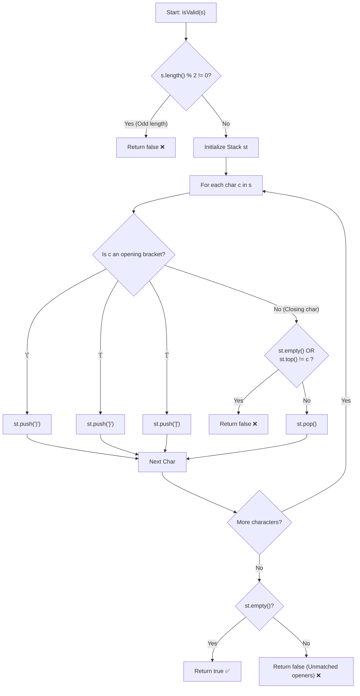

# 💡 Approach — Valid Parentheses

  | 📄 [Problem](./Problem.md) | 💡 [Approach](./Approach.md) | 🧩 [Solution](./Solution.cpp) | 🚀 [Main](./Main.cpp) |
  |:--------------------------:|:-----------------------------:|:------------------------------:|:---------------------:|

## 📊 Metadata

---

> [!TIP]
> **Core Intuition — The "Expected Closing Bracket" Stack Pattern:**
> 1. **LIFO Matching**:
>    Because brackets can be nested arbitrarily, the most recently opened bracket must be the first one to be closed. A **Stack** naturally enforces this Last-In, First-Out order.
> 2. **Push Expected Closers Directly**:
>    Instead of pushing `'('`, `'{'`, `'['` and checking complex lookup tables on close brackets, whenever an opener appears, push its **matching closer** onto the stack:
>    - Encounter `'('` $\implies$ push `')'`
>    - Encounter `'{'` $\implies$ push `'}'`
>    - Encounter `'['` $\implies$ push `']'`
> 3. **Single Identity Comparison**:
>    When any closing bracket arrives, the validation condition becomes simply:
>    `!st.empty() && st.top() == c`
>    If this condition is violated at any point, the string is immediately invalid.
> 4. **Early Exit on Odd Length**:
>    A valid parentheses string must contain matched pairs; hence an odd length string can never be valid ($n \% 2 \ne 0 \implies \text{false}$).

---

## 🔩 Step-by-Step Breakdown

1. **Parity Check**:
   - If $s\text{.length}() \% 2 \ne 0$, return `false` immediately.

2. **Stack Initialization**:
   - Create a stack of characters `st`.
   - Alternatively, use a preallocated `vector<char>` or the string itself as a stack pointer to completely bypass heap reallocation overhead.

3. **Character Iteration**:
   - Traverse through each character $c$ in string $s$:
     - **Case 1: Opening Parenthesis `'('`**:
       Push `')'` to stack.
     - **Case 2: Opening Brace `'{'`**:
       Push `'}'` to stack.
     - **Case 3: Opening Bracket `'['`**:
       Push `']'` to stack.
     - **Case 4: Closing Parenthesis / Brace / Bracket**:
       - Check if stack is empty (indicates an extra closing bracket without an opener).
       - Check if `st.top() != c` (indicates mismatched bracket type or wrong ordering).
       - If either condition holds, return `false`.
       - Otherwise, pop the matched bracket `st.pop()`.

4. **Final Emptiness Check**:
   - After inspecting all characters in $s$, return `st.empty()`.
   - If the stack is empty, every bracket was properly matched and closed. If elements remain, some openers were never closed.

---

## 🔄 Mermaid Flowchart

---

## 🏃‍♂️ Dry Run

### Tracing Example 4: $s = \text{"([])"}$

| Index $i$ | Character $c$ | Action Taken | Stack State (Bottom $\to$ Top) | Match Valid? |
| :---: | :---: | :--- | :---: | :---: |
| — | — | Initial state | `[]` | — |
| **0** | `'('` | Opener: push `')'` | `[ ')' ]` | ✅ |
| **1** | `'['` | Opener: push `']'` | `[ ')', ']' ]` | ✅ |
| **2** | `']'` | Closer: matches `st.top()` $\implies$ pop | `[ ')' ]` | ✅ |
| **3** | `')'` | Closer: matches `st.top()` $\implies$ pop | `[]` | ✅ |

- End of string reached.
- Stack is empty: $\implies$ **`true`**.

### Tracing Example 5: $s = \text{"([)]"}$

| Index $i$ | Character $c$ | Action Taken | Stack State (Bottom $\to$ Top) | Match Valid? |
| :---: | :---: | :--- | :---: | :---: |
| — | — | Initial state | `[]` | — |
| **0** | `'('` | Opener: push `')'` | `[ ')' ]` | ✅ |
| **1** | `'['` | Opener: push `']'` | `[ ')', ']' ]` | ✅ |
| **2** | `')'` | Closer: expected `']'`, found `')'` ($')' \ne ']'$) | `[ ')', ']' ]` | ❌ **Mismatch!** |

- Immediate exit: returns **`false`**.

---

## ⏱️ Complexity Analysis

| Metric | Complexity | Rationale |
| :--- | :---: | :--- |
| **Time Complexity** | $\mathcal{O}(n)$ | We scan each character of the string $s$ of length $n$ exactly once. Each stack push and pop operation takes $\mathcal{O}(1)$ time. Overall execution is strictly linear. |
| **Auxiliary Space** | $\mathcal{O}(n)$ | In the worst case (e.g., all opening brackets like `"(((((("`), the stack stores up to $n$ characters. With fast array allocation, space is tightly bounded. |

---

> *"The elegance of stack-based parsing lies in postponing verification: we record our exact expectations when entering a scope and validate them instantaneously upon exit."*

---

<h3>Happy Coding! 🚀</h3>

