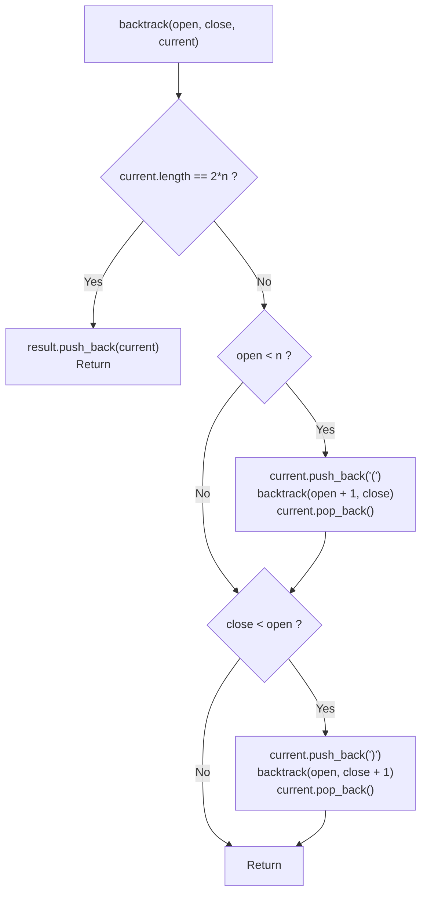

# 💡 Approach — Generate Parentheses

<div align="center">

  | 📄 [Problem](./Problem.md) | 💡 [Approach](./Approach.md) | 🧩 [Solution](./Solution.cpp) | 🚀 [Main](./Main.cpp) |
  |:--------------------------:|:-----------------------------:|:------------------------------:|:---------------------:|
</div>

## 📊 Metadata


---

> [!TIP]
> **Core Intuition — Controlled Backtracking & Structural Invariants:**
> 1. **Prefix Invariant**:
>    A valid string of parentheses of length $2n$ can never have more closing brackets than opening brackets at any prefix. If `close > open`, the string is irreparably malformed.
> 2. **Controlled Transitions**:
>    Instead of generating all $2^{2n}$ candidate strings and validating each with a stack ($\mathcal{O}(2^{2n} \cdot n)$), we only place characters that satisfy the prefix invariant:
>    - Add `'('` if $\text{open} < n$.
>    - Add `')'` if $\text{close} < \text{open}$.
> 3. **Catalan Recursion**:
>    Every generated string is guaranteed to be well-formed upon reaching length $2n$. Thus, exactly $C_n$ leaves are visited, where:
>    $$C_n = \frac{1}{n + 1}\binom{2n}{n}$$
> 4. **Dynamic Programming Alternative**:
>    Any non-empty well-formed parentheses string can be uniquely decomposed based on the closing bracket that matches the very first opening bracket:
>    $$\text{Sequence} = \text{"("} + A + \text{")"} + B$$
>    where $A$ contains $k$ pairs ($0 \le k \le n - 1$) and $B$ contains $n - 1 - k$ pairs. This establishes an elegant DP formulation.

---

## 🔩 Step-by-Step Breakdown

### Method 1: Depth-First Search with Backtracking (Optimal)

1. **State Definition**:
   - `open`: Count of `'('` placed so far ($0 \le \text{open} \le n$).
   - `close`: Count of `')'` placed so far ($0 \le \text{close} \le \text{open}$).
   - `current`: A dynamic string buffer of current parentheses sequence.
   - `result`: A collection of completed valid strings.

2. **Base Condition**:
   - If $\text{current.length}() == 2n$:
     - We have placed all $n$ opening and $n$ closing brackets.
     - Add `current` to `result` and return.

3. **Recursive Exploration**:
   - **Branch 1 (Add Open Bracket)**:
     - If $\text{open} < n$:
       - `current.push_back('(')`
       - Recurse with $\text{backtrack}(n, \text{open} + 1, \text{close}, \text{current}, \text{result})$
       - `current.pop_back()` (backtrack state)
   - **Branch 2 (Add Close Bracket)**:
     - If $\text{close} < \text{open}$:
       - `current.push_back(')')`
       - Recurse with $\text{backtrack}(n, \text{open}, \text{close} + 1, \text{current}, \text{result})$
       - `current.pop_back()` (backtrack state)

4. **Return Result**:
   - Return `result` containing all well-formed combinations in lexicographical order.

---

## 🔄 Mermaid Flowchart



---

## 🏃‍♂️ Dry Run

### Tracing $n = 2$ Decision Tree

Total pairs: $n = 2 \implies 2n = 4$ characters.
Expected combinations: $C_2 = \frac{1}{3}\binom{4}{2} = 2$.

```text
                     "" (open=0, close=0)
                            |
                         "(" (1, 0)
                       /           \
               "((" (2, 0)       "()" (1, 1)
                   |                  |
              "(()" (2, 1)       "()(" (2, 1)
                   |                  |
             "(())" (2, 2)      "()()" (2, 2)
              [LEAF 1]           [LEAF 2]
```

| Step | Current String | `open` | `close` | Valid Moves | Action Taken |
| :---: | :---: | :---: | :---: | :---: | :--- |
| **1** | `""` | $0$ | $0$ | Only `'('` | Append `'('` $\to$ `"("` |
| **2** | `"("` | $1$ | $0$ | `'('` and `')'` | Branch 1: Append `'('` $\to$ `"(("` |
| **3** | `"(("` | $2$ | $0$ | Only `')'` | Append `')'` $\to$ `"(()"` |
| **4** | `"(()"` | $2$ | $1$ | Only `')'` | Append `')'` $\to$ `"(())"` |
| **5** | `"(())"` | $2$ | $2$ | Base Case reached | **Add `"(())"` to result** |
| **6** | Backtrack to step 2 | $1$ | $0$ | Branch 2: Append `')'` | Append `')'` $\to$ `"()"` |
| **7** | `"()"` | $1$ | $1$ | Only `'('` | Append `'('` $\to$ `"()("` |
| **8** | `"()("` | $2$ | $1$ | Only `')'` | Append `')'` $\to$ `"()()"` |
| **9** | `"()()"` | $2$ | $2$ | Base Case reached | **Add `"()()"` to result** |

Final output: `["(())", "()()"]`.

---

## ⏱️ Complexity Analysis

| Metric | Complexity | Rationale |
| :--- | :---: | :--- |
| **Time Complexity** | $\mathcal{O}\left(\frac{4^n}{\sqrt{n}}\right)$ | The total number of valid parentheses sequences generated is bounded by the $n$-th Catalan number $C_n = \frac{1}{n+1}\binom{2n}{n} \approx \frac{4^n}{n\sqrt{\pi n}}$. Because each combination of length $2n$ requires $\mathcal{O}(n)$ time to copy into the output list, overall time is $\mathcal{O}\left(n \cdot C_n\right) = \mathcal{O}\left(\frac{4^n}{\sqrt{n}}\right)$. |
| **Auxiliary Space** | $\mathcal{O}(n)$ | The recursion tree reaches a maximum depth of $2n$. The current string buffer uses $\mathcal{O}(n)$ memory. Excluding the output array, auxiliary space is strictly $\mathcal{O}(n)$. |

---

> *"By enforcing local invariants on each recursive step, we eliminate invalid permutations before they are ever constructed, pruning the state-space directly to the exact Catalan count."*

---

<div align="center">
<h3>Happy Coding! 🚀</h3>
<a href="../247_Day/Approach.md">
  
</a>
<a href="https://x.com/PankajB42550" target="_blank">
  
</a>
<a href="../249_Day/Approach.md">
  
</a>
</div>
