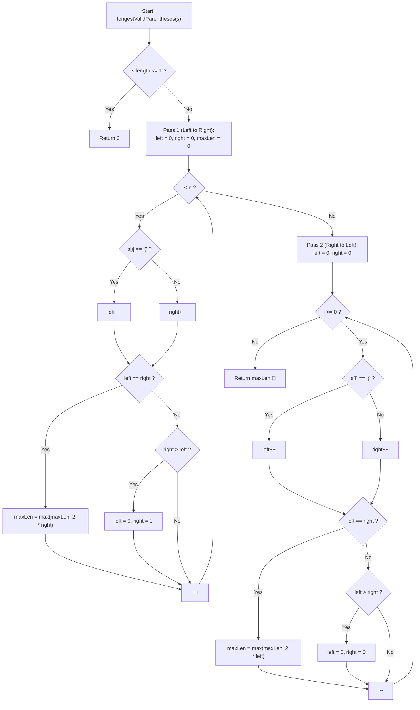

# 💡 Approach — Longest Valid Parentheses

  | 📄 [Problem](./Problem.md) | 💡 [Approach](./Approach.md) | 🧩 [Solution](./Solution.cpp) | 🚀 [Main](./Main.cpp) |
  |:--------------------------:|:-----------------------------:|:------------------------------:|:---------------------:|

## 📊 Metadata

---

> [!TIP]
> **Core Intuition — The Prefix Balance Property & Two-Pass Counter Method:**
> 1. **Validity Condition**:
>    A parentheses string is valid if and only if:
>    - At every prefix, count of `'('` $\ge$ count of `')'`.
>    - At the end, count of `'('` $=$ count of `')'`.
> 2. **Why a Single Left-to-Right Pass is Insufficient**:
>    In `"(()"`, `left` reaches $2$ and `right` reaches $1$. Since `right` never matches or exceeds `left`, a single forward pass would fail to detect the valid subsegment `"()"`.
> 3. **The Symmetrical Two-Pass Solution ($\mathcal{O}(1)$ Space)**:
>    - **Left $\to$ Right Pass**: Increment `left` on `'('` and `right` on `')'`. If `left == right`, record max length $2 \times \text{right}$. If `right > left`, invalidity is detected; reset `left = right = 0`. This catches all substrings balanced from the left.
>    - **Right $\to$ Left Pass**: Scan backwards with identical counting logic, resetting when `left > right`. This symmetrically catches substrings that have surplus `'('` characters before them (like `"(()"`).
> 4. **Stack Alternative ($\mathcal{O}(n)$ Space)**:
>    Initialize a stack with `-1` representing the baseline before valid substrings start. Push `'('` indices. On `')'`, pop once:
>    - If stack is non-empty, current valid length is $i - \text{st.top()}$.
>    - If stack becomes empty, push $i$ as the new anchor/baseline index.

---

## 🔩 Step-by-Step Breakdown

### Method 1: Two-Pass Counter ($\mathcal{O}(n)$ Time, $\mathcal{O}(1)$ Space) — Optimal

1. **Initialize Counters**:
   - `maxLen = 0`, `left = 0`, `right = 0`.
   - Let $n = |s|$. If $n \le 1$, return $0$.

2. **Forward Pass (Left to Right)**:
   - For $i = 0$ to $n - 1$:
     - If $s[i] == \text{'('}$, increment `left++`.
     - Else, increment `right++`.
     - If `left == right`: update $\text{maxLen} = \max(\text{maxLen}, 2 \times \text{right})$.
     - Else if `right > left`: reset `left = 0, right = 0`.

3. **Backward Pass (Right to Left)**:
   - Reset `left = 0, right = 0`.
   - For $i = n - 1$ down to $0$:
     - If $s[i] == \text{'('}$, increment `left++`.
     - Else, increment `right++`.
     - If `left == right`: update $\text{maxLen} = \max(\text{maxLen}, 2 \times \text{left})$.
     - Else if `left > right`: reset `left = 0, right = 0`.

4. **Return Result**:
   - Return `maxLen`.

---

## 🔄 Mermaid Flowchart

---

## 🏃‍♂️ Dry Run

### Tracing Example 2: $s = \text{")()())"}$ ($n = 6$)

#### Forward Pass (Left to Right):

| $i$ | $s[i]$ | `left` | `right` | Condition | `maxLen` | Action |
| :---: | :---: | :---: | :---: | :---: | :---: | :--- |
| **0** | `')'` | 0 | 1 | $\text{right} > \text{left}$ | 0 | Reset `left = right = 0` |
| **1** | `'('` | 1 | 0 | $\text{left} > \text{right}$ | 0 | Continue |
| **2** | `')'` | 1 | 1 | $\text{left} == \text{right}$ | 2 | Update $\text{maxLen} = \max(0, 2 \times 1) = 2$ |
| **3** | `'('` | 2 | 1 | $\text{left} > \text{right}$ | 2 | Continue |
| **4** | `')'` | 2 | 2 | $\text{left} == \text{right}$ | 4 | Update $\text{maxLen} = \max(2, 2 \times 2) = 4$ |
| **5** | `')'` | 2 | 3 | $\text{right} > \text{left}$ | 4 | Reset `left = right = 0` |

#### Backward Pass (Right to Left):
Traverses from index $5$ to $0$:
- At index $4$: `')'` $\to$ `right = 1`
- At index $3$: `'('` $\to$ `left = 1` $\to$ $\text{left} == \text{right} \implies \text{len} = 2$.
- At index $2$: `')'` $\to$ `right = 2`
- At index $1$: `'('` $\to$ `left = 2` $\to$ $\text{left} == \text{right} \implies \text{len} = 4$.
- At index $0$: `')'` $\to$ `right = 3`
- Final result: **`4`** ✅

---

## 📊 Complexity Analysis

| Approach | Time Complexity | Auxiliary Space | Key Advantage |
| :--- | :---: | :---: | :--- |
| **Two-Pass Counter** | $\mathcal{O}(n)$ | $\mathcal{O}(1)$ | Optimal space, no allocations, fastest runtime cache performance. |
| **Stack-Based** | $\mathcal{O}(n)$ | $\mathcal{O}(n)$ | Single pass, simple boundary arithmetic $i - \text{top}$. |
| **Dynamic Programming** | $\mathcal{O}(n)$ | $\mathcal{O}(n)$ | Subproblem recurrence, extends easily to generalized substring DP. |

---

> *"Balance is not found by looking in only one direction; symmetry emerges when we observe both from the start and from the end."*

---

<h3>Happy Coding! 🚀</h3>

