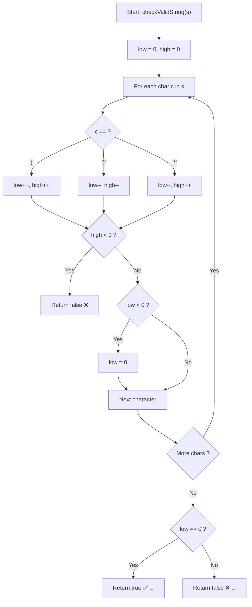

# 💡 Approach — Valid Parenthesis String

  | 📄 [Problem](./Problem.md) | 💡 [Approach](./Approach.md) | 🧩 [Solution](./Solution.cpp) | 🚀 [Main](./Main.cpp) |
  |:--------------------------:|:-----------------------------:|:------------------------------:|:---------------------:|

## 📊 Metadata

---

> [!TIP]
> **Core Intuition — Continuous Interval Tracking `[low, high]`:**
> 1. **Degrees of Freedom**:
>    In standard parentheses matching, we maintain a single scalar counter of open `'('` brackets. With the wildcard `'*'`, the count of open brackets ceases to be a single number and expands into a range of possibilities.
> 2. **Interval Continuity**:
>    Because each `'*'` can change the count by $-1$ (as `')'`), $+1$ (as `'('`), or $0$ (as empty `""`), the set of possible open bracket counts at any prefix forms a continuous interval:
>    $$\text{count} \in [\text{low}, \text{high}]$$
> 3. **Pruning & Validity Conditions**:
>    - **Maximum capacity bound**: If $\text{high} < 0$, even assigning every `'*'` to be an opening bracket `'('` fails to neutralize the closing brackets `')'`. The string is irrevocably invalid $\implies \text{return false}$.
>    - **Lower bound normalization**: If $\text{low} < 0$, we clamp $\text{low} = 0$. A negative open count is non-viable, but can be avoided by choosing `'*'` as an empty string `""` or `'('` rather than `')'`.
>    - **Final acceptance**: At index $n$, the string is valid if and only if $0 \in [\text{low}, \text{high}]$, which translates to $\text{low} == 0$.

---

## 🔩 Step-by-Step Breakdown

### Method 1: Greedy Range Tracking ($\mathcal{O}(n)$ Time, $\mathcal{O}(1)$ Space) — Optimal

1. **Initialize Interval**:
   - Set `low = 0` (minimum potential open brackets) and `high = 0` (maximum potential open brackets).

2. **Iterate Through Characters**:
   - For each character $c$ in string $s$:
     - If $c == \text{'('}$:
       - Both bounds increase: `low++`, `high++`.
     - Else if $c == \text{')'}$:
       - Both bounds decrease: `low--`, `high--`.
     - Else ($c == \text{'*'}`):
       - If treated as `')'`: `low` decreases $\to$ `low--`.
       - If treated as `'('`: `high` increases $\to$ `high++`.
       - If treated as `""`: open balance remains unchanged, which is inherently covered between `low` and `high`.

3. **Check Invariant Boundaries**:
   - If `high < 0`:
     - Return `false` immediately (excess closing brackets).
   - If `low < 0`:
     - Reset `low = 0` (cannot carry negative required open brackets).

4. **Final Check**:
   - Return `low == 0`.

---

### Method 2: Two Stacks for Indices ($\mathcal{O}(n)$ Time, $\mathcal{O}(n)$ Space)

1. Maintain `openIndices` for indices of `'('` and `starIndices` for indices of `'*'`.
2. On `')'`, pop from `openIndices` first. If empty, pop from `starIndices`. If both empty, return `false`.
3. After scanning, match remaining `'('` with `'*'`:
   - An `'*'` can only close a `'('` if its index is greater: `starIndices.top() > openIndices.top()`.
4. If all `'('` are matched, return `true`.

---

## 🔄 Mermaid Flowchart

---

## 🏃‍♂️ Dry Run

### Tracing Example 3: $s = \text{"(*))"}$ ($n = 4$)

| $i$ | $s[i]$ | Operation | `low` (before clamp) | `low` (after clamp) | `high` | Condition Check |
| :---: | :---: | :--- | :---: | :---: | :---: | :--- |
| **0** | `'('` | `low++, high++` | 1 | 1 | 1 | `high >= 0` ✅ |
| **1** | `'*'` | `low--, high++` | 0 | 0 | 2 | `high >= 0` ✅ |
| **2** | `')'` | `low--, high--` | -1 | 0 | 1 | `high >= 0` ✅, clamped `low` |
| **3** | `')'` | `low--, high--` | -1 | 0 | 0 | `high >= 0` ✅, clamped `low` |

**Final Evaluation:**
- At end of traversal: `low == 0` $\implies$ **`true`** ✅

---

### Tracing Example 4: $s = \text{"("}$ ($n = 1$)

| $i$ | $s[i]$ | Operation | `low` | `high` | Condition Check |
| :---: | :---: | :--- | :---: | :---: | :--- |
| **0** | `'('` | `low++, high++` | 1 | 1 | `high >= 0` ✅ |

**Final Evaluation:**
- At end of traversal: `low = 1 != 0` $\implies$ **`false`** ❌

---

## 📊 Complexity Analysis

| Approach | Time Complexity | Auxiliary Space | Key Advantage |
| :--- | :---: | :---: | :--- |
| **Greedy Range Tracking** | $\mathcal{O}(n)$ | $\mathcal{O}(1)$ | Optimal space, single pass, zero heap or stack memory allocation. |
| **Two Stacks (Indices)** | $\mathcal{O}(n)$ | $\mathcal{O}(n)$ | Intuitive physical matching of index order, great for debugging. |
| **Dynamic Programming** | $\mathcal{O}(n^2)$ | $\mathcal{O}(n^2)$ | Exhaustive subproblem memoization $(i, \text{openCount})$. |

---

> *"When uncertainty offers multiple paths, bounding the extremes illuminates the truth without walking every permutation."*

---

<h3>Happy Coding! 🚀</h3>

