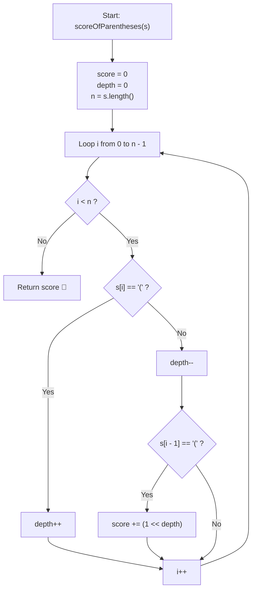

# 💡 Approach — Score of Parentheses

<div align="center">

  | 📄 [Problem](./Problem.md) | 💡 [Approach](./Approach.md) | 🧩 [Solution](./Solution.cpp) | 🚀 [Main](./Main.cpp) |
  |:--------------------------:|:-----------------------------:|:------------------------------:|:---------------------:|
</div>

## 📊 Metadata


---

> [!TIP]
> **Core Intuition — Nesting Depth Counting & Bit-Shift Contribution:**
> 1. **Algebraic Distributive Expansion**:
>    Every nested expression $(A + B)$ evaluates to $2 \times (A + B) = 2A + 2B$. Continuing this expansion recursively, the score of the entire string is simply the sum over all primitive leaves `"()"` of $2^{\text{depth}}$, where $\text{depth}$ is the number of open brackets enclosing that specific pair.
> 2. **Leaf Identification**:
>    A leaf `"()"` occurs if and only if a closing bracket `s[i] == ')'` is immediately preceded by an opening bracket `s[i - 1] == '('`.
> 3. **Space Optimization ($\mathcal{O}(1)$ Auxiliary Space)**:
>    Instead of maintaining an explicit stack or parsing a recursion tree, we only track the current `depth` integer. When seeing `'('`, increment `depth++`. When seeing `')'`, decrement `depth--`. If `s[i - 1] == '('`, add $(1 \ll \text{depth})$ to the running total.

---

## 🔩 Step-by-Step Breakdown

### Method 1: Bit-Shift Nesting Depth ($\mathcal{O}(n)$ Time, $\mathcal{O}(1)$ Auxiliary Space) — Primary

1. **State Tracking Variables**:
   - Initialize `score = 0` to accumulate the total score.
   - Initialize `depth = 0` to track the current level of open parenthesis nesting.

2. **Single Pass String Scan**:
   - Iterate through index $i \in [0, s.\text{length}() - 1]$:
     - If $s[i] == \text{'('}$:
       - Increment nesting depth: `depth++`.
     - Else ($s[i] == \text{')'}$):
       - Decrement nesting depth: `depth--`.
       - Check if $(s[i-1], s[i])$ forms an innermost core leaf:
         - If $s[i - 1] == \text{'('}$, add $(1 \ll \text{depth})$ to `score`.

3. **Return Evaluated Score**:
   - Return `score`.

---

### Method 2: Stack of Current Scope Scores ($\mathcal{O}(n)$ Time, $\mathcal{O}(n)$ Auxiliary Space) — Alternative

1. **Stack Initialization**:
   - Push `0` onto `stack<int> st` to represent the root accumulation context.

2. **Iterate Characters**:
   - For each character $c \in s$:
     - If $c == \text{'('}$:
       - Push `0` onto the stack (starting a new nested scope).
     - Else ($c == \text{')'}$):
       - Pop the top value `v = st.top()`; `st.pop()`.
       - The score contributed by this balanced segment is $\max(2 \times v, 1)$.
       - Add this contributed score to the current scope: `st.top() += max(2 * v, 1)`.

3. **Final Result**:
   - Return `st.top()`.

---

## 🔄 Mermaid Flowchart



---

## 🏃‍♂️ Dry Run

### Tracing Example 4: `s = "(()(()))"` ($n = 8$)

#### Parse Tree Visualization:

```text
               ROOT (Total Score = 6)
                      │
                     ( )  <- Encloses [ () + (()) ]
                    ┌───┴───┐
                   ( )     ( )
                    │       │
                  Leaf 1   ( )
                  (d = 1)   │
                  val = 2  Leaf 2
                           (d = 2)
                           val = 4
```

#### Step-by-Step Iteration Table:

| Index $i$ | Character `s[i]` | Action | Active `depth` | Condition `s[i-1] == '('` | Contribution Added | Running `score` |
| :---: | :---: | :---: | :---: | :---: | :---: | :---: |
| `0` | `'('` | Open outer frame | $1$ | — | — | $0$ |
| `1` | `'('` | Open first child | $2$ | — | — | $0$ |
| `2` | `')'` | Close first child | $1$ | **True** (Leaf at depth 1) | $1 \ll 1 = 2$ | **$2$** |
| `3` | `'('` | Open second child | $2$ | — | — | $2$ |
| `4` | `'('` | Open inner child | $3$ | — | — | $2$ |
| `5` | `')'` | Close inner child | $2$ | **True** (Leaf at depth 2) | $1 \ll 2 = 4$ | **$6$** |
| `6` | `')'` | Close second child | $1$ | **False** (`s[4] == ')'`) | $0$ | $6$ |
| `7` | `')'` | Close outer frame | $0$ | **False** (`s[5] == ')'`) | $0$ | **$6$** |

**Final Score:** **$6$** ✅

---

## 📊 Complexity Analysis

| Complexity Metric | Estimation | Rationale |
| :--- | :---: | :--- |
| **Time Complexity** | $\mathcal{O}(n)$ | We scan string $s$ of length $n$ exactly once with constant-time bitwise and arithmetic operations at each index. |
| **Auxiliary Space** | $\mathcal{O}(1)$ | Only two integer scalars (`score`, `depth`) are retained in the primary method. No stack or dynamic heap allocation is used. |

---

> *"The whole is the sum of its nested parts; distribute the weight from the roots to the leaves and each unit counts in powers of two."*

---

<div align="center">
<h3>Happy Coding! 🚀</h3>
<a href="../250_Day/Approach.md">
  
</a>
<a href="https://x.com/PankajB42550" target="_blank">
  
</a>
<a href="../252_Day/Approach.md">
  
</a>
</div>
