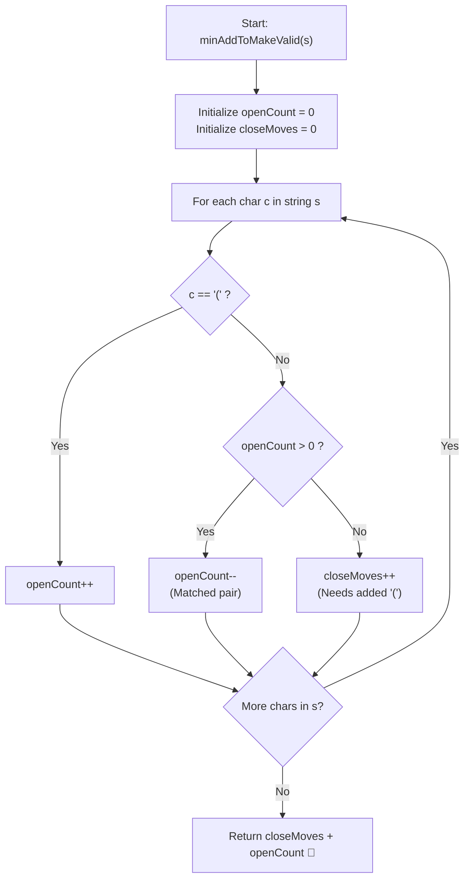

# 💡 Approach — Minimum Add to Make Parentheses Valid

<div align="center">

  | 📄 [Problem](./Problem.md) | 💡 [Approach](./Approach.md) | 🧩 [Solution](./Solution.cpp) | 🚀 [Main](./Main.cpp) |
  |:--------------------------:|:-----------------------------:|:------------------------------:|:---------------------:|
</div>

## 📊 Metadata


---

> [!TIP]
> **Core Intuition — Greedy Balance Tracking & Deficit Counting:**
> 1. **Balance Invariant**:
>    A valid parentheses sequence requires that every closing bracket `')'` matches an earlier opening bracket `'('`, and no opening bracket remains unclosed at the end.
> 2. **Immediate Deficit Recognition**:
>    Whenever a `')'` appears without any currently unmatched `'('` available, it is an irrevocable violation that can only be fixed by prepending an `'('`. Hence, `closeMoves` must immediately increment.
> 3. **Trailing Excess Elimination**:
>    Any `'('` that remains open after scanning the entire string represents an unmatched opener requiring a trailing `')'`.
> 4. **Optimal Result**:
>    The minimum moves is strictly equal to the sum of premature closing brackets and leftover opening brackets: $\text{Result} = \text{closeMoves} + \text{openCount}$.

---

## 🔩 Step-by-Step Breakdown

### Method 1: Greedy Balance Counter ($\mathcal{O}(n)$ Time, $\mathcal{O}(1)$ Auxiliary Space) — Primary

1. **State Tracking Variables**:
   - `openCount`: Tracks currently unmatched `'('` characters awaiting a matching `')'`.
   - `closeMoves`: Counts closing parentheses `')'` that arrived when `openCount == 0`, requiring an inserted `'('`.

2. **Single Pass Iteration**:
   - Traverse each character $c$ in the string $s$:
     - If $c == \text{'('}$:
       - Increment `openCount++`.
     - Else ($c == \text{')'}$):
       - If `openCount > 0`:
         - Decrement `openCount--` (one opening parenthesis successfully matched).
       - Else:
         - Increment `closeMoves++` (an unmatched closing bracket requiring an added `'('`).

3. **Compute Final Answer**:
   - Return `closeMoves + openCount`.

---

### Method 2: Stack Simulation ($\mathcal{O}(n)$ Time, $\mathcal{O}(n)$ Auxiliary Space) — Alternative

1. **Stack Setup**:
   - Maintain a stack `st` of characters.

2. **Push & Pop Transitions**:
   - For each character $c$ in $s$:
     - If $c == \text{'('}$: push onto `st`.
     - Else ($c == \text{')'}$):
       - If `!st.empty()` and `st.top() == '('`:
         - `st.pop()` (matched valid pair destroyed).
       - Else:
         - `st.push(')')` (unmatched closing bracket preserved).

3. **Evaluate Remaining Unmatched Elements**:
   - All elements remaining in the stack represent unmatched brackets that couldn't find a partner.
   - Return `st.size()`.

---

## 🔄 Mermaid Flowchart



---

## 🏃‍♂️ Dry Run

### Tracing Complex Case: `s = "()))(("` ($n = 6$)

```text
Visual String:
  Index:     0   1   2   3   4   5
  Character: (   )   )   )   (   (
```

| Step ($i$) | Character $s[i]$ | Action / Condition | `openCount` | `closeMoves` | Substring State |
| :---: | :---: | :--- | :---: | :---: | :--- |
| **Start** | — | Initial state | $0$ | $0$ | Deficit: none |
| **0** | `'('` | Opening bracket arrives | $1$ | $0$ | 1 open bracket pending |
| **1** | `')'` | `openCount > 0` $\to$ Matched! | $0$ | $0$ | `()` balanced |
| **2** | `')'` | `openCount == 0` $\to$ Deficit! | $0$ | $1$ | Needs 1 `'('` inserted before |
| **3** | `')'` | `openCount == 0` $\to$ Deficit! | $0$ | $2$ | Needs another `'('` inserted before |
| **4** | `'('` | Opening bracket arrives | $1$ | $2$ | 1 open bracket pending |
| **5** | `'('` | Opening bracket arrives | $2$ | $2$ | 2 open brackets pending |
| **End** | — | Total = `closeMoves + openCount` | $2$ | $2$ | **Total Moves = $2 + 2 = 4$** |

**Final Output:** `4` ✅

---

## 📊 Complexity Analysis

| Complexity Metric | Estimation | Rationale |
| :--- | :---: | :--- |
| **Time Complexity** | $\mathcal{O}(n)$ | We iterate through the string of length $n$ exactly once. Each character inspection and counter operation executes in $\mathcal{O}(1)$ time. |
| **Auxiliary Space** | $\mathcal{O}(1)$ | The primary greedy solution only maintains two integer scalar variables (`openCount` and `closeMoves`), using no heap or auxiliary structures. |

---

> *"Balance is not the absence of imbalance, but the exact accounting of where harmony was broken, and knowing precisely what is required to restore it."*

---

<div align="center">
<h3>Happy Coding! 🚀</h3>
<a href="../251_Day/Approach.md">
  
</a>
<a href="https://x.com/PankajB42550" target="_blank">
  
</a>
<a href="../253_Day/Approach.md">
  
</a>
</div>
